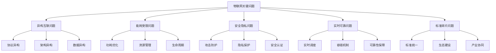
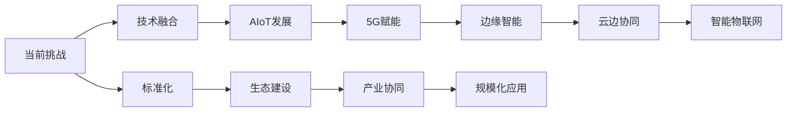

# 3.1.4 关键问题与挑战

## 1. 形式化定义

### 1.1 问题定义

**定义 3.1.4.1** (IoT问题) IoT问题是一个四元组 $P = (D, I, C, S)$，其中：

- $D$ 是问题描述
- $I$ 是影响范围
- $C$ 是复杂度
- $S$ 是严重程度

**定义 3.1.4.2** (挑战) 挑战是一个五元组 $C = (T, R, L, A, M)$，其中：

- $T$ 是技术挑战
- $R$ 是资源约束
- $L$ 是限制条件
- $A$ 是应用需求
- $M$ 是管理复杂度

### 1.2 问题严重程度量化

$$Severity(P) = \alpha \cdot Impact(P) + \beta \cdot Complexity(P) + \gamma \cdot Urgency(P)$$
其中 $\alpha, \beta, \gamma$ 是权重系数。

## 2. 主要问题详细分析

### 2.1 异构设备互联互通问题

**定义 3.1.4.3** (异构性) 异构性是一个三元组 $H = (P, A, D)$，其中：

- $P$ 是协议异构性
- $A$ 是架构异构性
- $D$ 是数据异构性

#### 2.1.1 协议异构性

$$P = \{p_i | p_i = (protocol_i, version_i, features_i)\}$$
其中：

- $protocol_i$ 是协议类型
- $version_i$ 是协议版本
- $features_i$ 是协议特性

#### 2.1.2 架构异构性

$$A = \{a_j | a_j = (arch_j, platform_j, os_j)\}$$
其中：

- $arch_j$ 是硬件架构
- $platform_j$ 是平台类型
- $os_j$ 是操作系统

#### 2.1.3 数据异构性

$$D = \{d_k | d_k = (format_k, schema_k, encoding_k)\}$$
其中：

- $format_k$ 是数据格式
- $schema_k$ 是数据模式
- $encoding_k$ 是编码方式

#### 2.1.4 解决方案

1. **协议网关**：$Gateway = \{g_i | g_i = (input_i, transform_i, output_i)\}$
2. **中间件**：$Middleware = \{m_j | m_j = (adapter_j, translator_j, router_j)\}$
3. **标准化**：$Standard = \{s_k | s_k = (spec_k, compliance_k, certification_k)\}$

### 2.2 能耗与资源受限问题

**定义 3.1.4.4** (能耗约束) 能耗约束是一个四元组 $E = (P, B, T, L)$，其中：

- $P$ 是功耗限制
- $B$ 是电池容量
- $T$ 是工作时间
- $L$ 是生命周期

#### 2.2.1 功耗模型

$$P_{total} = P_{cpu} + P_{radio} + P_{sensor} + P_{idle}$$
其中：

- $P_{cpu}$ 是CPU功耗
- $P_{radio}$ 是无线通信功耗
- $P_{sensor}$ 是传感器功耗
- $P_{idle}$ 是空闲功耗

#### 2.2.2 资源约束模型

$$R_{constraint} = \{r_i | r_i \leq r_{max_i}\}$$
其中：

- $r_i$ 是资源使用量
- $r_{max_i}$ 是资源上限

#### 2.2.3 优化策略

1. **动态电压调节**：$P \propto V^2 \cdot f$
2. **任务调度优化**：$E_{total} = \sum_{i=1}^{n} E_i \cdot t_i$
3. **休眠机制**：$T_{sleep} > T_{active}$

### 2.3 安全性与隐私保护问题

**定义 3.1.4.5** (安全威胁) 安全威胁是一个五元组 $T = (A, V, I, D, P)$，其中：

- $A$ 是攻击者
- $V$ 是漏洞
- $I$ 是攻击意图
- $D$ 是攻击手段
- $P$ 是防护措施

#### 2.3.1 攻击分类

1. **物理攻击**：$A_{physical} = \{a_i | a_i = (device_i, method_i, impact_i)\}$
2. **网络攻击**：$A_{network} = \{a_j | a_j = (protocol_j, exploit_j, target_j)\}$
3. **应用攻击**：$A_{application} = \{a_k | a_k = (vulnerability_k, payload_k, effect_k)\}$

#### 2.3.2 隐私保护模型

$$Privacy = \{p_i | p_i = (data_i, user_i, policy_i)\}$$
其中：

- $data_i$ 是敏感数据
- $user_i$ 是用户身份
- $policy_i$ 是隐私策略

#### 2.3.3 安全机制

1. **加密算法**：$Encrypt(data, key) = cipher$
2. **认证机制**：$Authenticate(user, credentials) = \{true, false\}$
3. **访问控制**：$Access(user, resource, policy) = \{allow, deny\}$

### 2.4 实时性与可靠性问题

**定义 3.1.4.6** (实时性) 实时性是一个三元组 $R = (D, L, C)$，其中：

- $D$ 是截止时间
- $L$ 是延迟要求
- $C$ 是一致性要求

#### 2.4.1 实时性约束

$$T_{response} \leq T_{deadline}$$
其中：

- $T_{response}$ 是响应时间
- $T_{deadline}$ 是截止时间

#### 2.4.2 可靠性模型

$$Reliability = \frac{MTBF}{MTBF + MTTR}$$
其中：

- $MTBF$ 是平均故障间隔时间
- $MTTR$ 是平均修复时间

#### 2.4.3 容错机制

1. **冗余设计**：$R_{redundant} = 1 - (1 - R)^n$
2. **故障检测**：$Detection = \{d_i | d_i = (sensor_i, threshold_i, alarm_i)\}$
3. **自动恢复**：$Recovery = \{r_j | r_j = (trigger_j, action_j, verification_j)\}$

### 2.5 标准化与碎片化问题

**定义 3.1.4.7** (标准化) 标准化是一个四元组 $S = (S, I, C, V)$，其中：

- $S$ 是标准规范
- $I$ 是实施指南
- $C$ 是合规性检查
- $V$ 是验证机制

#### 2.5.1 标准分类

1. **协议标准**：$P_{standard} = \{p_i | p_i = (protocol_i, version_i, features_i)\}$
2. **接口标准**：$I_{standard} = \{i_j | i_j = (interface_j, format_j, method_j)\}$
3. **安全标准**：$S_{standard} = \{s_k | s_k = (security_k, encryption_k, auth_k)\}$

#### 2.5.2 碎片化影响

$$Fragmentation = \sum_{i=1}^{n} w_i \cdot f_i$$
其中：

- $w_i$ 是权重系数
- $f_i$ 是碎片化程度

## 3. 挑战深度分析

### 3.1 理论与实际的差距

**定义 3.1.4.8** (理论-实际差距) 差距是一个三元组 $G = (M, R, U)$，其中：

- $M$ 是模型简化
- $R$ 是现实复杂性
- $U$ 是不确定性

#### 3.1.1 模型简化问题

1. **理想化假设**：$Model_{ideal} \neq Reality_{complex}$
2. **参数估计误差**：$Error = |Estimated - Actual|$
3. **环境变化影响**：$Impact = f(Environment, Time, Context)$

#### 3.1.2 不确定性建模

$$Uncertainty = \{u_i | u_i = (source_i, probability_i, impact_i)\}$$
其中：

- $source_i$ 是不确定性来源
- $probability_i$ 是发生概率
- $impact_i$ 是影响程度

### 3.2 多学科交叉难点

**定义 3.1.4.9** (多学科交叉) 交叉是一个四元组 $I = (D, K, T, I)$，其中：

- $D$ 是学科领域
- $K$ 是知识体系
- $T$ 是技术栈
- $I$ 是集成方法

#### 3.2.1 学科领域

1. **计算机科学**：算法、数据结构、系统架构
2. **通信工程**：网络协议、信号处理、无线通信
3. **电子工程**：电路设计、嵌入式系统、传感器技术
4. **控制理论**：系统控制、优化算法、稳定性分析

#### 3.2.2 知识整合挑战

$$Integration = \{i_j | i_j = (domain_j, knowledge_j, method_j)\}$$
其中：

- $domain_j$ 是学科领域
- $knowledge_j$ 是专业知识
- $method_j$ 是整合方法

### 3.3 未来发展趋势挑战

**定义 3.1.4.10** (发展趋势) 趋势是一个五元组 $T = (T, I, A, C, F)$，其中：

- $T$ 是技术趋势
- $I$ 是产业趋势
- $A$ 是应用趋势
- $C$ 是挑战
- $F$ 是机遇

#### 3.3.1 AIoT融合挑战

1. **算法复杂度**：$Complexity_{AI} > Complexity_{IoT}$
2. **计算资源需求**：$Resource_{AI} > Resource_{IoT}$
3. **实时性要求**：$Latency_{AI} < Latency_{IoT}$

#### 3.3.2 5G技术挑战

1. **网络切片**：$Slice = \{s_i | s_i = (type_i, qos_i, resource_i)\}$
2. **边缘计算**：$Edge = \{e_j | e_j = (location_j, capacity_j, latency_j)\}$
3. **大规模连接**：$Connection = \{c_k | c_k = (density_k, mobility_k, reliability_k)\}$

### 3.4 自组织与自适应能力

**定义 3.1.4.11** (自组织) 自组织是一个四元组 $S = (A, C, E, L)$，其中：

- $A$ 是自适应能力
- $C$ 是协作机制
- $E$ 是演化过程
- $L$ 是学习能力

#### 3.4.1 自适应算法

$$Adaptive = \{a_i | a_i = (input_i, algorithm_i, output_i)\}$$
其中：

- $input_i$ 是输入数据
- $algorithm_i$ 是自适应算法
- $output_i$ 是输出结果

#### 3.4.2 自愈机制

1. **故障检测**：$Detection = \{d_j | d_j = (sensor_j, threshold_j, trigger_j)\}$
2. **故障诊断**：$Diagnosis = \{diag_k | diag_k = (symptom_k, cause_k, solution_k)\}$
3. **自动修复**：$Repair = \{r_l | r_l = (action_l, verification_l, recovery_l)\}$

## 4. 解决方案与策略

### 4.1 技术解决方案

#### 4.1.1 异构性解决方案

1. **协议转换网关**：$Gateway = \{g_i | g_i = (input_i, transform_i, output_i)\}$
2. **中间件平台**：$Middleware = \{m_j | m_j = (adapter_j, translator_j, router_j)\}$
3. **标准化接口**：$Interface = \{i_k | i_k = (api_k, format_k, protocol_k)\}$

#### 4.1.2 能耗优化方案

1. **动态功耗管理**：$DPM = \{dpm_i | dpm_i = (state_i, power_i, transition_i)\}$
2. **智能调度算法**：$Scheduler = \{s_j | s_j = (task_j, priority_j, resource_j)\}$
3. **休眠唤醒机制**：$Sleep = \{sleep_k | sleep_k = (mode_k, duration_k, trigger_k)\}$

#### 4.1.3 安全防护方案

1. **多层次安全架构**：$Security = \{sec_i | sec_i = (layer_i, mechanism_i, policy_i)\}$
2. **加密通信协议**：$Encryption = \{enc_j | enc_j = (algorithm_j, key_j, mode_j)\}$
3. **身份认证机制**：$Auth = \{auth_k | auth_k = (method_k, credential_k, session_k)\}$

### 4.2 管理策略

#### 4.2.1 标准化策略

1. **国际标准遵循**：$Standard = \{std_i | std_i = (org_i, spec_i, compliance_i)\}$
2. **行业标准制定**：$Industry = \{ind_j | ind_j = (sector_j, requirement_j, guideline_j)\}$
3. **企业标准实施**：$Enterprise = \{ent_k | ent_k = (policy_k, procedure_k, audit_k)\}$

#### 4.2.2 人才培养策略

1. **跨学科教育**：$Education = \{edu_i | edu_i = (course_i, skill_i, practice_i)\}$
2. **技能认证体系**：$Certification = \{cert_j | cert_j = (level_j, exam_j, renewal_j)\}$
3. **实践经验积累**：$Experience = \{exp_k | exp_k = (project_k, role_k, outcome_k)\}$

## 5. 结构化表达

### 5.1 问题树

### 5.2 挑战矩阵

| 编号 | 挑战类型 | 影响领域 | 典型难点 | 解决方案 | 优先级 |
|------|----------|----------|----------|----------|--------|
| 3.1.4.1 | 理论与实际差距 | 工程实现 | 不确定性、模型失效 | 自适应算法、容错机制 | 高 |
| 3.1.4.2 | 多学科交叉 | 系统设计 | 知识整合、术语不统一 | 标准化、跨学科教育 | 中 |
| 3.1.4.3 | 未来趋势 | 前沿技术 | AIoT、5G、工业互联网 | 技术融合、生态建设 | 高 |
| 3.1.4.4 | 自组织自适应 | 智能系统 | 动态优化、自愈能力 | 机器学习、智能算法 | 中 |

### 5.3 发展趋势图

## 6. 多表征方法

### 6.1 概念图表示

- 问题分类图
- 挑战关系图
- 解决方案图

### 6.2 数学符号表示

- 形式化定义
- 量化分析模型
- 优化算法

### 6.3 结构表表示

- 问题对比表
- 挑战矩阵表
- 解决方案表

## 7. 规范说明

### 7.1 内容要求

- 内容需递归细化，支持多表征
- 保留批判性分析、图表等
- 如有遗漏，后续补全并说明

### 7.2 形式化要求

- 使用严格的数学符号
- 提供形式化定义
- 建立分析模型

### 7.3 扩展性要求

- 支持持续递归完善
- 可分解为子主题
- 支持多维度分析

> 本文件为递归细化与内容补全示范，后续可继续分解为3.1.4.1、3.1.4.2等子主题，支持持续递归完善。
