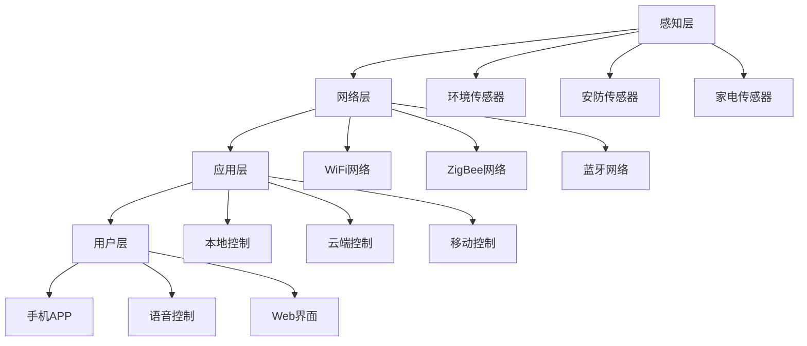
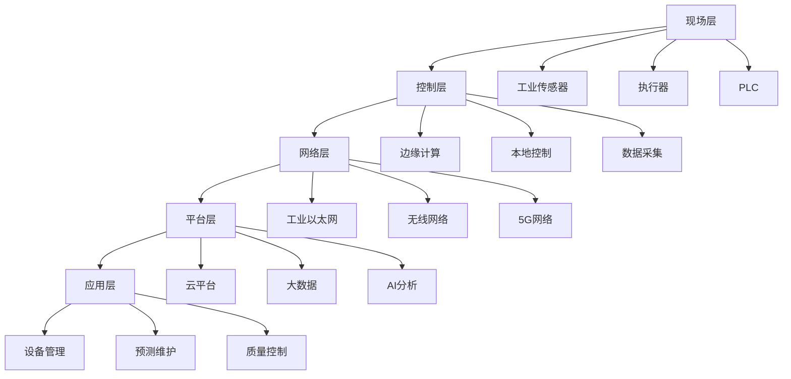
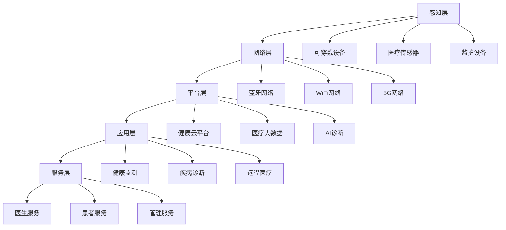
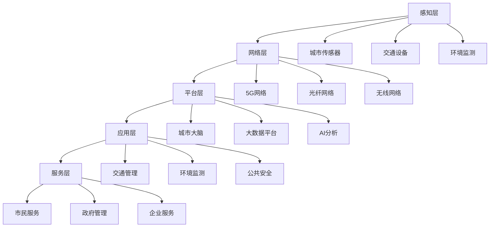
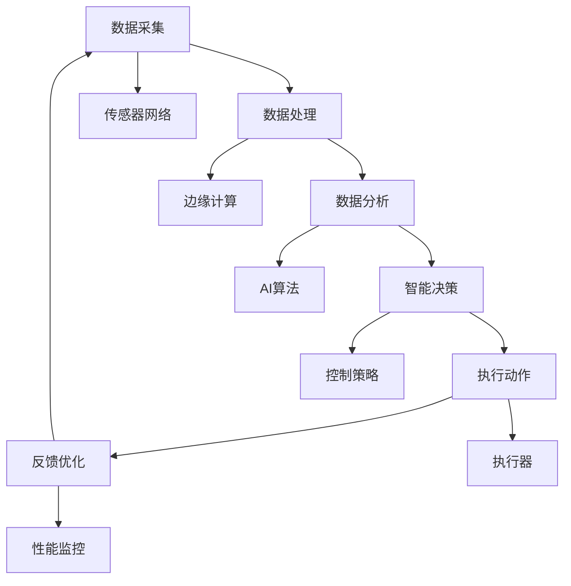
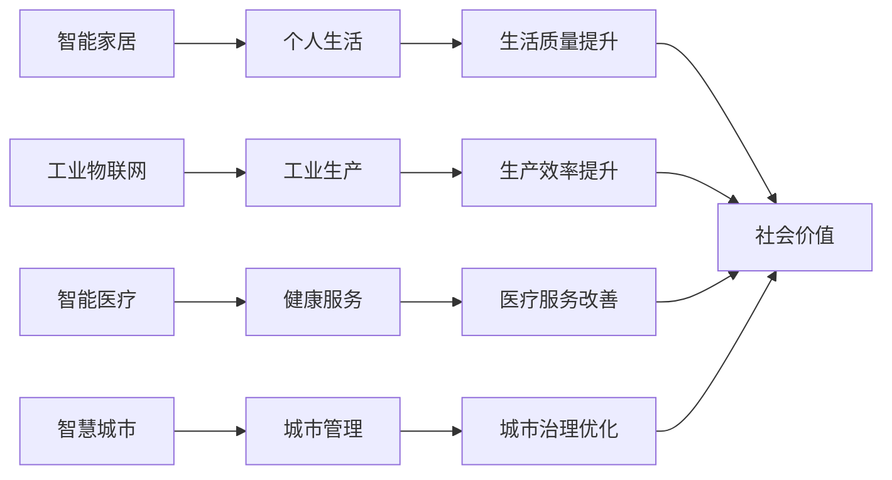

# 3.1.5 相关案例

## 1. 形式化定义

### 1.1 案例定义

**定义 3.1.5.1** (IoT案例) IoT案例是一个五元组 $C = (S, T, P, R, E)$，其中：

- $S$ 是系统架构
- $T$ 是技术栈
- $P$ 是问题集合
- $R$ 是解决方案
- $E$ 是效果评估

**定义 3.1.5.2** (案例分析) 案例分析是一个四元组 $A = (B, S, I, L)$，其中：

- $B$ 是背景分析
- $S$ 是系统分析
- $I$ 是实施过程
- $L$ 是经验教训

### 1.2 案例分类

$$Case_{type} = \{c_i | c_i = (domain_i, scale_i, complexity_i, impact_i)\}$$
其中：

- $domain_i$ 是应用领域
- $scale_i$ 是规模大小
- $complexity_i$ 是复杂度
- $impact_i$ 是影响程度

## 2. 典型案例详细分析

### 2.1 智能家居系统案例

#### 2.1.1 案例背景

**定义 3.1.5.3** (智能家居) 智能家居是一个四元组 $H = (D, S, C, U)$，其中：

- $D$ 是设备集合
- $S$ 是传感器网络
- $C$ 是控制系统
- $U$ 是用户界面

#### 2.1.2 系统架构

#### 2.1.3 技术实现

1. **传感器网络**：
   $$S = \{s_i | s_i = (type_i, location_i, data_i, status_i)\}$$
   其中：
   - $type_i$ 是传感器类型
   - $location_i$ 是安装位置
   - $data_i$ 是采集数据
   - $status_i$ 是工作状态

2. **通信协议**：
   - **WiFi**：$WiFi = \{w_i | w_i = (ssid_i, password_i, channel_i)\}$
   - **ZigBee**：$ZigBee = \{z_j | z_j = (pan_id_j, node_id_j, cluster_j)\}$
   - **蓝牙**：$Bluetooth = \{b_k | b_k = (mac_k, service_k, characteristic_k)\}$

3. **控制算法**：
   $$Control = \{c_i | c_i = (input_i, algorithm_i, output_i)\}$$
   其中：
   - $input_i$ 是输入数据
   - $algorithm_i$ 是控制算法
   - $output_i$ 是输出指令

#### 2.1.4 关键问题与解决方案

1. **协议兼容性问题**：
   - **问题**：多种协议设备无法直接通信
   - **解决方案**：协议转换网关
   $$Gateway = \{g_i | g_i = (input_protocol_i, converter_i, output_protocol_i)\}$$

2. **数据安全问题**：
   - **问题**：设备数据可能被恶意访问
   - **解决方案**：端到端加密
   $$Encryption = \{e_i | e_i = (algorithm_i, key_i, mode_i)\}$$

3. **用户体验问题**：
   - **问题**：操作复杂，学习成本高
   - **解决方案**：统一用户界面
   $$UI = \{ui_i | ui_i = (interface_i, interaction_i, feedback_i)\}$$

#### 2.1.5 性能评估

1. **响应时间**：$T_{response} \leq 500ms$
2. **可靠性**：$R_{system} \geq 99.9\%$
3. **能耗**：$P_{device} \leq 1W$
4. **覆盖范围**：$Range \geq 100m$

### 2.2 工业物联网案例

#### 2.2.1 案例背景

**定义 3.1.5.4** (工业物联网) 工业物联网是一个五元组 $I = (E, S, P, A, M)$，其中：

- $E$ 是设备集合
- $S$ 是传感器网络
- $P$ 是生产过程
- $A$ 是分析系统
- $M$ 是管理系统

#### 2.2.2 系统架构

#### 2.2.3 技术实现

1. **工业传感器**：
   $$Sensor = \{s_i | s_i = (type_i, range_i, accuracy_i, reliability_i)\}$$
   其中：
   - $type_i$ 是传感器类型
   - $range_i$ 是测量范围
   - $accuracy_i$ 是精度要求
   - $reliability_i$ 是可靠性指标

2. **边缘计算**：
   $$Edge = \{e_j | e_j = (location_j, capacity_j, latency_j, energy_j)\}$$
   其中：
   - $location_j$ 是部署位置
   - $capacity_j$ 是计算能力
   - $latency_j$ 是延迟要求
   - $energy_j$ 是能耗约束

3. **数据分析**：
   $$Analysis = \{a_k | a_k = (algorithm_k, input_k, output_k, performance_k)\}$$
   其中：
   - $algorithm_k$ 是分析算法
   - $input_k$ 是输入数据
   - $output_k$ 是输出结果
   - $performance_k$ 是性能指标

#### 2.2.4 关键问题与解决方案

1. **实时性问题**：
   - **问题**：工业控制对实时性要求极高
   - **解决方案**：边缘计算 + 实时调度
   $$RealTime = \{rt_i | rt_i = (deadline_i, priority_i, scheduler_i)\}$$

2. **可靠性问题**：
   - **问题**：工业环境恶劣，设备易故障
   - **解决方案**：冗余设计 + 故障检测
   $$Reliability = \{r_j | r_j = (redundancy_j, detection_j, recovery_j)\}$$

3. **数据分析问题**：
   - **问题**：海量数据需要智能分析
   - **解决方案**：AI算法 + 大数据平台
   $$AI = \{ai_k | ai_k = (model_k, training_k, inference_k)\}$$

#### 2.2.5 性能评估

1. **实时性**：$T_{response} \leq 10ms$
2. **可靠性**：$R_{system} \geq 99.99\%$
3. **可用性**：$A_{system} \geq 99.9\%$
4. **数据精度**：$Accuracy \geq 99.5\%$

### 2.3 智能医疗案例

#### 2.3.1 案例背景

**定义 3.1.5.5** (智能医疗) 智能医疗是一个五元组 $M = (D, S, P, A, C)$，其中：

- $D$ 是医疗设备
- $S$ 是传感器网络
- $P$ 是患者数据
- $A$ 是分析系统
- $C$ 是临床决策

#### 2.3.2 系统架构

#### 2.3.3 技术实现

1. **可穿戴设备**：
   $$Wearable = \{w_i | w_i = (type_i, sensor_i, battery_i, connectivity_i)\}$$
   其中：
   - $type_i$ 是设备类型
   - $sensor_i$ 是传感器配置
   - $battery_i$ 是电池容量
   - $connectivity_i$ 是连接方式

2. **健康数据**：
   $$HealthData = \{h_j | h_j = (patient_j, vital_j, history_j, trend_j)\}$$
   其中：
   - $patient_j$ 是患者信息
   - $vital_j$ 是生命体征
   - $history_j$ 是病史记录
   - $trend_j$ 是趋势分析

3. **AI诊断**：
   $$Diagnosis = \{d_k | d_k = (symptom_k, model_k, confidence_k, recommendation_k)\}$$
   其中：
   - $symptom_k$ 是症状描述
   - $model_k$ 是诊断模型
   - $confidence_k$ 是置信度
   - $recommendation_k$ 是治疗建议

#### 2.3.4 关键问题与解决方案

1. **数据隐私问题**：
   - **问题**：医疗数据涉及个人隐私
   - **解决方案**：加密存储 + 访问控制
   $$Privacy = \{p_i | p_i = (encryption_i, access_i, audit_i)\}$$

2. **互联互通问题**：
   - **问题**：不同设备数据格式不统一
   - **解决方案**：标准化接口 + 数据转换
   $$Interoperability = \{int_j | int_j = (standard_j, converter_j, validator_j)\}$$

3. **低功耗设计**：
   - **问题**：可穿戴设备需要长时间工作
   - **解决方案**：低功耗芯片 + 智能调度
   $$Power = \{pow_k | pow_k = (chip_k, scheduler_k, mode_k)\}$$

#### 2.3.5 性能评估

1. **数据精度**：$Accuracy \geq 99.9\%$
2. **响应时间**：$T_{response} \leq 1s$
3. **电池续航**：$Battery \geq 7days$
4. **诊断准确率**：$Diagnosis_{accuracy} \geq 95\%$

### 2.4 智慧城市案例

#### 2.4.1 案例背景

**定义 3.1.5.6** (智慧城市) 智慧城市是一个六元组 $C = (I, T, E, S, G, P)$，其中：

- $I$ 是基础设施
- $T$ 是交通系统
- $E$ 是环境监测
- $S$ 是安全系统
- $G$ 是政府服务
- $P$ 是公共服务

#### 2.4.2 系统架构

#### 2.4.3 技术实现

1. **城市传感器网络**：
   $$CitySensor = \{cs_i | cs_i = (type_i, location_i, coverage_i, data_i)\}$$
   其中：
   - $type_i$ 是传感器类型
   - $location_i$ 是部署位置
   - $coverage_i$ 是覆盖范围
   - $data_i$ 是采集数据

2. **交通管理系统**：
   $$Traffic = \{t_j | t_j = (signal_j, camera_j, detector_j, controller_j)\}$$
   其中：
   - $signal_j$ 是交通信号
   - $camera_j$ 是监控摄像头
   - $detector_j$ 是车辆检测器
   - $controller_j$ 是控制器

3. **环境监测系统**：
   $$Environment = \{env_k | env_k = (air_k, water_k, noise_k, waste_k)\}$$
   其中：
   - $air_k$ 是空气质量
   - $water_k$ 是水质监测
   - $noise_k$ 是噪声监测
   - $waste_k$ 是垃圾处理

#### 2.4.4 关键问题与解决方案

1. **大规模部署问题**：
   - **问题**：城市范围大，设备数量多
   - **解决方案**：分层部署 + 网格化管理
   $$Deployment = \{d_i | d_i = (layer_i, grid_i, management_i)\}$$

2. **数据融合问题**：
   - **问题**：多源异构数据需要融合
   - **解决方案**：数据融合算法 + 统一平台
   $$Fusion = \{f_j | f_j = (algorithm_j, platform_j, result_j)\}$$

3. **实时响应问题**：
   - **问题**：城市事件需要快速响应
   - **解决方案**：边缘计算 + 实时处理
   $$Response = \{r_k | r_k = (edge_k, realtime_k, action_k)\}$$

#### 2.4.5 性能评估

1. **覆盖范围**：$Coverage \geq 95\%$
2. **响应时间**：$T_{response} \leq 5min$
3. **数据准确率**：$Accuracy \geq 99\%$
4. **系统可用性**：$Availability \geq 99.9\%$

## 3. 案例对比分析

### 3.1 技术栈对比

| 案例类型 | 感知技术 | 通信技术 | 计算技术 | 应用技术 |
|----------|----------|----------|----------|----------|
| 智能家居 | 环境传感器 | WiFi/ZigBee | 嵌入式 | 移动应用 |
| 工业物联网 | 工业传感器 | 工业以太网 | 边缘计算 | 工业软件 |
| 智能医疗 | 医疗传感器 | 蓝牙/5G | 云端计算 | 医疗AI |
| 智慧城市 | 城市传感器 | 5G/光纤 | 城市大脑 | 城市服务 |

### 3.2 性能指标对比

| 案例类型 | 实时性 | 可靠性 | 安全性 | 可扩展性 |
|----------|--------|--------|--------|----------|
| 智能家居 | 中等 | 高 | 高 | 中等 |
| 工业物联网 | 极高 | 极高 | 高 | 高 |
| 智能医疗 | 高 | 极高 | 极高 | 中等 |
| 智慧城市 | 中等 | 高 | 高 | 极高 |

### 3.3 挑战对比

| 案例类型 | 主要挑战 | 技术难点 | 管理难点 | 成本难点 |
|----------|----------|----------|----------|----------|
| 智能家居 | 协议兼容 | 用户体验 | 生态建设 | 设备成本 |
| 工业物联网 | 实时可靠 | 边缘计算 | 标准统一 | 部署成本 |
| 智能医疗 | 数据隐私 | AI诊断 | 法规合规 | 研发成本 |
| 智慧城市 | 规模部署 | 数据融合 | 部门协调 | 投资成本 |

## 4. 结构化表达

### 4.1 案例流程图

### 4.2 结构表

| 编号 | 案例类型 | 主要要素 | 关键机制 | 技术特点 | 应用价值 |
|------|----------|----------|----------|----------|----------|
| 3.1.5.1 | 智能家居 | 传感器、执行器、网关 | 协议兼容、用户友好 | 低功耗、易部署 | 生活便利 |
| 3.1.5.2 | 工业物联网 | 工业传感器、边缘节点 | 实时性、可靠性 | 高精度、强实时 | 工业升级 |
| 3.1.5.3 | 智能医疗 | 可穿戴设备、云平台 | 数据安全、AI诊断 | 高精度、高可靠 | 健康管理 |
| 3.1.5.4 | 智慧城市 | 城市传感器、城市大脑 | 大规模、智能化 | 全覆盖、强智能 | 城市治理 |

### 4.3 案例关系图

## 5. 多表征方法

### 5.1 概念图表示

- 案例分类图
- 技术栈关系图
- 应用场景图

### 5.2 数学符号表示

- 形式化定义
- 性能分析模型
- 优化算法

### 5.3 结构表表示

- 案例对比表
- 技术栈对比表
- 性能指标表

## 6. 规范说明

### 6.1 内容要求

- 内容需递归细化，支持多表征
- 保留批判性分析、图表等
- 如有遗漏，后续补全并说明

### 6.2 形式化要求

- 使用严格的数学符号
- 提供形式化定义
- 建立分析模型

### 6.3 扩展性要求

- 支持持续递归完善
- 可分解为子主题
- 支持多维度分析

> 本文件为递归细化与内容补全示范，后续可继续分解为3.1.5.1、3.1.5.2等子主题，支持持续递归完善。
