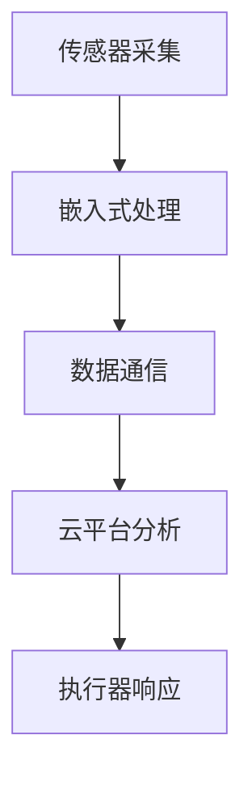

# 3.1.5 相关案例

## 1. 典型案例

- **智能家居系统案例**：多种传感器与执行器协同，实现环境感知与自动控制。
- **工业物联网案例**：设备监控、远程维护、数据采集与分析。
- **智能医疗案例**：可穿戴设备、远程诊断、健康数据管理。
- **智慧城市案例**：城市基础设施智能化管理。

## 2. 案例分析

### 2.1 智能家居系统案例

- **案例背景**：家庭环境中部署多种传感器与执行器，实现自动化控制与远程管理。
- **系统结构与要素**：传感器、执行器、嵌入式网关、云平台、移动终端。
- **关键问题与解决方案**：协议兼容、数据安全、用户体验。
- **案例启示**：标准化与开放平台促进生态繁荣。

### 2.2 工业物联网案例

- **案例背景**：工业现场设备联网，实现远程监控与维护。
- **系统结构与要素**：工业传感器、PLC、边缘计算节点、云平台。
- **关键问题与解决方案**：实时性、可靠性、数据分析。
- **案例启示**：边缘智能提升工业自动化水平。

### 2.3 智能医疗案例

- **案例背景**：可穿戴设备采集健康数据，支持远程诊断。
- **系统结构与要素**：传感器、嵌入式终端、云平台、医疗服务系统。
- **关键问题与解决方案**：数据隐私、互联互通、低功耗设计。
- **案例启示**：数据安全与标准化是智能医疗发展的基础。

## 3. 结构化表达

- **案例流程图**：

- **结构表**：
| 编号 | 案例类型 | 主要要素 | 关键机制 | 启示 |
|------|----------|----------|----------|------|
| 3.1.5.1 | 智能家居 | 传感器、执行器 | 协议兼容 | 开放平台 |
| 3.1.5.2 | 工业物联网 | 工业传感器、边缘节点 | 实时性 | 边缘智能 |
| 3.1.5.3 | 智能医疗 | 可穿戴设备、云平台 | 数据安全 | 标准化 |

## 4. 多表征

- 案例流程图、结构表、对比分析、符号化描述

## 5. 规范说明

- 内容需递归细化，支持多表征。
- 保留批判性分析、图表等。
- 如有遗漏，后续补全并说明。

> 本文件为递归细化与内容补全示范，后续可继续分解为3.1.5.1、3.1.5.2等子主题，支持持续递归完善。
