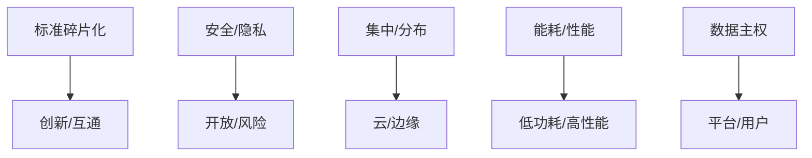

# 3.2.1 主要争议

## 1. 争议主题

- **标准碎片化与兼容性**：多种协议、平台标准不统一，影响互联互通。
- **安全性与隐私保护**：开放互联带来攻击面扩大与数据泄露风险。
- **集中式与分布式架构**：云平台集中处理与边缘分布式智能的权衡。
- **能耗与性能**：低功耗设计与高性能需求的矛盾。
- **数据主权与平台封闭**：数据归属权、平台生态开放性争议。

## 2. 结构化表达

- **争议对比表**：
| 编号 | 争议主题 | 主要观点A | 主要观点B |
|------|----------|----------|----------|
| 3.2.1.1 | 标准碎片化 | 灵活创新 | 互通受限 |
| 3.2.1.2 | 安全/隐私 | 开放互联 | 风险增加 |
| 3.2.1.3 | 集中/分布 | 云集中 | 边缘智能 |
| 3.2.1.4 | 能耗/性能 | 低功耗 | 高性能 |
| 3.2.1.5 | 数据主权 | 平台控制 | 用户自主 |

- **争议关系图**：

## 3. 多表征

- 对比表、关系图、案例分析、符号化描述

## 4. 规范说明

- 内容需递归细化，支持多表征。
- 保留批判性分析、图表等。
- 如有遗漏，后续补全并说明。

> 本文件为递归细化与内容补全示范，后续可继续分解为3.2.1.1、3.2.1.2等子主题，支持持续递归完善。
