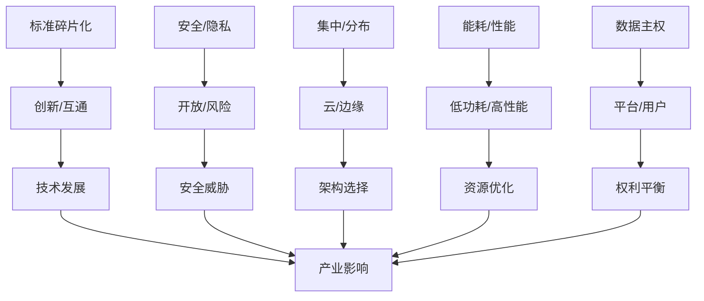
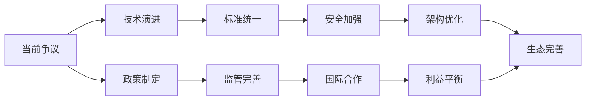

# 3.2.1 主要争议

## 1. 形式化定义

### 1.1 争议定义

**定义 3.2.1.1** (IoT争议) IoT争议是一个五元组 $D = (I, P, A, C, R)$，其中：

- $I$ 是争议议题
- $P$ 是参与方
- $A$ 是争议观点
- $C$ 是冲突程度
- $R$ 是影响范围

**定义 3.2.1.2** (争议分析) 争议分析是一个四元组 $A = (B, S, I, L)$，其中：

- $B$ 是背景分析
- $S$ 是争议分析
- $I$ 是影响评估
- $L$ 是解决方案

### 1.2 争议分类

$$Controversy_{type} = \{c_i | c_i = (domain_i, intensity_i, impact_i, resolution_i)\}$$
其中：

- $domain_i$ 是争议领域
- $intensity_i$ 是争议强度
- $impact_i$ 是影响程度
- $resolution_i$ 是解决难度

## 2. 主要争议详细分析

### 2.1 标准碎片化与兼容性争议

**定义 3.2.1.3** (标准碎片化) 标准碎片化是一个四元组 $F = (S, P, I, C)$，其中：

- $S$ 是标准集合
- $P$ 是协议集合
- $I$ 是互操作性
- $C$ 是兼容性

#### 2.1.1 争议焦点

1. **标准化vs创新**：
   - **支持标准化观点**：$Standardization = \{std_i | std_i = (unified_i, compatibility_i, ecosystem_i)\}$
   - **支持创新观点**：$Innovation = \{inn_j | inn_j = (flexibility_j, diversity_j, competition_j)\}$

2. **开放vs封闭**：
   - **开放标准观点**：$OpenStandard = \{os_k | os_k = (transparency_k, collaboration_k, adoption_k)\}$
   - **专有标准观点**：$ProprietaryStandard = \{ps_l | ps_l = (control_l, quality_l, revenue_l)\}$

#### 2.1.2 影响分析

$$Impact_{fragmentation} = \alpha \cdot Cost_{integration} + \beta \cdot Time_{development} + \gamma \cdot Risk_{interoperability}$$
其中：

- $Cost_{integration}$ 是集成成本
- $Time_{development}$ 是开发时间
- $Risk_{interoperability}$ 是互操作风险

#### 2.1.3 解决方案

1. **统一标准**：$UnifiedStandard = \{us_i | us_i = (consortium_i, specification_i, compliance_i)\}$
2. **协议转换**：$ProtocolTranslation = \{pt_j | pt_j = (gateway_j, converter_j, bridge_j)\}$
3. **中间件平台**：$Middleware = \{mw_k | mw_k = (adapter_k, translator_k, router_k)\}$

### 2.2 安全性与隐私保护争议

**定义 3.2.1.4** (安全争议) 安全争议是一个五元组 $S = (T, R, P, A, M)$，其中：

- $T$ 是威胁模型
- $R$ 是风险等级
- $P$ 是隐私保护
- $A$ 是攻击面
- $M$ 是缓解措施

#### 2.2.1 争议焦点

1. **开放互联vs安全风险**：
   - **开放互联观点**：$OpenInterconnection = \{oi_i | oi_i = (connectivity_i, innovation_i, efficiency_i)\}$
   - **安全风险观点**：$SecurityRisk = \{sr_j | sr_j = (vulnerability_j, attack_j, damage_j)\}$

2. **数据共享vs隐私保护**：
   - **数据共享观点**：$DataSharing = \{ds_k | ds_k = (value_k, collaboration_k, insight_k)\}$
   - **隐私保护观点**：$PrivacyProtection = \{pp_l | pp_l = (rights_l, control_l, security_l)\}$

#### 2.2.2 威胁模型

$$ThreatModel = \{tm_i | tm_i = (attacker_i, target_i, method_i, impact_i)\}$$
其中：

- $attacker_i$ 是攻击者
- $target_i$ 是攻击目标
- $method_i$ 是攻击方法
- $impact_i$ 是攻击影响

#### 2.2.3 解决方案

1. **多层安全架构**：$MultiLayerSecurity = \{mls_i | mls_i = (layer_i, mechanism_i, integration_i)\}$
2. **零信任模型**：$ZeroTrust = \{zt_j | zt_j = (verify_j, never_trust_j, always_verify_j)\}$
3. **隐私保护技术**：$PrivacyTech = \{pt_k | pt_k = (encryption_k, anonymization_k, differential_privacy_k)\}$

### 2.3 集中式与分布式架构争议

**定义 3.2.1.5** (架构争议) 架构争议是一个四元组 $A = (C, D, T, P)$，其中：

- $C$ 是集中式架构
- $D$ 是分布式架构
- $T$ 是权衡分析
- $P$ 是性能指标

#### 2.3.1 争议焦点

1. **云平台集中vs边缘分布式**：
   - **云平台观点**：$CloudPlatform = \{cp_i | cp_i = (centralization_i, scalability_i, management_i)\}$
   - **边缘分布式观点**：$EdgeDistributed = \{ed_j | ed_j = (localization_j, latency_j, autonomy_j)\}$

2. **数据处理位置**：
   - **云端处理观点**：$CloudProcessing = \{cp_k | cp_k = (power_k, storage_k, analysis_k)\}$
   - **边缘处理观点**：$EdgeProcessing = \{ep_l | ep_l = (real_time_l, privacy_l, bandwidth_l)\}$

#### 2.3.2 性能对比

$$Performance_{comparison} = \frac{Latency_{edge}}{Latency_{cloud}} \cdot \frac{Cost_{edge}}{Cost_{cloud}} \cdot \frac{Security_{edge}}{Security_{cloud}}$$

#### 2.3.3 解决方案

1. **混合架构**：$HybridArchitecture = \{ha_i | ha_i = (cloud_i, edge_i, orchestration_i)\}$
2. **智能调度**：$IntelligentScheduling = \{is_j | is_j = (workload_j, location_j, optimization_j)\}$
3. **自适应架构**：$AdaptiveArchitecture = \{aa_k | aa_k = (monitoring_k, adjustment_k, optimization_k)\}$

### 2.4 能耗与性能争议

**定义 3.2.1.6** (能耗争议) 能耗争议是一个四元组 $E = (P, E, T, O)$，其中：

- $P$ 是性能需求
- $E$ 是能耗约束
- $T$ 是权衡策略
- $O$ 是优化目标

#### 2.4.1 争议焦点

1. **低功耗vs高性能**：
   - **低功耗观点**：$LowPower = \{lp_i | lp_i = (battery_i, sustainability_i, cost_i)\}$
   - **高性能观点**：$HighPerformance = \{hp_j | hp_j = (speed_j, capability_j, user_experience_j)\}$

2. **实时性vs能耗**：
   - **实时性观点**：$RealTime = \{rt_k | rt_k = (latency_k, responsiveness_k, reliability_k)\}$
   - **能耗优化观点**：$EnergyOptimization = \{eo_l | eo_l = (efficiency_l, battery_life_l, sustainability_l)\}$

#### 2.4.2 能耗模型

$$EnergyModel = \{em_i | em_i = (cpu_i, radio_i, sensor_i, idle_i)\}$$
其中：

- $cpu_i$ 是CPU能耗
- $radio_i$ 是无线通信能耗
- $sensor_i$ 是传感器能耗
- $idle_i$ 是空闲能耗

#### 2.4.3 解决方案

1. **动态功耗管理**：$DynamicPowerManagement = \{dpm_i | dpm_i = (scaling_i, scheduling_i, sleep_i)\}$
2. **智能调度算法**：$IntelligentScheduling = \{is_j | is_j = (task_j, priority_j, resource_j)\}$
3. **能量收集技术**：$EnergyHarvesting = \{eh_k | eh_k = (solar_k, kinetic_k, thermal_k)\}$

### 2.5 数据主权与平台封闭争议

**定义 3.2.1.7** (数据主权争议) 数据主权争议是一个五元组 $D = (O, C, P, R, A)$，其中：

- $O$ 是数据所有权
- $C$ 是控制权
- $P$ 是平台权力
- $R$ 是用户权利
- $A$ 是访问控制

#### 2.5.1 争议焦点

1. **平台控制vs用户自主**：
   - **平台控制观点**：$PlatformControl = \{pc_i | pc_i = (ecosystem_i, quality_i, revenue_i)\}$
   - **用户自主观点**：$UserAutonomy = \{ua_j | ua_j = (rights_j, control_j, privacy_j)\}$

2. **数据归属权**：
   - **平台归属观点**：$PlatformOwnership = \{po_k | po_k = (investment_k, service_k, value_k)\}$
   - **用户归属观点**：$UserOwnership = \{uo_l | uo_l = (generation_l, rights_l, control_l)\}$

#### 2.5.2 数据权利模型

$$DataRights = \{dr_i | dr_i = (ownership_i, access_i, control_i, benefit_i)\}$$
其中：

- $ownership_i$ 是所有权
- $access_i$ 是访问权
- $control_i$ 是控制权
- $benefit_i$ 是收益权

#### 2.5.3 解决方案

1. **数据治理框架**：$DataGovernance = \{dg_i | dg_i = (policy_i, regulation_i, enforcement_i)\}$
2. **用户数据权利**：$UserDataRights = \{udr_j | udr_j = (consent_j, access_j, portability_j)\}$
3. **开放平台生态**：$OpenPlatform = \{op_k | op_k = (interoperability_k, competition_k, innovation_k)\}$

## 3. 争议影响评估

### 3.1 技术影响

$$TechnicalImpact = \{ti_i | ti_i = (development_i, adoption_i, innovation_i)\}$$
其中：

- $development_i$ 是发展速度
- $adoption_i$ 是采用率
- $innovation_i$ 是创新程度

### 3.2 经济影响

$$EconomicImpact = \{ei_j | ei_j = (cost_j, revenue_j, market_j)\}$$
其中：

- $cost_j$ 是成本影响
- $revenue_j$ 是收益影响
- $market_j$ 是市场影响

### 3.3 社会影响

$$SocialImpact = \{si_k | si_k = (privacy_k, security_k, equity_k)\}$$
其中：

- $privacy_k$ 是隐私影响
- $security_k$ 是安全影响
- $equity_k$ 是公平性影响

## 4. 争议解决策略

### 4.1 技术策略

1. **标准化策略**：$StandardizationStrategy = \{ss_i | ss_i = (consortium_i, specification_i, compliance_i)\}$
2. **安全策略**：$SecurityStrategy = \{sec_j | sec_j = (framework_j, mechanism_j, monitoring_j)\}$
3. **架构策略**：$ArchitectureStrategy = \{as_k | as_k = (hybrid_k, adaptive_k, optimal_k)\}$

### 4.2 政策策略

1. **监管框架**：$RegulatoryFramework = \{rf_i | rf_i = (law_i, policy_i, enforcement_i)\}$
2. **行业自律**：$IndustrySelfRegulation = \{isr_j | isr_j = (guideline_j, certification_j, audit_j)\}$
3. **国际合作**：$InternationalCooperation = \{ic_k | ic_k = (agreement_k, standard_k, coordination_k)\}$

### 4.3 生态策略

1. **开放生态**：$OpenEcosystem = \{oe_i | oe_i = (interoperability_i, competition_i, innovation_i)\}$
2. **用户教育**：$UserEducation = \{ue_j | ue_j = (awareness_j, literacy_j, empowerment_j)\}$
3. **利益平衡**：$InterestBalance = \{ib_k | ib_k = (stakeholder_k, compromise_k, win_win_k)\}$

## 5. 结构化表达

### 5.1 争议对比表

| 编号 | 争议主题 | 主要观点A | 主要观点B | 影响程度 | 解决难度 |
|------|----------|----------|----------|----------|----------|
| 3.2.1.1 | 标准碎片化 | 灵活创新 | 互通受限 | 高 | 中 |
| 3.2.1.2 | 安全/隐私 | 开放互联 | 风险增加 | 极高 | 高 |
| 3.2.1.3 | 集中/分布 | 云集中 | 边缘智能 | 中 | 中 |
| 3.2.1.4 | 能耗/性能 | 低功耗 | 高性能 | 中 | 中 |
| 3.2.1.5 | 数据主权 | 平台控制 | 用户自主 | 高 | 高 |

### 5.2 争议关系图

### 5.3 争议发展趋势

## 6. 多表征方法

### 6.1 概念图表示

- 争议分类图
- 影响关系图
- 解决策略图

### 6.2 数学符号表示

- 形式化定义
- 影响评估模型
- 解决策略模型

### 6.3 结构表表示

- 争议对比表
- 影响评估表
- 解决策略表

## 7. 规范说明

### 7.1 内容要求

- 内容需递归细化，支持多表征
- 保留批判性分析、图表等
- 如有遗漏，后续补全并说明

### 7.2 形式化要求

- 使用严格的数学符号
- 提供形式化定义
- 建立分析模型

### 7.3 扩展性要求

- 支持持续递归完善
- 可分解为子主题
- 支持多维度分析

> 本文件为递归细化与内容补全示范，后续可继续分解为3.2.1.1、3.2.1.2等子主题，支持持续递归完善。
