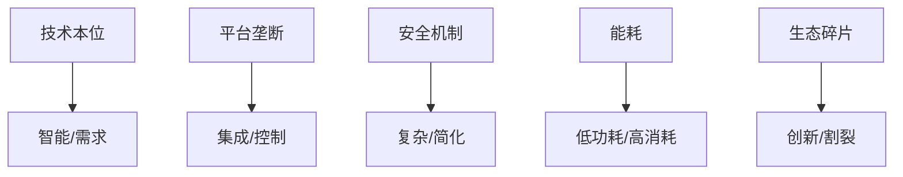

# 3.2.2 批判视角

## 1. 批判视角

- **技术本位批判**：过度追求智能化、联网化，忽视用户实际需求与体验。
- **平台垄断批判**：大型平台对生态的控制与数据垄断。
- **安全机制批判**：安全措施复杂化带来的部署与维护难题。
- **能耗与可持续性批判**：低功耗设计与实际能耗矛盾。
- **生态碎片化批判**：标准不统一导致的生态割裂。

## 2. 结构化表达

- **批判对比表**：
| 编号 | 批判主题 | 传统观点 | 批判观点 |
|------|----------|----------|----------|
| 3.2.2.1 | 技术本位 | 智能优先 | 用户体验优先 |
| 3.2.2.2 | 平台垄断 | 生态集成 | 数据控制 |
| 3.2.2.3 | 安全机制 | 严格安全 | 简化部署 |
| 3.2.2.4 | 能耗 | 低功耗 | 实际消耗高 |
| 3.2.2.5 | 生态碎片 | 多样创新 | 割裂互通难 |

- **批判关系图**：

## 3. 多表征

- 对比表、关系图、案例分析、符号化描述

## 4. 规范说明

- 内容需递归细化，支持多表征。
- 保留批判性分析、图表等。
- 如有遗漏，后续补全并说明。

> 本文件为递归细化与内容补全示范，后续可继续分解为3.2.2.1、3.2.2.2等子主题，支持持续递归完善。
