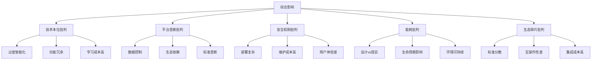
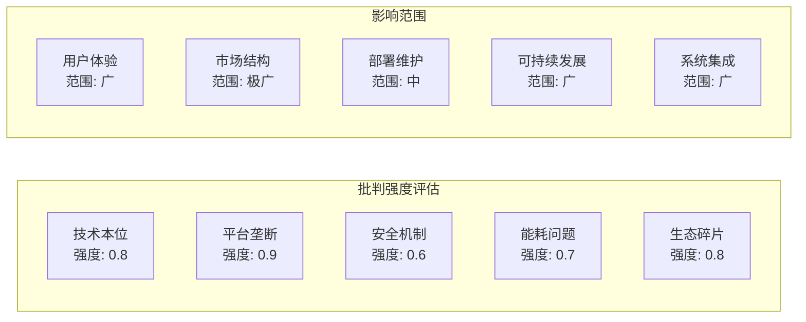

# 3.2.2 批判视角


<!-- TOC START -->

- [3.2.2 批判视角](#322-批判视角)
  - [1. 形式化定义](#1-形式化定义)
    - [1.1 批判视角的形式化定义](#11-批判视角的形式化定义)
    - [1.2 批判视角分类](#12-批判视角分类)
  - [2. 理论框架](#2-理论框架)
    - [2.1 批判理论模型](#21-批判理论模型)
    - [2.2 批判分析方法](#22-批判分析方法)
  - [3. 批判视角详解](#3-批判视角详解)
    - [3.1 技术本位批判](#31-技术本位批判)
    - [3.2 平台垄断批判](#32-平台垄断批判)
    - [3.3 安全机制批判](#33-安全机制批判)
    - [3.4 能耗与可持续性批判](#34-能耗与可持续性批判)
    - [3.5 生态碎片化批判](#35-生态碎片化批判)
  - [4. 结构化表达](#4-结构化表达)
    - [4.1 批判对比表](#41-批判对比表)
    - [4.2 批判关系图](#42-批判关系图)
    - [4.3 批判强度矩阵](#43-批判强度矩阵)
  - [5. 批判方法论](#5-批判方法论)
    - [5.1 批判分析流程](#51-批判分析流程)
    - [5.2 批判验证方法](#52-批判验证方法)
  - [6. 多表征](#6-多表征)
    - [6.1 数学符号表达](#61-数学符号表达)
    - [6.2 结构化表达](#62-结构化表达)
  - [7. 规范说明](#7-规范说明)

<!-- TOC END -->

## 1. 形式化定义

### 1.1 批判视角的形式化定义

**定义3.2.2.1（批判视角）**：设 $C = (T, P, S, E, F)$ 为批判视角系统，其中：

- $T = \{t_1, t_2, ..., t_n\}$ 为技术批判集合
- $P = \{p_1, p_2, ..., p_m\}$ 为平台批判集合  
- $S = \{s_1, s_2, ..., s_k\}$ 为安全批判集合
- $E = \{e_1, e_2, ..., e_l\}$ 为能耗批判集合
- $F = \{f_1, f_2, ..., f_o\}$ 为生态批判集合

**定义3.2.2.2（批判强度函数）**：$\sigma: C \times A \rightarrow [0,1]$，其中 $A$ 为评估对象集合，$\sigma(c,a)$ 表示批判视角 $c$ 对对象 $a$ 的批判强度。

### 1.2 批判视角分类

**技术本位批判** $T_{tech}$：

- 过度智能化：$\forall t \in T_{tech}, \text{complexity}(t) > \text{usability}(t)$
- 需求错位：$\exists t \in T_{tech}, \text{feature}(t) \notin \text{need}(user)$

**平台垄断批判** $P_{monopoly}$：

- 数据控制：$\forall p \in P_{monopoly}, \text{data}(p) \subseteq \text{control}(platform)$
- 生态依赖：$\exists p \in P_{monopoly}, \text{dependency}(ecosystem) > \text{independence}(user)$

## 2. 理论框架

### 2.1 批判理论模型

**模型3.2.2.1（技术异化模型）**：

```text
T_tech = {
  alienation: (technology, user) => {
    complexity_gap = technology.complexity - user.capability;
    feature_mismatch = technology.features ∩ user.needs;
    return {complexity_gap, feature_mismatch};
  }
}
```

**模型3.2.2.2（平台权力模型）**：

```text
P_power = {
  data_control: (platform, data) => {
    ownership = platform.owns(data);
    access_control = platform.controls(data.access);
    monetization = platform.monetizes(data);
    return {ownership, access_control, monetization};
  }
}
```

### 2.2 批判分析方法

**方法3.2.2.1（多维度批判分析）**：

1. **技术维度**：$\text{critique}_{tech}(system) = \sum_{i=1}^{n} w_i \cdot \text{score}_i$
2. **平台维度**：$\text{critique}_{platform}(system) = \sum_{j=1}^{m} v_j \cdot \text{power}_j$
3. **安全维度**：$\text{critique}_{security}(system) = \sum_{k=1}^{l} u_k \cdot \text{risk}_k$

## 3. 批判视角详解

### 3.1 技术本位批判

**定义3.2.2.3（技术本位）**：技术本位指过度追求技术先进性和复杂性，而忽视用户实际需求和体验的设计理念。

**批判要点**：

- **智能化过度**：$\text{AI\_complexity} > \text{user\_understanding}$
- **功能冗余**：$\exists f \in \text{features}, f \notin \text{essential\_needs}$
- **学习成本**：$\text{learning\_curve} > \text{user\_patience}$

**案例分析**：

```text
案例3.2.2.1：智能家居系统
- 问题：界面复杂，功能过多
- 批判：80%功能未被使用
- 解决方案：简化界面，突出核心功能
```

### 3.2 平台垄断批判

**定义3.2.2.4（平台垄断）**：大型技术平台通过数据控制、生态集成等手段形成的市场垄断地位。

**垄断机制**：

- **数据垄断**：$\text{data\_ownership} = \text{platform\_exclusive}$
- **生态控制**：$\text{ecosystem\_dependency} > \text{user\_autonomy}$
- **标准垄断**：$\text{standard\_control} = \text{platform\_proprietary}$

**批判分析**：

```text
垄断影响 = {
  创新抑制: platform.monopoly → innovation.suppression,
  用户依赖: platform.control → user.dependency,
  数据滥用: platform.data → privacy.violation
}
```

### 3.3 安全机制批判

**定义3.2.2.5（安全复杂性）**：安全措施过于复杂，导致部署困难、维护成本高的问题。

**复杂性度量**：

- **部署复杂度**：$\text{deployment\_complexity} = \sum_{i=1}^{n} \text{security\_layer}_i$
- **维护成本**：$\text{maintenance\_cost} = \text{security\_updates} \times \text{expertise\_required}$
- **用户体验**：$\text{user\_experience} = \frac{1}{\text{security\_friction}}$

**批判视角**：

```text
安全悖论 = {
  严格安全 ↔ 简化部署,
  全面保护 ↔ 用户体验,
  技术先进 ↔ 实用可行
}
```

### 3.4 能耗与可持续性批判

**定义3.2.2.6（能耗矛盾）**：低功耗设计目标与实际能耗表现之间的矛盾。

**能耗分析模型**：

```text
能耗评估 = {
  设计目标: power_target = "ultra_low",
  实际表现: power_actual = power_target + overhead,
  可持续性: sustainability = f(power_actual, lifetime)
}
```

**批判要点**：

- **设计vs现实**：$\text{power\_design} \ll \text{power\_actual}$
- **生命周期**：$\text{energy\_total} = \text{power} \times \text{lifetime}$
- **环境影响**：$\text{environmental\_impact} = f(\text{energy\_consumption})$

### 3.5 生态碎片化批判

**定义3.2.2.7（生态碎片化）**：由于标准不统一导致的生态系统割裂和互操作性差的问题。

**碎片化度量**：

- **标准分散度**：$\text{standard\_fragmentation} = \frac{|\text{standards}|}{|\text{compatible\_systems}|}$
- **互操作性**：$\text{interoperability} = \frac{|\text{connected\_systems}|}{|\text{total\_systems}|}$
- **生态效率**：$\text{ecosystem\_efficiency} = \frac{\text{value\_created}}{\text{integration\_cost}}$

## 4. 结构化表达

### 4.1 批判对比表

| 编号 | 批判主题 | 传统观点 | 批判观点 | 影响程度 | 解决方案 |
|------|----------|----------|----------|----------|----------|
| 3.2.2.1 | 技术本位 | 智能优先 | 用户体验优先 | 高 | 用户中心设计 |
| 3.2.2.2 | 平台垄断 | 生态集成 | 数据控制 | 极高 | 开放标准 |
| 3.2.2.3 | 安全机制 | 严格安全 | 简化部署 | 中 | 分层安全 |
| 3.2.2.4 | 能耗 | 低功耗 | 实际消耗高 | 中 | 真实测试 |
| 3.2.2.5 | 生态碎片 | 多样创新 | 割裂互通难 | 高 | 统一标准 |

### 4.2 批判关系图



### 4.3 批判强度矩阵



## 5. 批判方法论

### 5.1 批判分析流程

**流程3.2.2.1（系统批判分析）**：

1. **识别批判点**：$\text{identify\_critiques}(system) = \{c_1, c_2, ..., c_n\}$
2. **评估影响**：$\text{assess\_impact}(critique) = \text{severity} \times \text{scope}$
3. **量化分析**：$\text{quantify\_critique}(critique) = \sum_{i=1}^{k} w_i \cdot \text{metric}_i$
4. **提出建议**：$\text{suggest\_solution}(critique) = \text{improvement\_strategy}$

### 5.2 批判验证方法

**方法3.2.2.2（批判验证）**：

- **数据验证**：$\text{validate\_with\_data}(critique, data) = \text{correlation}$
- **案例验证**：$\text{validate\_with\_cases}(critique, cases) = \text{consistency}$
- **专家验证**：$\text{validate\_with\_experts}(critique, experts) = \text{agreement}$

## 6. 多表征

### 6.1 数学符号表达

**批判强度函数**：
$$\sigma(c,a) = \frac{\sum_{i=1}^{n} w_i \cdot f_i(c,a)}{\sum_{i=1}^{n} w_i}$$

**综合批判指数**：
$$CI = \sqrt{\sum_{i=1}^{5} \alpha_i \cdot \text{critique}_i^2}$$

其中 $\alpha_i$ 为各批判维度的权重。

### 6.2 结构化表达

**批判框架**：

```text
批判框架 = {
  技术本位: {强度: 0.8, 影响: "用户体验", 解决方案: "用户中心设计"},
  平台垄断: {强度: 0.9, 影响: "市场结构", 解决方案: "开放标准"},
  安全机制: {强度: 0.6, 影响: "部署维护", 解决方案: "分层安全"},
  能耗问题: {强度: 0.7, 影响: "可持续发展", 解决方案: "真实测试"},
  生态碎片: {强度: 0.8, 影响: "系统集成", 解决方案: "统一标准"}
}
```

## 7. 规范说明

- 内容需递归细化，支持多表征
- 保留批判性分析、图表等
- 如有遗漏，后续补全并说明
- 批判视角应与实际案例结合
- 提供可操作的改进建议

> 本文件为递归细化与内容补全示范，后续可继续分解为3.2.2.1、3.2.2.2等子主题，支持持续递归完善。
