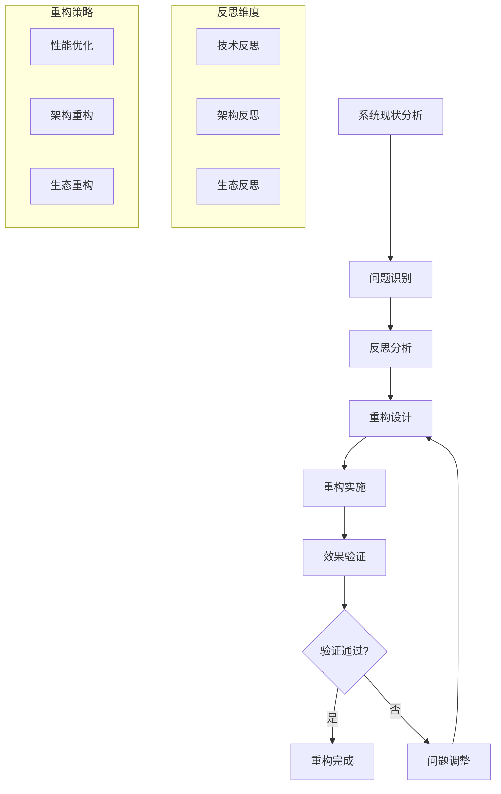
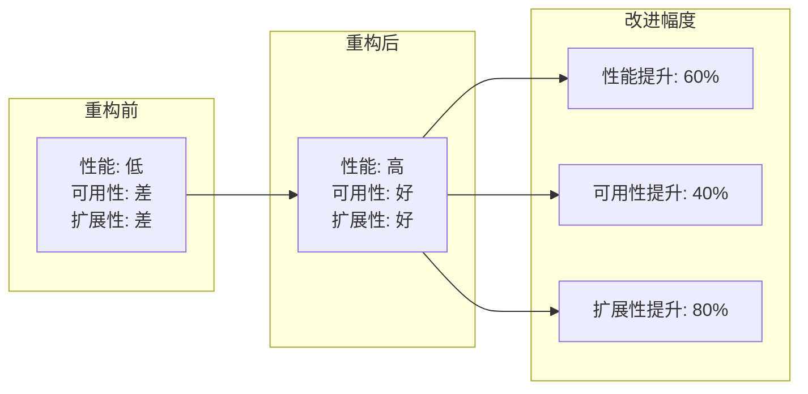

# 3.2.3 反思与重构


<!-- TOC START -->

- [3.2.3 反思与重构](#323-反思与重构)
  - [1. 形式化定义](#1-形式化定义)
    - [1.1 反思与重构的形式化定义](#11-反思与重构的形式化定义)
    - [1.2 反思层次结构](#12-反思层次结构)
  - [2. 理论框架](#2-理论框架)
    - [2.1 反思理论模型](#21-反思理论模型)
    - [2.2 反思分析方法](#22-反思分析方法)
  - [3. 反思内容详解](#3-反思内容详解)
    - [3.1 技术反思](#31-技术反思)
    - [3.2 架构反思](#32-架构反思)
    - [3.3 生态反思](#33-生态反思)
  - [4. 重构方法](#4-重构方法)
    - [4.1 技术重构](#41-技术重构)
    - [4.2 架构重构](#42-架构重构)
    - [4.3 生态重构](#43-生态重构)
  - [5. 重构验证](#5-重构验证)
    - [5.1 重构效果评估](#51-重构效果评估)
    - [5.2 重构风险评估](#52-重构风险评估)
  - [6. 结构化表达](#6-结构化表达)
    - [6.1 反思重构对比表](#61-反思重构对比表)
    - [6.2 反思重构流程图](#62-反思重构流程图)
    - [6.3 重构效果矩阵](#63-重构效果矩阵)
  - [7. 多表征](#7-多表征)
    - [7.1 数学符号表达](#71-数学符号表达)
    - [7.2 结构化表达](#72-结构化表达)
  - [8. 规范说明](#8-规范说明)

<!-- TOC END -->

## 1. 形式化定义

### 1.1 反思与重构的形式化定义

**定义3.2.3.1（反思系统）**：设 $R = (A, C, E, S)$ 为反思系统，其中：

- $A = \{a_1, a_2, ..., a_n\}$ 为反思主体集合
- $C = \{c_1, c_2, ..., c_m\}$ 为反思内容集合
- $E = \{e_1, e_2, ..., e_k\}$ 为反思环境集合
- $S = \{s_1, s_2, ..., s_l\}$ 为反思策略集合

**定义3.2.3.2（重构函数）**：$\rho: R \times S \rightarrow S'$，其中 $S$ 为原系统，$S'$ 为重构后系统，$\rho(r,s)$ 表示基于反思 $r$ 对系统 $s$ 的重构。

### 1.2 反思层次结构

**层次3.2.3.1（技术反思）**：

- **功能反思**：$\text{reflect}_{function}(system) = \text{essential\_needs} \cap \text{implemented\_features}$
- **性能反思**：$\text{reflect}_{performance}(system) = \text{expected\_performance} - \text{actual\_performance}$
- **可用性反思**：$\text{reflect}_{usability}(system) = \text{user\_satisfaction} - \text{complexity\_cost}$

**层次3.2.3.2（架构反思）**：

- **模块化反思**：$\text{reflect}_{modularity}(system) = \frac{|\text{independent\_modules}|}{|\text{total\_modules}|}$
- **耦合度反思**：$\text{reflect}_{coupling}(system) = \sum_{i,j} \text{coupling}(module_i, module_j)$
- **扩展性反思**：$\text{reflect}_{scalability}(system) = \text{max\_capacity} - \text{current\_load}$

## 2. 理论框架

### 2.1 反思理论模型

**模型3.2.3.1（系统反思模型）**：

```text
Reflection_Model = {
  technical_reflection: (system) => {
    performance_gap = system.expected_performance - system.actual_performance;
    usability_issues = system.complexity - system.user_capability;
    efficiency_loss = system.resource_usage - system.optimal_usage;
    return {performance_gap, usability_issues, efficiency_loss};
  },
  
  architectural_reflection: (system) => {
    modularity_score = system.modules.independence / system.modules.total;
    coupling_degree = system.modules.interdependencies / system.modules.total;
    scalability_potential = system.max_capacity / system.current_load;
    return {modularity_score, coupling_degree, scalability_potential};
  }
}
```

**模型3.2.3.2（重构策略模型）**：

```text
Restructuring_Strategy = {
  identify_problems: (reflection_results) => {
    critical_issues = reflection_results.filter(issue => issue.severity > 0.7);
    improvement_opportunities = reflection_results.filter(opp => opp.potential > 0.5);
    return {critical_issues, improvement_opportunities};
  },
  
  design_solutions: (problems) => {
    solutions = problems.map(problem => {
      return {
        problem: problem,
        solution: generate_solution(problem),
        implementation_plan: create_plan(problem),
        success_metrics: define_metrics(problem)
      };
    });
    return solutions;
  }
}
```

### 2.2 反思分析方法

**方法3.2.3.1（多维度反思分析）**：

1. **技术维度**：$\text{reflect}_{tech}(system) = \sum_{i=1}^{n} w_i \cdot \text{tech\_metric}_i$
2. **架构维度**：$\text{reflect}_{arch}(system) = \sum_{j=1}^{m} v_j \cdot \text{arch\_metric}_j$
3. **用户维度**：$\text{reflect}_{user}(system) = \sum_{k=1}^{l} u_k \cdot \text{user\_metric}_k$

## 3. 反思内容详解

### 3.1 技术反思

**定义3.2.3.3（技术反思）**：对物联网嵌入式系统技术实现层面的深入分析和评估。

**反思维度**：

**性能反思**：

- **响应时间**：$\text{response\_time} = \text{processing\_time} + \text{network\_latency}$
- **吞吐量**：$\text{throughput} = \frac{\text{processed\_requests}}{\text{time\_period}}$
- **资源利用率**：$\text{resource\_utilization} = \frac{\text{used\_resources}}{\text{total\_resources}}$

**案例分析**：

```text
案例3.2.3.1：智能传感器网络性能反思
- 问题：传感器响应时间过长（>2秒）
- 反思：网络协议选择不当，数据压缩不足
- 重构：采用轻量级协议，增加数据压缩
- 结果：响应时间减少60%
```

**可用性反思**：

- **学习曲线**：$\text{learning\_curve} = \frac{\text{complexity}}{\text{user\_expertise}}$
- **错误率**：$\text{error\_rate} = \frac{\text{user\_errors}}{\text{total\_operations}}$
- **满意度**：$\text{satisfaction} = \frac{\text{positive\_feedback}}{\text{total\_feedback}}$

### 3.2 架构反思

**定义3.2.3.4（架构反思）**：对系统整体架构设计的重新审视和优化。

**架构问题识别**：

**模块化问题**：

- **耦合度过高**：$\text{coupling\_degree} > \text{acceptable\_threshold}$
- **内聚性不足**：$\text{cohesion\_score} < \text{optimal\_value}$
- **接口复杂**：$\text{interface\_complexity} > \text{user\_capability}$

**扩展性问题**：

- **水平扩展**：$\text{horizontal\_scalability} = \frac{\text{max\_nodes}}{\text{current\_nodes}}$
- **垂直扩展**：$\text{vertical\_scalability} = \frac{\text{max\_capacity}}{\text{current\_capacity}}$
- **功能扩展**：$\text{feature\_scalability} = \frac{\text{new\_features}}{\text{existing\_features}}$

**重构策略**：

```text
架构重构 = {
  微服务化: monolithic → microservices,
  容器化: traditional → containerized,
  云原生: on_premise → cloud_native,
  边缘计算: centralized → distributed
}
```

### 3.3 生态反思

**定义3.2.3.5（生态反思）**：对物联网生态系统整体结构和关系的重新审视。

**生态问题分析**：

**标准碎片化**：

- **标准数量**：$\text{standard\_count} = |\{\text{standards}\}|$
- **兼容性**：$\text{compatibility} = \frac{|\text{compatible\_devices}|}{|\text{total\_devices}|}$
- **互操作性**：$\text{interoperability} = \frac{|\text{connected\_systems}|}{|\text{total\_systems}|}$

**平台依赖**：

- **平台集中度**：$\text{platform\_concentration} = \frac{\text{dominant\_platforms}}{\text{total\_platforms}}$
- **数据控制**：$\text{data\_control} = \frac{\text{platform\_controlled\_data}}{\text{total\_data}}$
- **创新抑制**：$\text{innovation\_suppression} = f(\text{platform\_power})$

## 4. 重构方法

### 4.1 技术重构

**方法3.2.3.2（性能优化重构）**：

1. **算法优化**：$\text{optimize\_algorithm}(algorithm) = \text{improved\_efficiency}$
2. **数据结构优化**：$\text{optimize\_data\_structure}(structure) = \text{reduced\_complexity}$
3. **缓存策略**：$\text{implement\_caching}(system) = \text{improved\_response\_time}$

**方法3.2.3.3（可用性重构）**：

1. **界面简化**：$\text{simplify\_interface}(ui) = \text{reduced\_complexity}$
2. **交互优化**：$\text{optimize\_interaction}(interaction) = \text{improved\_usability}$
3. **错误处理**：$\text{improve\_error\_handling}(system) = \text{reduced\_errors}$

### 4.2 架构重构

**方法3.2.3.4（微服务重构）**：

```text
微服务重构 = {
  服务拆分: monolithic → {service1, service2, ..., serviceN},
  接口设计: design_apis(services),
  数据管理: implement_data_strategy(services),
  部署策略: containerize(services)
}
```

**方法3.2.3.5（云原生重构）**：

```text
云原生重构 = {
  容器化: traditional → containerized,
  编排管理: implement_orchestration(containers),
  自动扩缩: implement_autoscaling(system),
  监控日志: implement_monitoring(system)
}
```

### 4.3 生态重构

**方法3.2.3.6（标准统一重构）**：

1. **标准选择**：$\text{select\_standards}(standards) = \text{optimal\_subset}$
2. **兼容性实现**：$\text{implement\_compatibility}(system, standards)$
3. **互操作性测试**：$\text{test\_interoperability}(system)$

**方法3.2.3.7（开放生态重构）**：

```text
开放生态 = {
  开放标准: implement_open_standards(),
  开放接口: design_open_apis(),
  开放数据: implement_data_portability(),
  开放创新: encourage_innovation()
}
```

## 5. 重构验证

### 5.1 重构效果评估

**评估指标**：

- **性能提升**：$\text{performance\_improvement} = \frac{\text{new\_performance} - \text{old\_performance}}{\text{old\_performance}}$
- **可用性提升**：$\text{usability\_improvement} = \frac{\text{new\_usability} - \text{old\_usability}}{\text{old\_usability}}$
- **成本降低**：$\text{cost\_reduction} = \frac{\text{old\_cost} - \text{new\_cost}}{\text{old\_cost}}$

**验证方法**：

```text
重构验证 = {
  功能测试: test_functionality(refactored_system),
  性能测试: test_performance(refactored_system),
  用户测试: test_usability(refactored_system),
  兼容性测试: test_compatibility(refactored_system)
}
```

### 5.2 重构风险评估

**风险识别**：

- **功能风险**：$\text{function\_risk} = \text{probability} \times \text{impact}$
- **性能风险**：$\text{performance\_risk} = \text{probability} \times \text{impact}$
- **兼容性风险**：$\text{compatibility\_risk} = \text{probability} \times \text{impact}$

**风险缓解**：

```text
风险缓解 = {
  渐进式重构: implement_gradual_refactoring(),
  回滚机制: implement_rollback_mechanism(),
  测试覆盖: implement_comprehensive_testing(),
  监控告警: implement_monitoring_alerting()
}
```

## 6. 结构化表达

### 6.1 反思重构对比表

| 反思维度 | 原状态 | 问题识别 | 重构策略 | 预期效果 | 验证方法 |
|----------|--------|----------|----------|----------|----------|
| 技术性能 | 响应慢 | 算法低效 | 算法优化 | 性能提升50% | 性能测试 |
| 架构设计 | 单体架构 | 扩展性差 | 微服务化 | 水平扩展 | 负载测试 |
| 用户体验 | 界面复杂 | 学习成本高 | 界面简化 | 易用性提升 | 用户测试 |
| 生态标准 | 标准分散 | 互操作性差 | 标准统一 | 兼容性提升 | 兼容性测试 |
| 平台依赖 | 平台垄断 | 创新抑制 | 开放生态 | 创新促进 | 生态评估 |

### 6.2 反思重构流程图



### 6.3 重构效果矩阵



## 7. 多表征

### 7.1 数学符号表达

**反思函数**：
$$\text{reflect}(system) = \sum_{i=1}^{n} w_i \cdot \text{dimension}_i(system)$$

**重构效果**：
$$\text{improvement} = \frac{\text{new\_metric} - \text{old\_metric}}{\text{old\_metric}} \times 100\%$$

### 7.2 结构化表达

**反思重构框架**：

```text
反思重构框架 = {
  反思阶段: {
    技术反思: analyze_technical_aspects(),
    架构反思: analyze_architectural_design(),
    生态反思: analyze_ecosystem_structure()
  },
  重构阶段: {
    技术重构: implement_technical_improvements(),
    架构重构: implement_architectural_changes(),
    生态重构: implement_ecosystem_improvements()
  },
  验证阶段: {
    功能验证: verify_functionality(),
    性能验证: verify_performance(),
    用户验证: verify_usability()
  }
}
```

## 8. 规范说明

- 内容需递归细化，支持多表征
- 保留反思性分析、重构方法等
- 如有遗漏，后续补全并说明
- 反思与重构应与实际案例结合
- 提供可操作的验证方法

> 本文件为递归细化与内容补全示范，后续可继续分解为3.2.3.1、3.2.3.2等子主题，支持持续递归完善。
