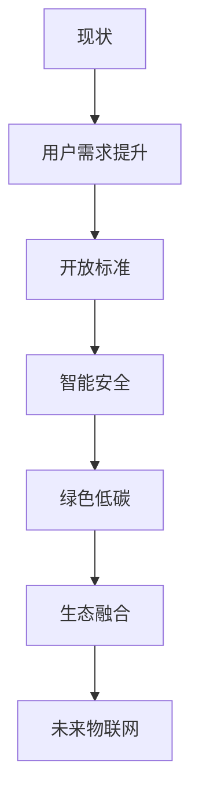

# 3.2.3 反思与重构

## 1. 反思内容

- **用户需求与智能化的平衡**：系统设计需兼顾智能化与实际应用场景。
- **开放生态与平台控制的权衡**：推动标准化与开放，减少平台垄断。
- **安全与易用的协同**：安全机制应简化部署与维护。
- **能耗优化与可持续发展**：结合低功耗设计与实际能耗监控。
- **生态互通与标准统一**：推动协议、平台标准统一，促进生态融合。

## 2. 重构方向

- **以用户为中心**：关注实际需求与体验，提升系统可用性。
- **开放标准与互通**：推动协议、平台开放，促进多方协作。
- **智能安全机制**：引入AI与自动化，提升安全性与便捷性。
- **绿色低碳设计**：优化能耗，支持可持续发展。
- **生态融合发展**：打破壁垒，构建多元协同生态。

## 3. 结构化表达

- **反思路径图**：

- **对比表**：
| 编号 | 现状 | 重构方向 |
|------|------|----------|
| 3.2.3.1 | 技术本位 | 用户中心 |
| 3.2.3.2 | 平台垄断 | 开放标准 |
| 3.2.3.3 | 复杂安全 | 智能简化 |
| 3.2.3.4 | 高能耗 | 绿色低碳 |
| 3.2.3.5 | 生态割裂 | 融合发展 |

## 4. 多表征

- 路径图、对比表、案例分析、符号化描述

## 5. 规范说明

- 内容需递归细化，支持多表征。
- 保留批判性分析、图表等。
- 如有遗漏，后续补全并说明。

> 本文件为递归细化与内容补全示范，后续可继续分解为3.2.3.1、3.2.3.2等子主题，支持持续递归完善。
