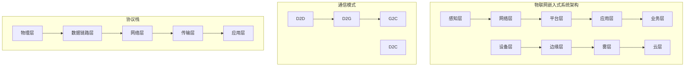
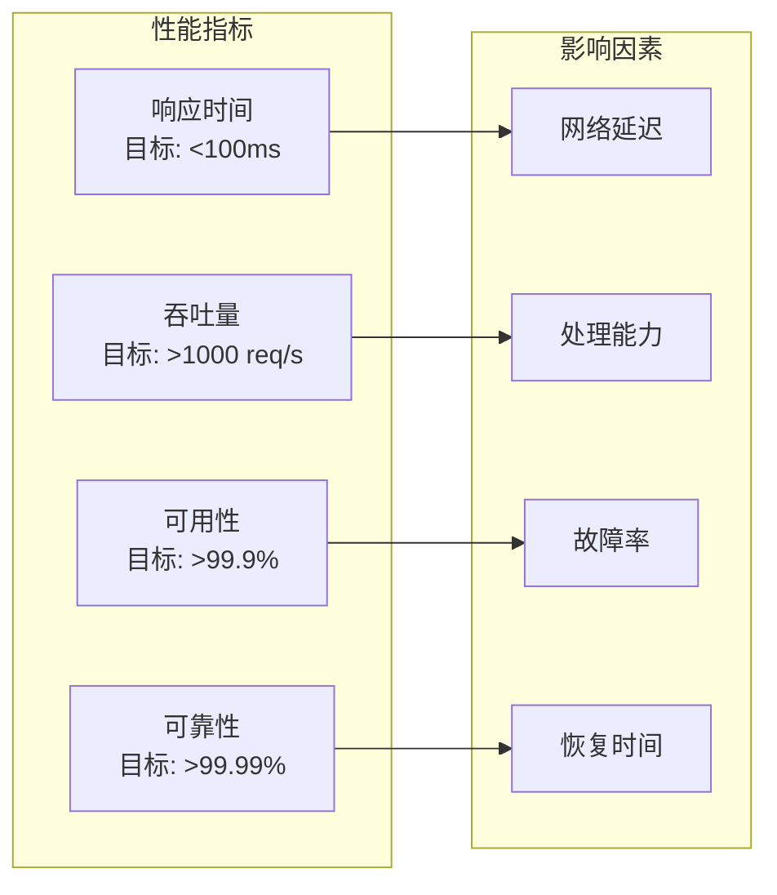

# 3.3.1 形式化定义

## 1. 基本形式化定义

### 1.1 物联网嵌入式系统形式化定义

**定义3.3.1.1（物联网嵌入式系统）**：设 $IoT\_ES = (D, N, P, A, S)$ 为物联网嵌入式系统，其中：

- $D = \{d_1, d_2, ..., d_n\}$ 为设备集合
- $N = \{n_1, n_2, ..., n_m\}$ 为网络集合
- $P = \{p_1, p_2, ..., p_k\}$ 为协议集合
- $A = \{a_1, a_2, ..., a_l\}$ 为应用集合
- $S = \{s_1, s_2, ..., s_o\}$ 为服务集合

**定义3.3.1.2（系统状态）**：$\text{State}(IoT\_ES) = \{(d_i, s_i) | d_i \in D, s_i \in S_i\}$，其中 $S_i$ 为设备 $d_i$ 的状态空间。

### 1.2 设备形式化定义

**定义3.3.1.3（物联网设备）**：设 $d = (h, s, c, p)$ 为物联网设备，其中：

- $h$ 为硬件配置：$h = (cpu, memory, storage, sensors, actuators)$
- $s$ 为软件栈：$s = (os, middleware, application, firmware)$
- $c$ 为通信能力：$c = (protocols, bandwidth, range, power)$
- $p$ 为处理能力：$p = (computation, storage, energy, security)$

**定义3.3.1.4（设备类型分类）**：

- **感知设备**：$\text{Sensor} = \{d | \text{has\_sensor}(d) = \text{true}\}$
- **执行设备**：$\text{Actuator} = \{d | \text{has\_actuator}(d) = \text{true}\}$
- **网关设备**：$\text{Gateway} = \{d | \text{is\_gateway}(d) = \text{true}\}$
- **边缘设备**：$\text{Edge} = \{d | \text{is\_edge}(d) = \text{true}\}$

### 1.3 网络形式化定义

**定义3.3.1.5（物联网网络）**：设 $n = (t, p, t, s)$ 为物联网网络，其中：

- $t$ 为网络拓扑：$t \in \{\text{star}, \text{mesh}, \text{tree}, \text{cluster}\}$
- $p$ 为协议栈：$p = (physical, data\_link, network, transport, application)$
- $t$ 为传输技术：$t \in \{\text{WiFi}, \text{Bluetooth}, \text{ZigBee}, \text{LoRa}, \text{NB-IoT}\}$
- $s$ 为安全机制：$s = (authentication, encryption, access\_control, integrity)$

**定义3.3.1.6（网络拓扑函数）**：
$$\text{Topology}(N) = \{(n_i, n_j) | n_i, n_j \in N, \text{connected}(n_i, n_j) = \text{true}\}$$

## 2. 系统架构形式化定义

### 2.1 分层架构定义

**定义3.3.1.7（物联网分层架构）**：设 $L = \{L_1, L_2, L_3, L_4, L_5\}$ 为物联网分层架构，其中：

- $L_1$ 为感知层：$L_1 = \{\text{sensors}, \text{actuators}, \text{rfid}\}$
- $L_2$ 为网络层：$L_2 = \{\text{gateways}, \text{routers}, \text{switches}\}$
- $L_3$ 为平台层：$L_3 = \{\text{platforms}, \text{middleware}, \text{apis}\}$
- $L_4$ 为应用层：$L_4 = \{\text{applications}, \text{services}, \text{interfaces}\}$
- $L_5$ 为业务层：$L_5 = \{\text{business\_logic}, \text{analytics}, \text{intelligence}\}$

**定义3.3.1.8（层间关系）**：
$$\text{Layer\_Relation} = \{(L_i, L_j) | i < j, \text{provides\_service}(L_i, L_j) = \text{true}\}$$

### 2.2 边缘计算架构定义

**定义3.3.1.9（边缘计算架构）**：设 $EC = (E, C, F)$ 为边缘计算架构，其中：

- $E = \{e_1, e_2, ..., e_n\}$ 为边缘节点集合
- $C = \{c_1, c_2, ..., c_m\}$ 为云节点集合
- $F = \{f_1, f_2, ..., f_k\}$ 为雾节点集合

**定义3.3.1.10（计算层次）**：

- **设备层**：$\text{Device\_Layer} = \{d | \text{compute\_capability}(d) = \text{minimal}\}$
- **边缘层**：$\text{Edge\_Layer} = \{e | \text{compute\_capability}(e) = \text{moderate}\}$
- **雾层**：$\text{Fog\_Layer} = \{f | \text{compute\_capability}(f) = \text{high}\}$
- **云层**：$\text{Cloud\_Layer} = \{c | \text{compute\_capability}(c) = \text{maximum}\}$

## 3. 协议与通信形式化定义

### 3.1 协议栈定义

**定义3.3.1.11（物联网协议栈）**：设 $PS = (PHY, DLL, NET, TRANS, APP)$ 为协议栈，其中：

- $PHY$ 为物理层协议：$PHY \in \{\text{IEEE 802.15.4}, \text{IEEE 802.11}, \text{Bluetooth}\}$
- $DLL$ 为数据链路层协议：$DLL \in \{\text{ZigBee}, \text{6LoWPAN}, \text{LoRaWAN}\}$
- $NET$ 为网络层协议：$NET \in \{\text{IPv6}, \text{RPL}, \text{6LoWPAN}\}$
- $TRANS$ 为传输层协议：$TRANS \in \{\text{TCP}, \text{UDP}, \text{CoAP}, \text{MQTT}\}$
- $APP$ 为应用层协议：$APP \in \{\text{HTTP}, \text{CoAP}, \text{MQTT}, \text{AMQP}\}$

**定义3.3.1.12（协议兼容性）**：
$$\text{Protocol\_Compatibility}(p_1, p_2) = \begin{cases}
\text{true} & \text{if } p_1 \text{ and } p_2 \text{ are compatible} \\
\text{false} & \text{otherwise}
\end{cases}$$

### 3.2 通信模式定义

**定义3.3.1.13（通信模式）**：
- **设备到设备**：$\text{D2D} = \{(d_i, d_j) | d_i, d_j \in D, i \neq j\}$
- **设备到网关**：$\text{D2G} = \{(d, g) | d \in D, g \in \text{Gateway}\}$
- **设备到云**：$\text{D2C} = \{(d, c) | d \in D, c \in \text{Cloud}\}$
- **网关到云**：$\text{G2C} = \{(g, c) | g \in \text{Gateway}, c \in \text{Cloud}\}$

**定义3.3.1.14（通信质量）**：
$$\text{QoS}(communication) = \text{latency} \times w_1 + \text{reliability} \times w_2 + \text{bandwidth} \times w_3$$

## 4. 数据处理形式化定义

### 4.1 数据流定义

**定义3.3.1.15（数据流）**：设 $DF = (S, P, T, D)$ 为数据流，其中：
- $S$ 为数据源：$S = \{s_1, s_2, ..., s_n\}$
- $P$ 为处理节点：$P = \{p_1, p_2, ..., p_m\}$
- $T$ 为传输路径：$T = \{t_1, t_2, ..., t_k\}$
- $D$ 为数据目标：$D = \{d_1, d_2, ..., d_l\}$

**定义3.3.1.16（数据处理函数）**：
$$\text{Process}(data, operation) = \begin{cases}
\text{filter}(data) & \text{if } operation = \text{filter} \\
\text{aggregate}(data) & \text{if } operation = \text{aggregate} \\
\text{transform}(data) & \text{if } operation = \text{transform} \\
\text{analyze}(data) & \text{if } operation = \text{analyze}
\end{cases}$$

### 4.2 数据存储定义

**定义3.3.1.17（存储层次）**：
- **本地存储**：$\text{Local\_Storage} = \{s | \text{location}(s) = \text{device}\}$
- **边缘存储**：$\text{Edge\_Storage} = \{s | \text{location}(s) = \text{edge}\}$
- **云存储**：$\text{Cloud\_Storage} = \{s | \text{location}(s) = \text{cloud}\}$

**定义3.3.1.18（存储策略）**：
$$\text{Storage\_Strategy}(data) = \arg\min_{s \in S} \text{cost}(s) + \text{latency}(s) + \text{reliability}(s)$$

## 5. 安全与隐私形式化定义

### 5.1 安全机制定义

**定义3.3.1.19（安全机制）**：设 $SM = (A, E, AC, I)$ 为安全机制，其中：
- $A$ 为认证机制：$A = \{\text{password}, \text{certificate}, \text{biometric}\}$
- $E$ 为加密机制：$E = \{\text{symmetric}, \text{asymmetric}, \text{hash}\}$
- $AC$ 为访问控制：$AC = \{\text{RBAC}, \text{ABAC}, \text{IBAC}\}$
- $I$ 为完整性保护：$I = \{\text{checksum}, \text{signature}, \text{hash}\}$

**定义3.3.1.20（安全等级）**：
$$\text{Security\_Level}(system) = \frac{\sum_{i=1}^{n} w_i \cdot \text{security\_metric}_i}{\sum_{i=1}^{n} w_i}$$

### 5.2 隐私保护定义

**定义3.3.1.21（隐私保护）**：设 $PP = (A, M, C)$ 为隐私保护机制，其中：
- $A$ 为匿名化：$A = \{\text{randomization}, \text{generalization}, \text{perturbation}\}$
- $M$ 为最小化：$M = \{\text{data\_minimization}, \text{purpose\_limitation}\}$
- $C$ 为控制：$C = \{\text{consent}, \text{access}, \text{deletion}\}$

## 6. 性能与可靠性形式化定义

### 6.1 性能指标定义

**定义3.3.1.22（性能指标）**：
- **响应时间**：$\text{Response\_Time} = \text{processing\_time} + \text{network\_latency}$
- **吞吐量**：$\text{Throughput} = \frac{\text{processed\_requests}}{\text{time\_period}}$
- **可用性**：$\text{Availability} = \frac{\text{uptime}}{\text{total\_time}}$
- **可靠性**：$\text{Reliability} = \frac{\text{successful\_operations}}{\text{total\_operations}}$

**定义3.3.1.23（性能函数）**：
$$\text{Performance}(system) = \alpha \cdot \text{response\_time} + \beta \cdot \text{throughput} + \gamma \cdot \text{availability}$$

### 6.2 可靠性定义

**定义3.3.1.24（可靠性模型）**：设 $RM = (F, R, M)$ 为可靠性模型，其中：
- $F$ 为故障模式：$F = \{f_1, f_2, ..., f_n\}$
- $R$ 为恢复机制：$R = \{r_1, r_2, ..., r_m\}$
- $M$ 为监控机制：$M = \{m_1, m_2, ..., m_k\}$

**定义3.3.1.25（故障率函数）**：
$$\lambda(t) = \frac{dF(t)}{dt} \cdot \frac{1}{1 - F(t)}$$

## 7. 结构化表达

### 7.1 系统分类表

| 分类维度 | 类别 | 形式化定义 | 特征描述 |
|----------|------|------------|----------|
| 设备类型 | 感知设备 | $\text{Sensor} = \{d | \text{has\_sensor}(d)\}$ | 数据采集能力 |
| 设备类型 | 执行设备 | $\text{Actuator} = \{d | \text{has\_actuator}(d)\}$ | 控制执行能力 |
| 设备类型 | 网关设备 | $\text{Gateway} = \{d | \text{is\_gateway}(d)\}$ | 协议转换能力 |
| 网络拓扑 | 星型网络 | $\text{Star} = \{(c, d_i) | i = 1,2,...,n\}$ | 中心化结构 |
| 网络拓扑 | 网状网络 | $\text{Mesh} = \{(d_i, d_j) | i,j = 1,2,...,n\}$ | 分布式结构 |
| 计算层次 | 设备层 | $\text{Device\_Layer} = \{d | \text{compute}(d) = \text{minimal}\}$ | 本地处理 |
| 计算层次 | 边缘层 | $\text{Edge\_Layer} = \{e | \text{compute}(e) = \text{moderate}\}$ | 就近处理 |
| 计算层次 | 云层 | $\text{Cloud\_Layer} = \{c | \text{compute}(c) = \text{maximum}\}$ | 集中处理 |

### 7.2 架构关系图



### 7.3 性能指标矩阵



## 8. 多表征

### 8.1 数学符号表达

**系统状态函数**：
$$\text{State}(t) = \text{State}(t-1) + \Delta\text{State}(t)$$

**性能优化函数**：
$$\text{Optimize}(system) = \arg\min_{x} \sum_{i=1}^{n} w_i \cdot \text{cost}_i(x)$$

### 8.2 结构化表达

**物联网嵌入式系统框架**：
```
IoT_Embedded_System = {
  设备层: {
    感知设备: sensors,
    执行设备: actuators,
    网关设备: gateways
  },
  网络层: {
    通信协议: protocols,
    网络拓扑: topology,
    传输技术: technologies
  },
  平台层: {
    中间件: middleware,
    应用接口: apis,
    数据管理: data_management
  },
  应用层: {
    业务应用: applications,
    服务接口: services,
    用户界面: interfaces
  },
  安全层: {
    认证授权: authentication,
    数据加密: encryption,
    隐私保护: privacy
  }
}
```

## 9. 规范说明

- 内容需递归细化，支持多表征
- 保留形式化定义、数学符号等
- 如有遗漏，后续补全并说明
- 形式化定义应与实际应用结合
- 提供可验证的数学模型

> 本文件为递归细化与内容补全示范，后续可继续分解为3.3.1.1、3.3.1.2等子主题，支持持续递归完善。
