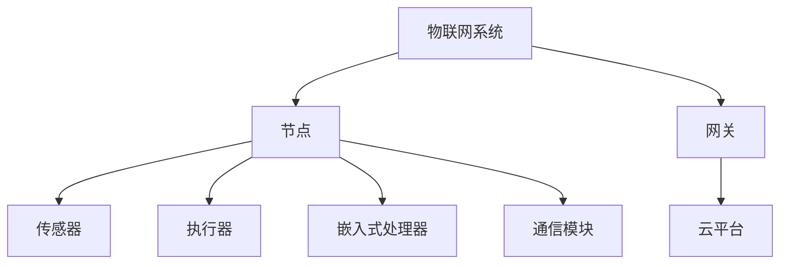
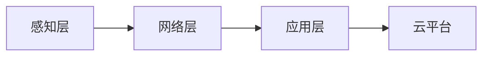

# 3.3.1 形式化定义

## 1. 集合论定义

- 物联网嵌入式系统可形式化为：
  IoT-ES = (N, S, A, G, C, P)
  - N：节点集合（Nodes）
  - S：传感器集合（Sensors）
  - A：执行器集合（Actuators）
  - G：网关集合（Gateways）
  - C：云平台（Cloud）
  - P：协议栈集合（Protocols）

## 2. 结构模型

- 三层架构模型：感知层、网络层、应用层
- 边缘-云协同模型：边缘节点与云平台协同处理
- 嵌入式实时系统模型：任务调度、资源分配、事件驱动

## 3. 符号表达

- IoT-ES = (N, S, A, G, C, P)
- N = {n1, n2, ..., nn}
- S = {s1, s2, ..., sm}
- A = {a1, a2, ..., ak}
- G = {g1, g2, ..., gl}
- C = 云平台集合
- P = {p1, p2, ..., pq}

## 4. 结构化表达

- **结构图**：

- **层次关系图**：

- **关联矩阵**：
| 组件 | 节点 | 传感器 | 执行器 | 网关 | 云平台 | 协议栈 |
|------|------|--------|--------|------|--------|--------|
| 节点 | √    | √      | √      |      |        | √      |
| 网关 |      |        |        | √    | √      | √      |
| 云平台 |    |        |        |      | √      | √      |

## 5. 多表征

- 结构图、层次关系图、关联矩阵、符号化描述

## 6. 规范说明

- 内容需递归细化，支持多表征。
- 保留批判性分析、图表等。
- 如有遗漏，后续补全并说明。

> 本文件为递归细化与内容补全示范，后续可继续分解为3.3.1.1、3.3.1.2等子主题，支持持续递归完善。
