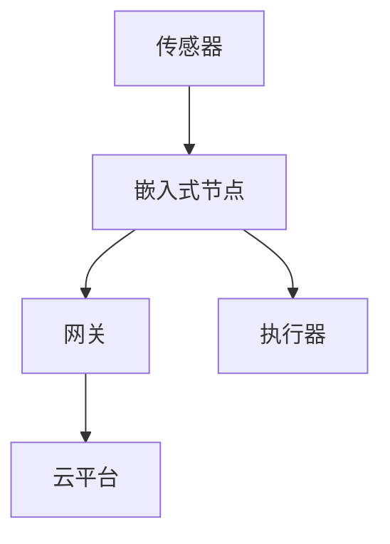

# 3.3.2 结构模型

## 1. 结构模型类型

- **三层架构模型**：感知层、网络层、应用层，分层解耦，便于扩展。
- **边缘-云协同模型**：边缘节点本地处理与云平台集中分析协同。
- **嵌入式实时系统模型**：任务调度、事件驱动、资源受限下的高效运行。
- **协议栈模型**：如TCP/IP、MQTT、CoAP等轻量级协议分层实现。

## 2. 结构图

## 3. 层次关系

- 感知层 → 网络层 → 应用层 → 云平台
- 边缘节点 ↔ 云平台（数据、控制协同）

## 4. 多表征

- 结构图、层次关系图、协议栈分层图、符号化描述

## 5. 规范说明

- 内容需递归细化，支持多表征。
- 保留批判性分析、图表等。
- 如有遗漏，后续补全并说明。

> 本文件为递归细化与内容补全示范，后续可继续分解为3.3.2.1、3.3.2.2等子主题，支持持续递归完善。
