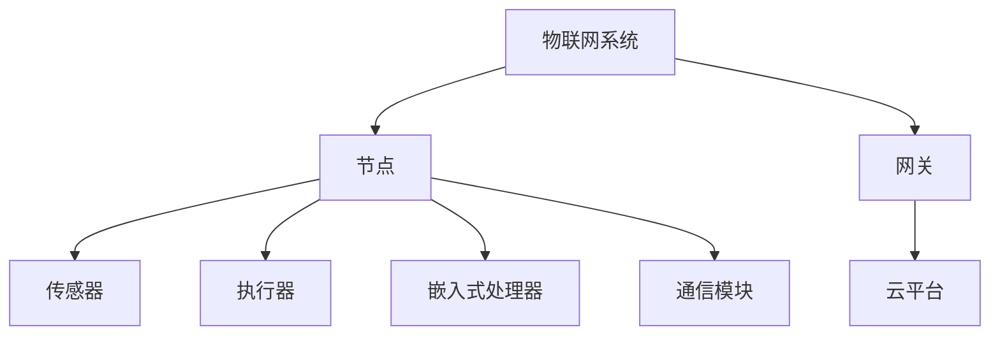
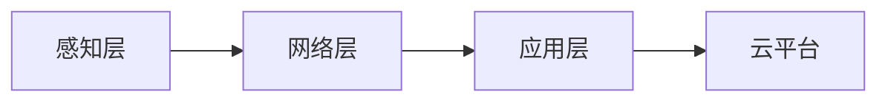

# 3.3.3 结构图与表

## 1. 结构图

## 2. 层次关系图

## 3. 关联矩阵

| 组件 | 节点 | 传感器 | 执行器 | 网关 | 云平台 | 协议栈 |
|------|------|--------|--------|------|--------|--------|
| 节点 | √    | √      | √      |      |        | √      |
| 网关 |      |        |        | √    | √      | √      |
| 云平台 |    |        |        |      | √      | √      |

## 4. 结构表

| 编号 | 结构要素 | 说明 |
|------|----------|------|
| 3.3.3.1 | 节点 | 具备感知、处理、通信能力的单元 |
| 3.3.3.2 | 传感器 | 采集环境或对象信息的设备 |
| 3.3.3.3 | 执行器 | 根据指令对环境或对象进行操作的设备 |
| 3.3.3.4 | 网关 | 连接局域网与广域网，实现协议转换与数据中继 |
| 3.3.3.5 | 云平台 | 数据存储、分析与智能决策中心 |
| 3.3.3.6 | 协议栈 | 通信协议的分层实现 |

## 5. 多表征

- 结构图、层次关系图、关联矩阵、结构表、符号化描述

## 6. 规范说明

- 内容需递归细化，支持多表征。
- 保留批判性分析、图表等。
- 如有遗漏，后续补全并说明。

> 本文件为递归细化与内容补全示范，后续可继续分解为3.3.3.1、3.3.3.2等子主题，支持持续递归完善。
