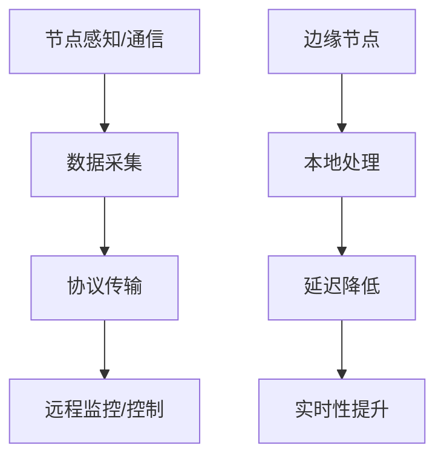

# 3.4.1 命题与定理

## 1. 主要命题

- 命题1：若物联网节点具备感知与通信能力，则可实现远程监控与控制。
- 命题2：边缘-云协同架构能提升系统实时性与可靠性。
- 命题3：协议标准化有助于异构设备互联互通。
- 命题4：低功耗设计与高性能需求存在权衡。

## 2. 定理陈述

- 定理1：对于任意具备感知与通信能力的节点集合N，存在一组协议P，使得N可实现远程数据采集与控制。
- 定理2：边缘-云协同模型下，系统可通过本地处理降低延迟，提高实时性。

## 3. 结构化表达

- **推理链**：
  - 节点感知+通信 → 数据采集 → 协议传输 → 远程监控/控制
  - 边缘-云协同 → 本地处理 → 延迟降低 → 实时性提升

- **流程图**：

## 4. 多表征

- 推理链、流程图、定理表述、符号化描述

## 5. 规范说明

- 内容需递归细化，支持多表征。
- 保留批判性分析、图表等。
- 如有遗漏，后续补全并说明。

> 本文件为递归细化与内容补全示范，后续可继续分解为3.4.1.1、3.4.1.2等子主题，支持持续递归完善。
