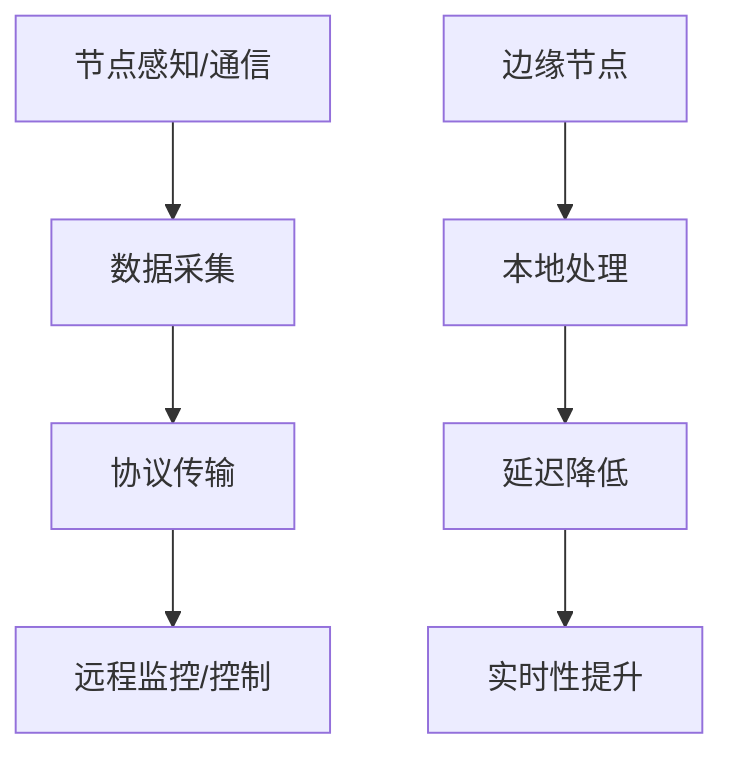

# 3.4.2 证明过程

## 1. 证明结构

- 证明命题1：若物联网节点具备感知与通信能力，则可实现远程监控与控制。
  - 依据：节点通过传感器采集数据，经通信模块上传，实现远程监控与控制。
  - 推理链：节点感知+通信 → 数据采集 → 协议传输 → 远程监控/控制。

- 证明命题2：边缘-云协同架构能提升系统实时性与可靠性。
  - 依据：边缘节点本地处理可降低延迟，云平台集中分析提升可靠性。
  - 推理链：边缘-云协同 → 本地处理 → 延迟降低 → 实时性提升。

## 2. 推理链与流程图

- **推理链**：
  - 节点感知+通信 → 数据采集 → 协议传输 → 远程监控/控制
  - 边缘-云协同 → 本地处理 → 延迟降低 → 实时性提升

- **流程图**：

## 3. 多表征

- 推理链、流程图、证明结构、符号化描述

## 4. 规范说明

- 内容需递归细化，支持多表征。
- 保留批判性分析、图表等。
- 如有遗漏，后续补全并说明。

> 本文件为递归细化与内容补全示范，后续可继续分解为3.4.2.1、3.4.2.2等子主题，支持持续递归完善。
