# 3.5.1 概念图

## 1. 物联网嵌入式系统概念图

### 1.1 整体概念图

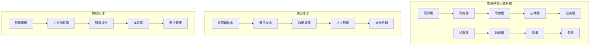

### 1.2 分层架构概念图

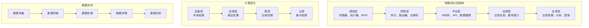

## 2. 设备类型概念图

### 2.1 设备分类图

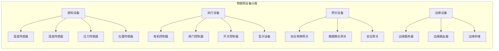

### 2.2 设备能力概念图

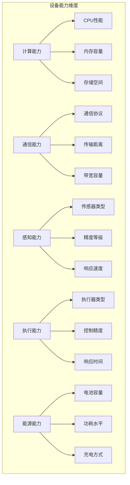

## 3. 网络通信概念图

### 3.1 通信技术概念图

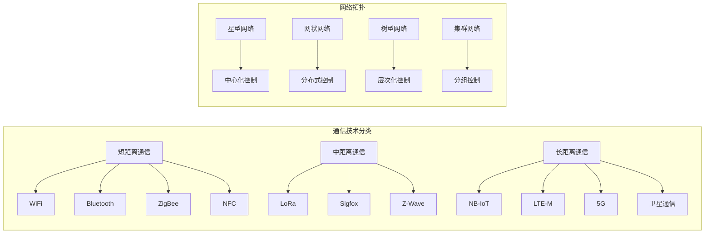

### 3.2 协议栈概念图

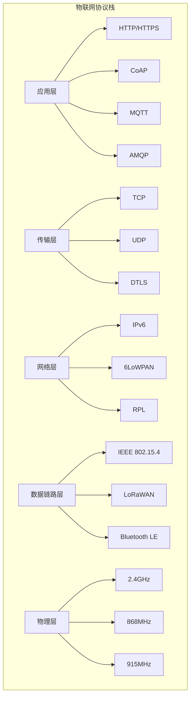

## 4. 数据处理概念图

### 4.1 数据流概念图

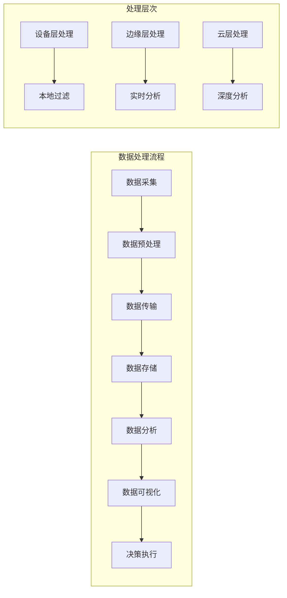

### 4.2 存储层次概念图

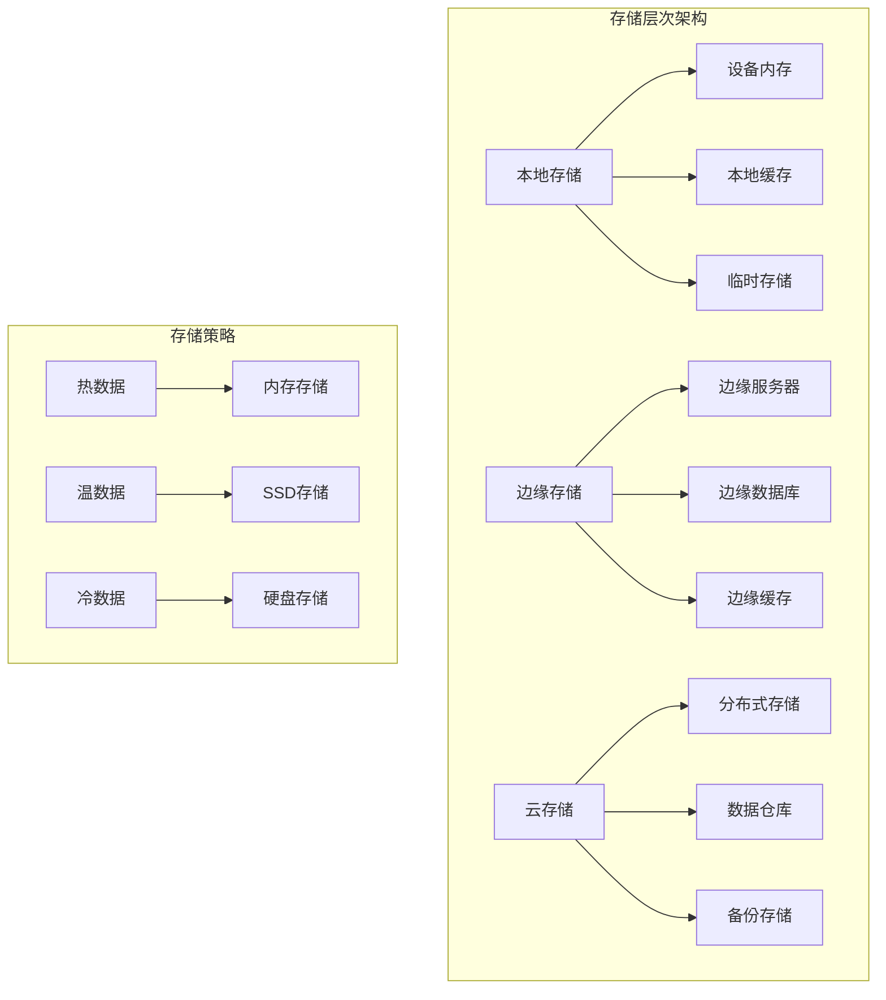

## 5. 安全机制概念图

### 5.1 安全层次概念图

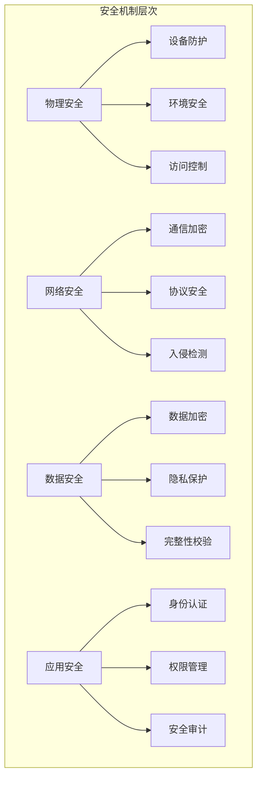

### 5.2 安全威胁概念图

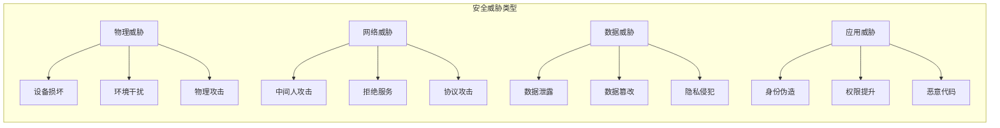

## 6. 应用场景概念图

### 6.1 应用领域概念图

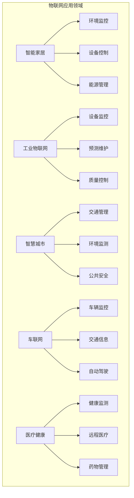

### 6.2 技术融合概念图

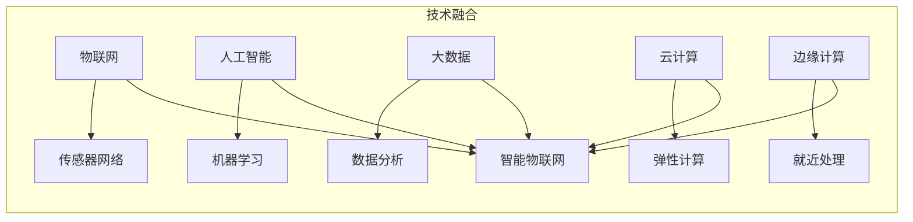

## 7. 性能指标概念图

### 7.1 性能维度概念图

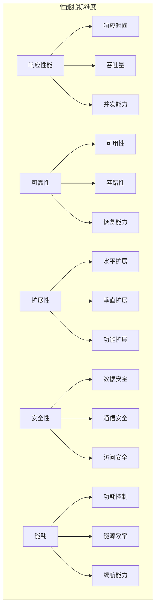

### 7.2 优化策略概念图

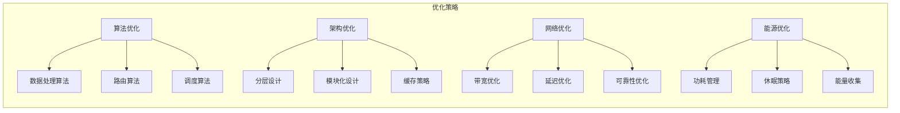

## 8. 发展趋势概念图

### 8.1 技术趋势概念图

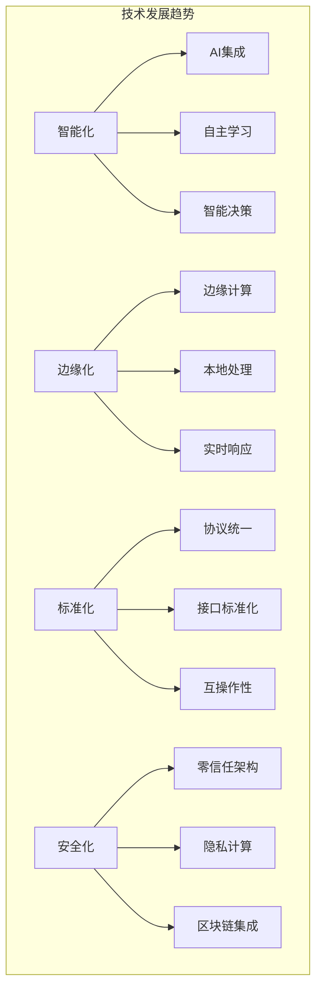

### 8.2 应用趋势概念图

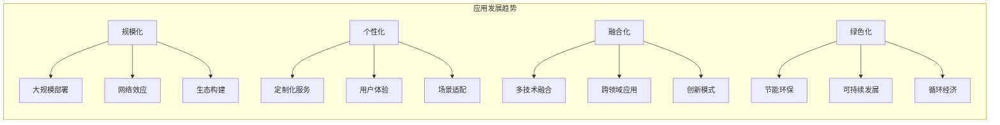

## 9. 规范说明

- 概念图采用mermaid语法绘制
- 支持层次化、分类化、关系化表达
- 保持概念间的逻辑关系清晰
- 可根据需要扩展和细化
- 支持多维度、多角度的概念表达

> 本文件为递归细化与内容补全示范，后续可继续分解为3.5.1.1、3.5.1.2等子主题，支持持续递归完善。
