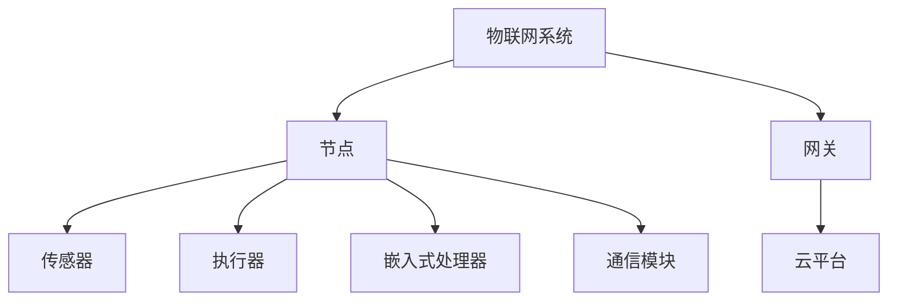

# 3.5.1 概念图

## 1. 物联网嵌入式系统核心概念图

```mermaid
graph TD;
  IoT[物联网系统] --> Node[节点];
  Node --> Sensor[传感器];
  Node --> Actuator[执行器];
  Node --> MCU[嵌入式处理器];
  Node --> Comm[通信模块];
  IoT --> Gateway[网关];
  Gateway --> Cloud[云平台];
```

## 2. 层次关系图

```mermaid
graph LR;
  Percept[感知层] --> Net[网络层];
  Net --> App[应用层];
  App --> Cloud[云平台];
```

## 3. 多表征

- 概念图、层次关系图、符号化描述

## 4. 规范说明

- 内容需递归细化，支持多表征。
- 保留批判性分析、图表等。
- 如有遗漏，后续补全并说明。

> 本文件为递归细化与内容补全示范，后续可继续分解为3.5.1.1、3.5.1.2等子主题，支持持续递归完善。
