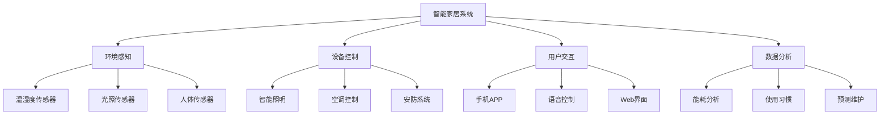

# 3.5.4 多角度表达

## 概述

物联网嵌入式系统的多角度表达提供了从不同视角理解和分析系统的综合方法，包括技术视角、应用视角、架构视角和生态视角。

## 技术视角

### 硬件层面

- **传感器网络**: 温度、湿度、压力、位置等传感器
- **执行器系统**: 电机、阀门、开关等控制设备
- **通信模块**: WiFi、蓝牙、LoRa、NB-IoT等通信技术
- **计算单元**: MCU、SoC、FPGA等处理单元

### 软件层面

- **嵌入式操作系统**: FreeRTOS、uC/OS、Linux等
- **中间件**: 消息队列、数据库、协议栈
- **应用软件**: 数据采集、处理、控制算法
- **安全机制**: 加密、认证、访问控制

## 应用视角

### 智能家居



### 工业物联网

- **设备监控**: 实时状态监测、预测性维护
- **生产优化**: 自动化控制、质量检测
- **供应链管理**: 物流跟踪、库存管理
- **安全管理**: 环境监测、人员定位

### 智慧城市

- **交通管理**: 信号控制、车辆检测
- **环境监测**: 空气质量、噪声监测
- **公共服务**: 路灯控制、垃圾管理
- **应急响应**: 灾害预警、救援协调

## 架构视角

### 分层架构

```text
┌─────────────────────────────────────┐
│           应用层 (Application)       │
├─────────────────────────────────────┤
│           服务层 (Service)          │
├─────────────────────────────────────┤
│           网络层 (Network)          │
├─────────────────────────────────────┤
│           感知层 (Perception)       │
└─────────────────────────────────────┘
```

### 边缘计算架构

- **本地处理**: 实时响应、数据过滤
- **边缘节点**: 分布式计算、缓存
- **云端协同**: 大数据分析、模型训练
- **混合部署**: 动态负载分配

### 微服务架构

- **服务拆分**: 按功能模块划分
- **独立部署**: 容器化、自动化
- **服务发现**: 注册中心、负载均衡
- **容错机制**: 熔断、降级、重试

## 生态视角

### 技术生态

- **硬件厂商**: 芯片、传感器、模块供应商
- **软件平台**: 操作系统、中间件、开发工具
- **云服务商**: 计算、存储、分析服务
- **标准组织**: 协议标准、安全规范

### 应用生态

- **垂直行业**: 制造、农业、医疗、交通
- **解决方案**: 系统集成、定制开发
- **服务模式**: SaaS、PaaS、IaaS
- **商业模式**: 订阅、按需、授权

### 创新生态

- **开源社区**: 技术分享、协作开发
- **产业联盟**: 标准制定、市场推广
- **投资机构**: 资金支持、资源整合
- **人才培养**: 教育培训、技能认证

## 多维度分析

### 技术维度

| 维度 | 内容 | 特点 |
|------|------|------|
| 感知 | 传感器、数据采集 | 多样化、实时性 |
| 传输 | 通信协议、网络 | 可靠性、低功耗 |
| 处理 | 计算能力、算法 | 智能化、高效性 |
| 应用 | 业务逻辑、服务 | 个性化、可扩展 |

### 价值维度

- **经济价值**: 成本降低、效率提升
- **社会价值**: 生活改善、环境保护
- **技术价值**: 创新驱动、产业升级
- **生态价值**: 可持续发展、绿色低碳

### 风险维度

- **技术风险**: 可靠性、安全性
- **市场风险**: 竞争、需求变化
- **政策风险**: 法规、标准变化
- **生态风险**: 环境影响、资源消耗

## 发展趋势

### 技术融合

- **AI+IoT**: 智能感知、自主决策
- **5G+IoT**: 高速传输、低延迟
- **区块链+IoT**: 数据可信、价值传递
- **量子+IoT**: 安全通信、超强计算

### 应用拓展

- **数字孪生**: 虚实结合、实时映射
- **元宇宙**: 虚拟现实、沉浸体验
- **脑机接口**: 人机融合、意识控制
- **生物计算**: 生物芯片、DNA存储

### 生态演进

- **平台化**: 统一标准、开放生态
- **智能化**: 自主决策、自适应
- **绿色化**: 节能环保、可持续发展
- **普惠化**: 降低成本、普及应用

## 总结

物联网嵌入式系统的多角度表达提供了全面理解系统的框架，从技术实现到应用价值，从架构设计到生态发展，形成了完整的认知体系。这种多维度的方法有助于：

1. **全面分析**: 从不同角度深入理解系统
2. **系统思考**: 考虑技术、应用、生态的相互关系
3. **前瞻规划**: 把握发展趋势和机遇
4. **风险管控**: 识别和应对各种挑战

通过多角度表达，我们可以更好地理解物联网嵌入式系统的复杂性，为系统设计、开发和部署提供全面的指导。
