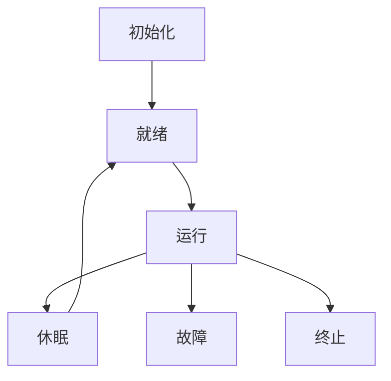

# 3.6.2 语义模型

<!-- TOC START -->

- [3.6.2 语义模型](#362-语义模型)
  - [1. 语义模型](#1-语义模型)
  - [2. 状态机表达](#2-状态机表达)
  - [3. 协议模型](#3-协议模型)
  - [4. 多表征](#4-多表征)
  - [5. 规范说明](#5-规范说明)

<!-- TOC END -->

## 1. 语义模型

- 节点状态机模型：描述节点生命周期与状态转换。
- 协议交互模型：形式化描述节点、网关、云平台之间的协议交互语义。
- 资源分配与调度模型：表达资源分配、任务调度的语义。

## 2. 状态机表达

- **节点状态机图**：

## 3. 协议模型

- 节点 <-> 网关 <-> 云平台
- 协议集合P = {p1, p2, ..., pq}

## 4. 多表征

- 状态机图、协议模型、符号化描述

## 5. 规范说明

- 内容需递归细化，支持多表征。
- 保留批判性分析、图表等。
- 如有遗漏，后续补全并说明。

> 本文件为递归细化与内容补全示范，后续可继续分解为3.6.2.1、3.6.2.2等子主题，支持持续递归完善。
