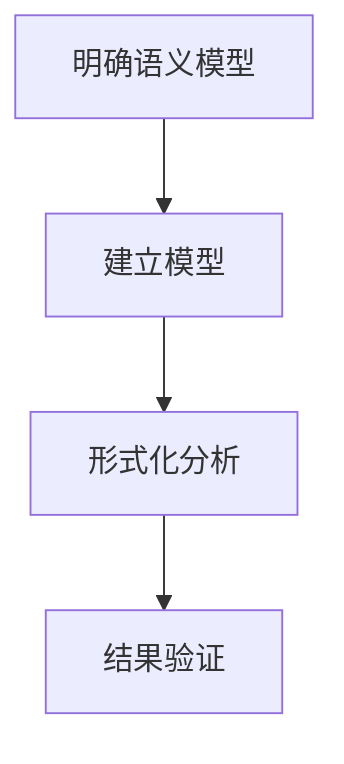

# 3.6.3 语义分析方法

<!-- TOC START -->

- [3.6.3 语义分析方法](#363-语义分析方法)
  - [1. 语义分析方法](#1-语义分析方法)
  - [2. 分析流程](#2-分析流程)
  - [3. 结构化表达](#3-结构化表达)
  - [4. 多表征](#4-多表征)
  - [5. 规范说明](#5-规范说明)

<!-- TOC END -->

## 1. 语义分析方法

- 一致性验证：确保系统各部分语义定义的一致性。
- 死锁检测：通过模型分析系统可能的死锁状态。
- 自动化推理：利用形式化工具对系统行为进行自动验证。

## 2. 分析流程

- 明确语义模型 → 建立状态机/协议模型 → 形式化分析 → 结果验证

## 3. 结构化表达

- **分析流程图**：

## 4. 多表征

- 分析流程图、符号化描述、分析方法表

## 5. 规范说明

- 内容需递归细化，支持多表征。
- 保留批判性分析、图表等。
- 如有遗漏，后续补全并说明。

> 本文件为递归细化与内容补全示范，后续可继续分解为3.6.3.1、3.6.3.2等子主题，支持持续递归完善。
