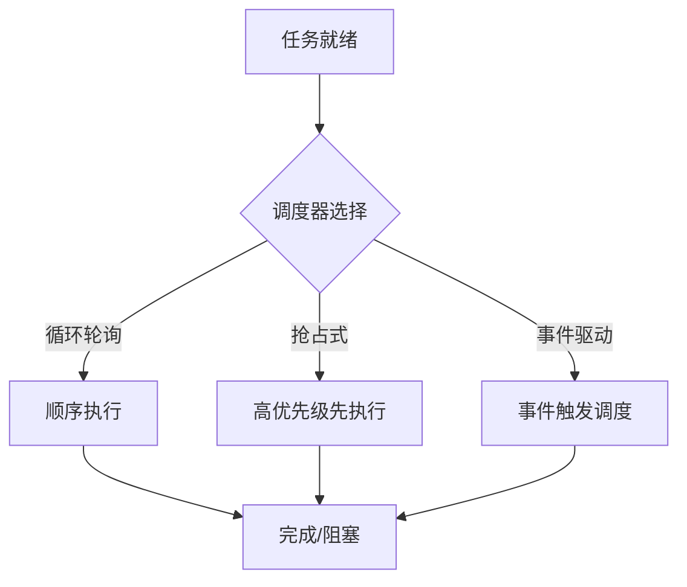

# 3.7.1 运行时行为与调度模型

## 1. 主题简介

- 概述物联网嵌入式系统运行时行为的特点与调度模型的核心作用。
- 强调资源受限、实时性等对运行时语义的特殊要求。

## 2. 典型运行时行为

- 任务调度与切换
- 事件驱动处理
- 低功耗管理
- 通信与同步

## 3. 调度模型分类与对比

| 调度模型 | 主要特征 | 适用场景 | 优缺点 |
|---|---|---|---|
| 循环轮询 | 简单、低开销 | 超小型嵌入式 | 实现简单，实时性差 |
| 抢占式优先级 | 响应快、实时性强 | 实时物联网 | 实时性好，易饿死低优先级 |
| 时间片轮转 | 公平、适中 | 多任务嵌入式 | 响应好，调度开销大 |
| 事件驱动 | 低功耗、响应快 | 传感器网络 | 节能，复杂度高 |

## 4. Mermaid 调度流程示意图



## 5. 伪代码/公式

```pseudo
// 抢占式优先级调度伪代码
while 就绪队列非空:
    取最高优先级任务T
    运行T直到被抢占或完成
```

## 6. 工程案例

- FreeRTOS优先级调度
- TinyOS事件驱动模型

## 7. 未来展望

- 超低功耗智能调度
- AI驱动自适应调度
