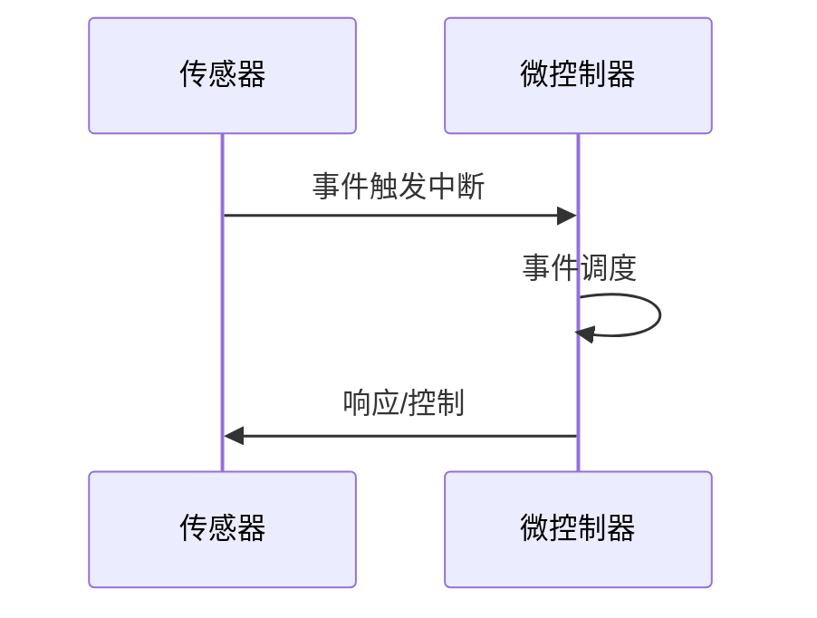
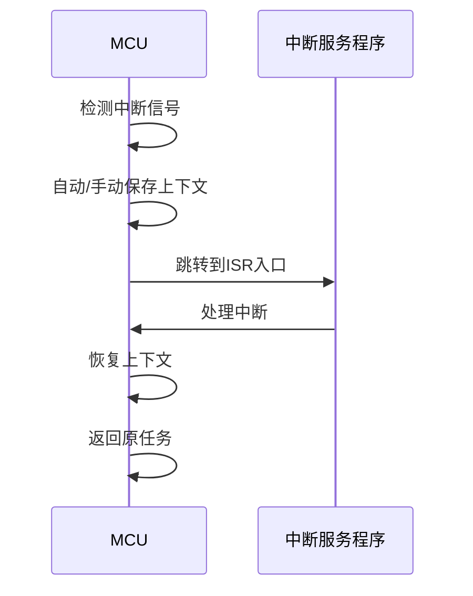

# 3.7.2 典型运行时机制分析

## 1. 主题简介

- 分析物联网嵌入式系统运行时的关键机制及其对系统行为的影响。

## 2. 典型机制分类

- 任务/线程管理
- 低功耗管理
- 通信与同步
- 中断与事件处理

## 3. 关键机制流程

- 任务创建与销毁
- 低功耗切换
- 事件响应与调度

## 4. Mermaid 机制流程图



## 5. 伪代码/公式

```pseudo
// 低功耗切换伪代码
if 无任务就绪:
    进入低功耗模式
```

## 6. 工程案例

- STM32低功耗管理
- Zigbee事件调度机制

## 7. 未来展望

- 智能化功耗管理
- 多协议协同机制

## 3.7.2.x 中断上下文的起点

### 1. 概念与定义

- 中断上下文：MCU/嵌入式CPU响应中断时，保存当前任务/线程的执行环境，切换到ISR。
- 起点：中断信号到达，硬件自动完成部分寄存器/PC/PSW等保护，进入ISR首条指令。

### 2. 结构化流程



### 3. 伪代码

```pseudo
on_interrupt():
    Save_Context()
    Jump_To_ISR()
    ISR_Handler()
    Restore_Context()
    Return_From_Interrupt()
```

### 4. 关键数据结构

- 中断向量表：`IVT[IRQ] = Handler_Address`
- 上下文结构体：`Context = {PC, SP, Registers, Flags}`

### 5. 形式化描述

- $Interrupt\_Event \rightarrow Save\_Context \rightarrow ISR\_Entry$
- LTL公式：`G (interrupt -> F isr_entry)`

### 6. 工程案例1

- STM32：自动堆栈入栈，`vector table`跳转
- FreeRTOS：手动保存/恢复上下文

### 7. 未来展望1

- 超低功耗中断上下文优化、嵌套中断、硬件加速上下文切换
