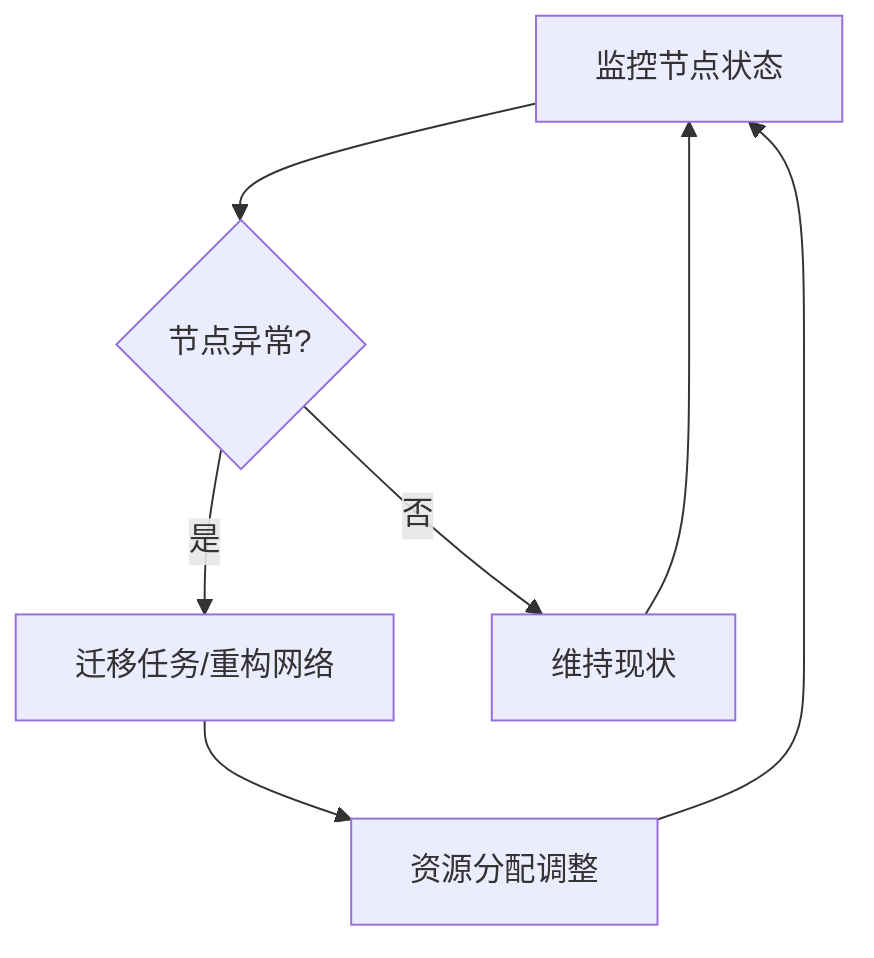

# 3.7.5 自适应与弹性运行机制


<!-- TOC START -->

- [3.7.5 自适应与弹性运行机制](#375-自适应与弹性运行机制)
  - [1. 主题简介](#1-主题简介)
  - [2. 自适应机制分类](#2-自适应机制分类)
  - [3. 弹性运行策略](#3-弹性运行策略)
  - [4. Mermaid 弹性机制流程图](#4-mermaid-弹性机制流程图)
  - [5. 伪代码/公式](#5-伪代码公式)
  - [6. 工程案例](#6-工程案例)
  - [7. 未来展望](#7-未来展望)

<!-- TOC END -->

## 1. 主题简介

- 介绍物联网嵌入式系统自适应与弹性运行机制的基本原理与重要性。

## 2. 自适应机制分类

- 负载感知自适应
- 能耗感知自适应
- 故障自愈机制

## 3. 弹性运行策略

- 动态资源分配
- 节点容错与恢复
- 网络自愈与重构

## 4. Mermaid 弹性机制流程图



## 5. 伪代码/公式

```pseudo
// 节点自愈伪代码
if 节点失效:
    触发任务迁移与网络重构
```

## 6. 工程案例

- LoRa自愈网络
- Zigbee动态重构

## 7. 未来展望

- 智能化自愈与弹性调度
- 跨域自适应资源管理
