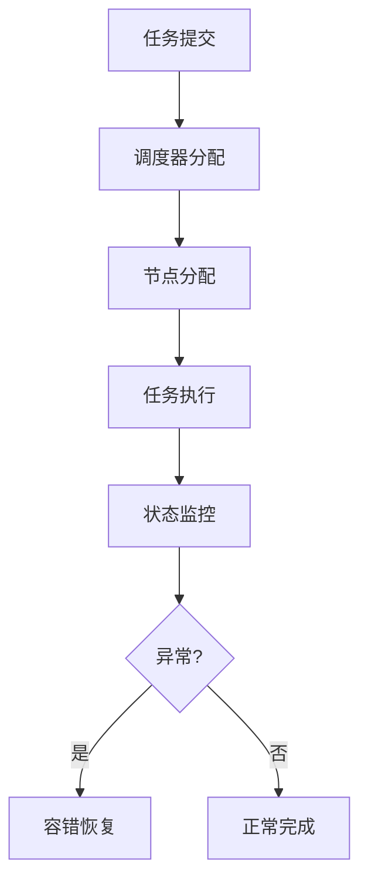

# 3.7.6 工程案例与实践

## 1. 主题简介

- 汇总物联网嵌入式系统运行时语义相关的工程实践与典型案例。

## 2. 典型案例汇总

- FreeRTOS多任务调度
- LoRa分布式调度
- Zigbee自愈网络

## 3. 关键技术剖析

- 事件驱动调度
- 能耗感知机制
- 节点容错与恢复

## 4. Mermaid 案例流程图



## 5. 伪代码/公式

```pseudo
// 节点容错恢复伪代码
if 节点执行失败:
    启动任务迁移与恢复流程
```

## 6. 案例对比分析

| 案例 | 关键机制 | 优势 | 挑战 |
|---|---|---|---|
| FreeRTOS | 优先级调度 | 实时性强 | 资源有限 |
| LoRa | 分布式调度 | 节能 | 网络复杂 |
| Zigbee | 自愈重构 | 灵活 | 协议复杂 |

## 7. 未来展望

- 跨平台运行时优化
- 智能化工程实践
