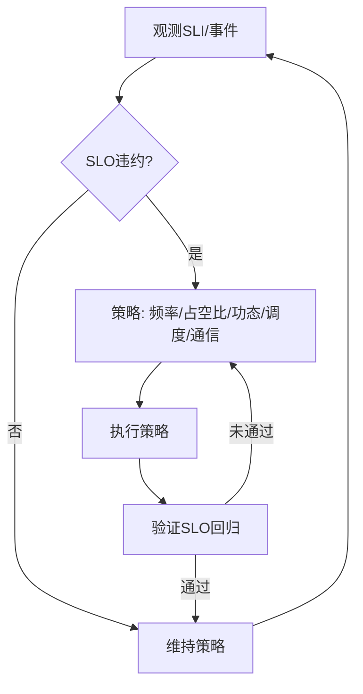

# 物联网嵌入式系统运行时语义


<!-- TOC START -->

- [物联网嵌入式系统运行时语义](#物联网嵌入式系统运行时语义)
  - [概述](#概述)
  - [目录结构](#目录结构)
  - [核心概念](#核心概念)
    - [运行时行为](#运行时行为)
    - [调度模型](#调度模型)
    - [语义建模](#语义建模)
  - [SLO/SLI 驱动的运行时闭环](#slosli-驱动的运行时闭环)
  - [Mermaid 运行时治理闭环（低功耗/实时）](#mermaid-运行时治理闭环低功耗实时)
  - [伪代码示例](#伪代码示例)
  - [策略选择矩阵（示例）](#策略选择矩阵示例)
  - [学习目标](#学习目标)
  - [应用领域](#应用领域)
  - [相关资源](#相关资源)
  - [实践项目](#实践项目)

<!-- TOC END -->

## 概述

物联网嵌入式系统运行时语义研究物联网和嵌入式系统在运行过程中的行为特征、状态转换、资源调度和动态特性，为物联网嵌入式系统的运行时行为分析和优化提供理论基础。

## 目录结构

- **3.7.1 运行时行为与调度模型** - 物联网嵌入式系统的运行时行为模型和调度机制
- **3.7.2 典型运行时机制分析** - 常见物联网嵌入式系统运行时机制的分析
- **3.7.3 运行时语义建模与形式化验证** - 运行时语义的形式化建模和验证
- **3.7.4 多节点协同与动态调度** - 多节点系统的协同运行和动态调度
- **3.7.5 自适应与弹性运行机制** - 系统的自适应和弹性运行特性
- **3.7.6 工程案例与实践** - 实际工程中的运行时语义应用
- **3.7.7 未来发展与挑战** - 运行时语义领域的发展趋势和挑战

## 核心概念

### 运行时行为

- **设备状态**：物联网设备在不同状态间的转换规律
- **传感器数据**：传感器数据的采集和处理机制
- **通信协议**：设备间通信的运行时行为
- **能量管理**：设备能量消耗的管理机制

### 调度模型

- **实时调度**：满足实时性要求的调度策略
- **低功耗调度**：优化能量消耗的调度算法
- **任务调度**：嵌入式任务的调度管理
- **中断处理**：中断的响应和处理机制

### 语义建模

- **设备语义**：物联网设备操作的语义定义
- **网络语义**：网络通信的语义描述
- **数据语义**：数据处理的语义建模
- **控制语义**：控制操作的语义定义

## SLO/SLI 驱动的运行时闭环

- SLI：电池剩余率、能耗/任务、P99 任务完成时延、丢包率、唤醒频次、睡眠占比。
- SLO：如 24h 电池续航、P99 任务时延 < 50ms、丢包率 < 0.5%、睡眠占比 > 80%。
- 闭环：观测 → 诊断 → 策略（频率/占空比/功态/调度）→ 执行 → 验证 → 回滚/巩固。

## Mermaid 运行时治理闭环（低功耗/实时）



## 伪代码示例

```pseudo
// 动态功耗管理（DPM）
if 预测空闲时间 > 阈值:
    进入深度睡眠(DS)
else:
    低功耗运行(低频率)

// 实时任务调度（EDF 简化）
按截止期排序就绪队列
调度最早截止期任务
若超期风险高: 提升频率/降级非关键任务
```

## 策略选择矩阵（示例）

| 场景 | 首选策略 | 备选 | 权衡 |
|---|---|---|---|
| 电量告急 | 深度睡眠+占空比降低 | 降级采样率 | 实时性与数据完整性 |
| 时延超标 | 提升频率+优先级 | 关闭非关键任务 | 能耗与温升 |
| 丢包上升 | 重传+链路自适应 | 本地缓存 | 时效与可靠性 |
| 频繁唤醒 | 批处理+合并唤醒 | 调整阈值 | 延迟与能耗 |

## 学习目标

1. **理解物联网嵌入式系统运行时语义的基本概念**
2. **掌握物联网嵌入式系统的运行时行为建模方法**
3. **学会分析和设计实时调度算法**
4. **了解形式化验证技术在物联网系统中的应用**
5. **掌握多节点物联网的协同运行机制**
6. **理解低功耗和实时性的平衡策略**

## 应用领域

- **智能家居系统**
- **工业物联网**
- **智能城市**
- **可穿戴设备**
- **自动驾驶系统**
- **医疗设备**

## 相关资源

- **经典文献**：《Embedded Systems》、《Internet of Things》
- **学术期刊**：IEEE Transactions on Industrial Electronics、ACM Transactions on Embedded Computing Systems
- **会议论文**：RTSS、EMSOFT、IoT等顶级会议
- **在线资源**：嵌入式系统文档、物联网协议标准

## 实践项目

1. **实时调度器实现**：实现满足实时性要求的调度算法
2. **低功耗管理系统**：设计能量优化的管理系统
3. **传感器数据处理**：实现传感器数据的实时处理
4. **通信协议优化**：优化设备间的通信协议
