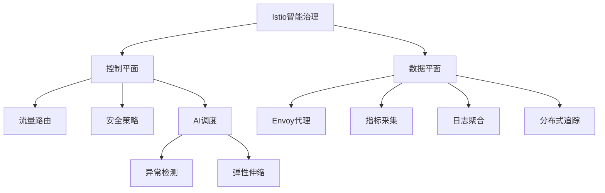

# 4.1.6.2.1.1 Istio智能治理原理与实践

## 1. 智能流量治理原理

- 控制平面（Pilot、Citadel、Galley）+数据平面（Envoy代理）
- 流量路由、熔断、限流、灰度发布、A/B测试
- AI驱动的流量调度与异常检测

## 2. 可观测性与安全机制

- 分布式追踪、指标采集、日志聚合
- 双向TLS加密、服务认证与授权、策略控制
- 智能告警与自愈

## 3. 典型应用场景

- 大型微服务集群
- 金融、电商、云原生平台
- 多云与混合云环境

## 4. 结构表

| 功能         | Istio实现     | 智能化特性 | 典型优势 |
|--------------|--------------|------------|----------|
| 流量治理     | Envoy代理+控制平面 | AI调度、异常检测 | 精细流控、弹性伸缩 |
| 可观测性     | 指标、追踪、日志 | 智能告警、自愈   | 故障定位、性能优化 |
| 安全机制     | 双向TLS、认证授权 | 智能策略        | 数据安全、合规性   |

**智能流量调度模型：**
$$Traffic_{ai} = \sum_{i=1}^{n} w_i \cdot Flow_i + AI_{policy}$$

**弹性伸缩函数：**
$$Scale_{istio} = f(Load, Latency, Anomaly, AI_{predict})$$

## 5. Mermaid结构图

## 6. 批判性分析

- **优势**：极大提升微服务治理智能化水平，支持复杂流控与安全合规，适合大规模生产环境。
- **局限**：系统复杂度高，资源消耗大，AI治理尚处早期，调优难度大。
- **未来方向**：更高效的AI治理、跨云标准化、自动化安全与自愈。

## 7. 规范说明

- 内容需递归细化，支持多表征
- 保留批判性分析、图表、符号等
- 如有遗漏，后续补全并说明
- 支持持续递归完善

> 本文件为递归细化与内容补全示范，后续可继续分解为4.1.6.2.1.1.1等子主题，支持持续递归完善。
