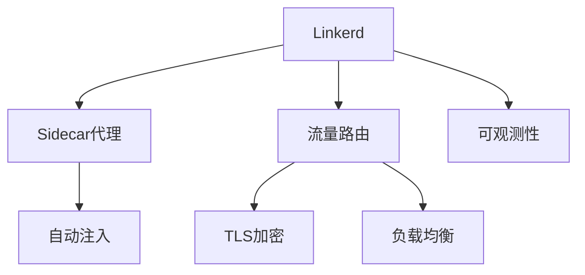

# 4.1.6.2.1.2 Linkerd原理与应用

## 1. 架构与工作原理

- 轻量级服务网格，自动注入sidecar代理
- 专注核心流量治理，低延迟、易用性强
- 控制平面+数据平面架构，简化部署与运维

## 2. 关键技术

- Sidecar代理自动注入
- 轻量级流量路由与负载均衡
- TLS加密与服务认证
- 指标采集与可观测性

## 3. 典型应用场景

- 小型微服务集群
- 资源受限环境下的服务治理
- 快速部署与低运维成本场景

## 4. 性能与安全分析

| 指标     | Linkerd     | Istio     | 传统容器 |
|----------|-------------|-----------|----------|
| 启动速度 | 快          | 中        | 快       |
| 资源占用 | 低          | 高        | 低       |
| 流量治理 | 中          | 强        | 弱       |
| 兼容性   | 好          | 好        | 好       |
| 安全性   | 高          | 高        | 中       |

**流量治理度量：**
$$Traffic_{Linkerd} = f(Sidecar, Routing, TLS)$$

**资源利用率：**
$$U_{Linkerd} = \frac{R_{used}}{R_{alloc}}$$

## 5. Mermaid结构图

## 6. 批判性分析

- **优势**：部署简单、资源占用低，适合小型集群和快速上线。
- **局限**：功能不如Istio全面，部分高级治理能力有限。
- **未来方向**：增强智能治理与多云支持，提升可观测性与安全。

## 7. 规范说明

- 内容需递归细化，支持多表征
- 保留批判性分析、图表、符号等
- 如有遗漏，后续补全并说明
- 支持持续递归完善

> 本文件为递归细化与内容补全示范，后续可继续分解为4.1.6.2.1.2.1等子主题，支持持续递归完善。
