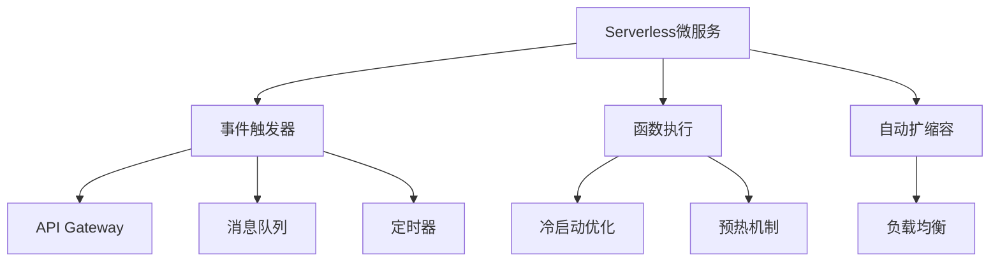

# 4.1.6.2.1.3 Serverless微服务架构

## 1. 架构与工作原理

- 事件驱动、按需执行、自动扩缩容
- 无服务器运维，专注业务逻辑
- 按使用量计费，零闲置成本
- 支持多种编程语言和运行时

## 2. 关键技术

- 事件触发器（API Gateway、消息队列、定时器等）
- 冷启动优化与预热机制
- 自动扩缩容与负载均衡
- 函数间通信与状态管理

## 3. 典型应用场景

- 事件驱动数据处理
- API网关与后端服务
- 实时数据流处理
- 定时任务与批处理

## 4. 性能与成本分析

| 指标     | Serverless | 传统微服务 | 容器化微服务 |
|----------|------------|------------|--------------|
| 启动速度 | 冷启动慢   | 快         | 快           |
| 资源利用率| 高         | 中         | 高           |
| 运维成本 | 极低       | 高         | 中           |
| 扩展性   | 自动       | 手动       | 自动         |
| 成本模型 | 按使用量   | 固定       | 混合         |

**成本优化模型：**
$$Cost_{serverless} = \sum_{i=1}^{n} (Invocation_i \times Duration_i \times Memory_i)$$

**性能优化：**
$$Performance = f(Warm_{start}, Cold_{start}, Concurrency)$$

## 5. Mermaid结构图

## 6. 批判性分析

- **优势**：零运维、自动扩缩容、按使用量计费，适合事件驱动和突发流量场景。
- **局限**：冷启动延迟、状态管理复杂、厂商锁定风险、调试困难。
- **未来方向**：冷启动优化、跨云标准化、状态管理简化、AI驱动优化。

## 7. 规范说明

- 内容需递归细化，支持多表征
- 保留批判性分析、图表、符号等
- 如有遗漏，后续补全并说明
- 支持持续递归完善

> 本文件为递归细化与内容补全示范，后续可继续分解为4.1.6.2.1.3.1等子主题，支持持续递归完善。
