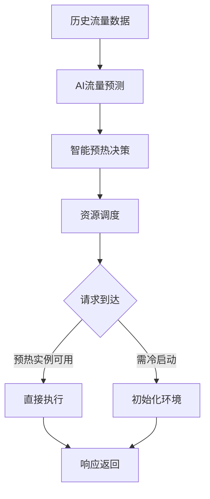

# 4.1.6.2.1.3.1.1 Serverless冷启动AI预测优化

## 1. AI/ML在冷启动优化中的应用

- 基于历史流量数据的负载预测
- 智能预热决策（何时、预热多少实例）
- 动态资源调度与分配
- 结合时间序列分析、深度学习等模型

## 2. 关键技术与算法

- LSTM/GRU等时序预测模型
- 强化学习调度策略
- 智能阈值与自适应预热
- 多维特征输入（流量、时间、事件类型等）

## 3. 性能对比与结构表

| 优化方式   | 启动延迟 | 资源消耗 | 预测准确性 | 适用场景         |
|------------|----------|----------|------------|------------------|
| 静态预热   | 低       | 高       | 无         | 流量稳定         |
| AI预测预热 | 低       | 低       | 高         | 流量波动明显     |
| 被动触发   | 高       | 低       | 无         | 低频调用         |

**AI预测优化模型：**
$$T_{cold,ai} = f(Predict_{load}, Prewarm_{policy}, Resource_{alloc})$$

**目标函数：**
$$\min (T_{cold,ai} + Resource_{waste})$$

## 4. Mermaid流程图

## 5. 批判性分析

- **优势**：AI预测可显著降低冷启动延迟，减少资源浪费，适应流量波动。
- **局限**：模型训练与部署复杂，依赖高质量数据，异常流量难以预测。
- **未来方向**：联邦学习、跨平台AI调度、与边缘计算协同优化。

## 6. 规范说明

- 内容需递归细化，支持多表征
- 保留批判性分析、图表、符号等
- 如有遗漏，后续补全并说明
- 支持持续递归完善

> 本文件为递归细化与内容补全示范，后续可继续分解为4.1.6.2.1.3.1.1.1等子主题，支持持续递归完善。
