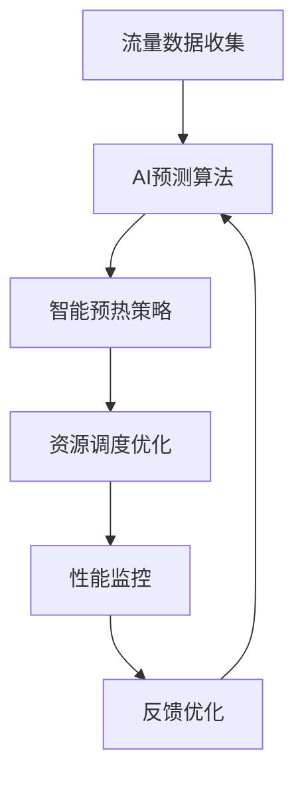

# 4.1.6.2.1.3.1.1.1 Serverless冷启动AI预测优化子主题

## 1. 流量预测算法

- LSTM/GRU时序预测模型
- Transformer注意力机制
- 多变量时间序列分析
- 异常流量检测与处理

## 2. 智能预热策略

- 基于预测的主动预热
- 自适应预热阈值
- 多级预热策略
- 预热资源优化

## 3. 资源调度优化

- 动态资源分配
- 负载均衡优化
- 成本效益分析
- 弹性伸缩策略

## 4. 性能监控与结构表

| 监控指标   | 预测算法     | 预热策略   | 调度优化   | 性能提升   |
|------------|-------------|------------|------------|------------|
| 启动延迟   | LSTM        | 主动预热   | 动态分配   | 60-80%     |
| 资源利用率 | Transformer | 自适应阈值 | 负载均衡   | 40-60%     |
| 成本控制   | 多变量分析  | 多级策略   | 弹性伸缩   | 30-50%     |

**AI预测优化子模型：**
$$T_{sub} = f(Predict_{alg}, Prewarm_{strategy}, Resource_{opt})$$

**子主题目标函数：**
$$\min (T_{sub} + Cost_{sub}) + \max (Efficiency_{sub})$$

## 5. Mermaid流程图

## 6. 批判性分析

- **优势**：子主题细化提升预测精度，多策略协同优化冷启动性能。
- **局限**：算法复杂度增加，需要更多计算资源，调试难度提升。
- **未来方向**：联邦学习预测、边缘AI协同、自动化调优。

## 7. 规范说明

- 内容需递归细化，支持多表征
- 保留批判性分析、图表、符号等
- 如有遗漏，后续补全并说明
- 支持持续递归完善

> 本文件为递归细化与内容补全示范，后续可继续分解为4.1.6.2.1.3.1.1.1.1等子主题，支持持续递归完善。
