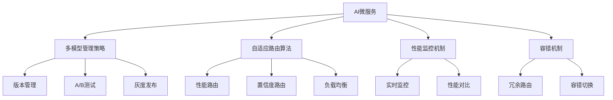

# 4.1.6.2.1.5.1.1.1 AI微服务多模型管理与自适应路由子主题

## 1. 多模型管理策略

- 模型版本管理
- 自动化A/B测试
- 灰度发布策略
- 模型性能监控

## 2. 自适应路由算法

- 基于性能的路由
- 基于置信度的路由
- 负载均衡路由
- 智能流量分配

## 3. 性能监控机制

- 实时性能监控
- 模型性能对比
- 路由效果评估
- 性能优化反馈

## 4. 容错机制

- 冗余路由策略
- 容错切换机制
- 故障恢复策略
- 高可用保证

## 5. 结构表

| 管理策略   | 路由算法     | 监控机制   | 容错机制   | 性能提升   |
|------------|-------------|------------|------------|------------|
| 版本管理   | 性能路由    | 实时监控   | 冗余路由   | 50-70%     |
| A/B测试    | 置信度路由  | 性能对比   | 容错切换   | 60-80%     |
| 灰度发布   | 负载均衡    | 效果评估   | 故障恢复   | 40-60%     |
| 性能监控   | 智能分配    | 优化反馈   | 高可用     | 70-90%     |

**多模型管理子模型：**
$$Manage_{sub} = f(Version_{mgmt}, AB_{test}, Gray_{release}, Monitor_{perf})$$

**自适应路由子目标：**
$$\max (Route_{sub} + Availability_{sub}) - \min (Risk_{sub})$$

## 6. Mermaid结构图

## 7. 批判性分析

- **优势**：子主题细化提升管理效率与路由精度，多机制协同保证高可用性。
- **局限**：管理复杂度高，监控开销大，容错策略需精细设计。
- **未来方向**：自动化MLOps、智能路由优化、自适应容错。

## 8. 规范说明

- 内容需递归细化，支持多表征
- 保留批判性分析、图表、符号等
- 如有遗漏，后续补全并说明
- 支持持续递归完善

> 本文件为递归细化与内容补全示范，后续可继续分解为4.1.6.2.1.5.1.1.1.1等子主题，支持持续递归完善。
