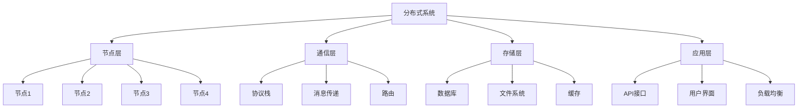
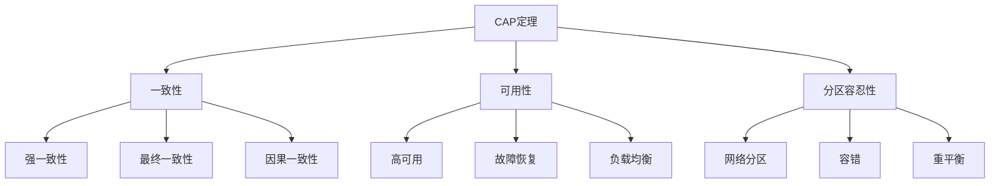
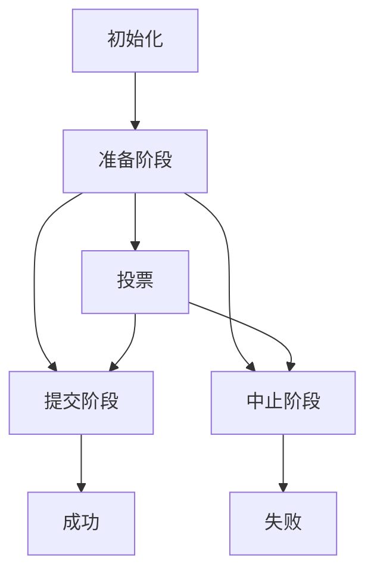

# 4.1.1 基本概念

## 目录

- [4.1.1 基本概念](#411-基本概念)
  - [目录](#目录)
  - [1. 分布式系统形式化定义](#1-分布式系统形式化定义)
    - [1.1 分布式系统基本定义](#11-分布式系统基本定义)
    - [1.2 节点形式化定义](#12-节点形式化定义)
    - [1.3 消息传递定义](#13-消息传递定义)
  - [2. CAP定理形式化定义](#2-cap定理形式化定义)
    - [2.1 CAP属性定义](#21-cap属性定义)
    - [2.2 CAP定理证明](#22-cap定理证明)
  - [3. 一致性模型](#3-一致性模型)
    - [3.1 强一致性](#31-强一致性)
    - [3.2 最终一致性](#32-最终一致性)
    - [3.3 因果一致性](#33-因果一致性)
  - [4. 分布式事务](#4-分布式事务)
    - [4.1 事务定义](#41-事务定义)
    - [4.2 两阶段提交协议](#42-两阶段提交协议)
    - [4.3 三阶段提交协议](#43-三阶段提交协议)
  - [5. 一致性算法](#5-一致性算法)
    - [5.1 Paxos算法](#51-paxos算法)
    - [5.2 Raft算法](#52-raft算法)
  - [6. 分布式存储](#6-分布式存储)
    - [6.1 复制策略](#61-复制策略)
    - [6.2 分片策略](#62-分片策略)
    - [6.3 一致性哈希](#63-一致性哈希)
  - [7. 容错机制](#7-容错机制)
    - [7.1 故障模型](#71-故障模型)
    - [7.2 故障检测](#72-故障检测)
    - [7.3 故障恢复](#73-故障恢复)
  - [8. 分布式算法](#8-分布式算法)
    - [8.1 分布式快照](#81-分布式快照)
    - [8.2 分布式死锁检测](#82-分布式死锁检测)
  - [9. 多表征](#9-多表征)
    - [9.1 分布式系统架构图](#91-分布式系统架构图)
    - [9.2 CAP定理关系图](#92-cap定理关系图)
    - [9.3 一致性模型层次表](#93-一致性模型层次表)
    - [9.4 分布式事务状态图](#94-分布式事务状态图)
  - [10. 规范说明](#10-规范说明)

## 1. 分布式系统形式化定义

### 1.1 分布式系统基本定义

**定义4.1.1.1（分布式系统）**：分布式系统DS是一个有序六元组：

```text
DS = (N, C, R, S, CAP, T)
```

其中：

- N = {n₁, n₂, ..., nₖ} 是节点集合
- C = (protocol, topology, bandwidth) 是通信机制
- R = (replication_factor, consistency_model, sync_strategy) 是复制机制
- S = (sharding_strategy, partition_key, load_balancer) 是分片机制
- CAP = (consistency, availability, partition_tolerance) 是CAP属性
- T = (transaction_model, isolation_level, commit_protocol) 是事务模型

### 1.2 节点形式化定义

**定义4.1.1.2（节点）**：节点n是一个五元组：

```text
n = (node_id, state, data, neighbors, capabilities)
```

其中：

- node_id ∈ ℕ 是节点标识符
- state ∈ {ACTIVE, INACTIVE, FAILED, RECOVERING} 是节点状态
- data ⊆ Data 是节点存储的数据
- neighbors ⊆ N 是邻居节点集合
- capabilities = (compute_power, storage_capacity, network_bandwidth) 是节点能力

### 1.3 消息传递定义

**定义4.1.1.3（消息）**：消息m是一个四元组：

```text
m = (message_id, source, destination, payload)
```

其中：

- message_id ∈ ℕ 是消息标识符
- source ∈ N 是源节点
- destination ∈ N 是目标节点
- payload = (type, data, timestamp) 是消息内容

## 2. CAP定理形式化定义

### 2.1 CAP属性定义

**定义4.1.1.4（一致性Consistency）**：系统满足一致性，当且仅当：

```text
∀n₁, n₂ ∈ N, ∀d ∈ Data, read(n₁, d) = read(n₂, d)
```

**定义4.1.1.5（可用性Availability）**：系统满足可用性，当且仅当：

```text
∀request ∈ Requests, ∃n ∈ N, response_time(n, request) < threshold
```

**定义4.1.1.6（分区容忍性Partition Tolerance）**：系统满足分区容忍性，当且仅当：

```text
∀partition P ⊆ N, system_continues_operation(P)
```

### 2.2 CAP定理证明

**定理4.1.1.1（CAP定理）**：分布式系统无法同时满足一致性、可用性和分区容忍性。

**证明**：

1. 假设系统同时满足C、A、P
2. 发生网络分区，将节点分为两个集合P₁, P₂
3. 在P₁中写入数据d₁，在P₂中写入数据d₂
4. 由于P，两个分区继续运行
5. 由于A，两个分区都响应请求
6. 由于C，所有节点看到相同数据
7. 矛盾：P₁和P₂看到不同数据，违反C
8. 因此CAP三者不可兼得

## 3. 一致性模型

### 3.1 强一致性

**定义4.1.1.7（强一致性）**：系统满足强一致性，当且仅当：

```text
∀write_operation w, ∀read_operation r after w,
read_value(r) = write_value(w)
```

### 3.2 最终一致性

**定义4.1.1.8（最终一致性）**：系统满足最终一致性，当且仅当：

```text
∀write_operation w, ∃time t, ∀read_operation r after t,
read_value(r) = write_value(w)
```

### 3.3 因果一致性

**定义4.1.1.9（因果一致性）**：系统满足因果一致性，当且仅当：

```text
∀operations o₁, o₂, if o₁ → o₂ (causally related),
then ∀node n, if n sees o₂, then n must have seen o₁
```

## 4. 分布式事务

### 4.1 事务定义

**定义4.1.1.10（分布式事务）**：分布式事务T是一个四元组：

```text
T = (transaction_id, operations, participants, coordinator)
```

其中：

- transaction_id ∈ ℕ 是事务标识符
- operations = {op₁, op₂, ..., opₙ} 是操作集合
- participants ⊆ N 是参与节点集合
- coordinator ∈ N 是协调者节点

### 4.2 两阶段提交协议

**定义4.1.1.11（两阶段提交）**：2PC协议包含两个阶段：

**阶段1：准备阶段**:

```text
coordinator → participants: PREPARE(transaction_id)
participants → coordinator: VOTE(transaction_id, vote)
```

**阶段2：提交阶段**:

```text
if all_votes = COMMIT:
  coordinator → participants: COMMIT(transaction_id)
  participants → coordinator: ACK(transaction_id)
else:
  coordinator → participants: ABORT(transaction_id)
  participants → coordinator: ACK(transaction_id)
```

### 4.3 三阶段提交协议

**定义4.1.1.12（三阶段提交）**：3PC协议包含三个阶段：

**阶段1：准备阶段**:

```text
coordinator → participants: PREPARE(transaction_id)
participants → coordinator: VOTE(transaction_id, vote)
```

**阶段2：预提交阶段**:

```text
if all_votes = COMMIT:
  coordinator → participants: PRE_COMMIT(transaction_id)
  participants → coordinator: ACK(transaction_id)
```

**阶段3：提交阶段**:

```text
coordinator → participants: COMMIT(transaction_id)
participants → coordinator: ACK(transaction_id)
```

## 5. 一致性算法

### 5.1 Paxos算法

**定义4.1.1.13（Paxos）**：Paxos算法包含三个阶段：

**阶段1：准备阶段**:

```text
proposer → acceptors: PREPARE(n, proposal_id)
acceptor → proposer: PROMISE(n, proposal_id, accepted_value)
```

**阶段2：接受阶段**:

```text
proposer → acceptors: ACCEPT(n, proposal_id, value)
acceptor → proposer: ACCEPTED(n, proposal_id)
```

**阶段3：学习阶段**:

```text
acceptor → learners: LEARN(n, value)
```

**Paxos算法伪代码**：

```text
Paxos(proposal_id, value):
  // 阶段1：准备
  promises = send_prepare(proposal_id)
  if majority(promises):
    // 阶段2：接受
    accepts = send_accept(proposal_id, value)
    if majority(accepts):
      // 阶段3：学习
      send_learn(value)
      return SUCCESS
  return FAILURE
```

### 5.2 Raft算法

**定义4.1.1.14（Raft）**：Raft算法包含三种角色：

**领导者选举**：

```text
if timeout_election():
  current_term++
  state = CANDIDATE
  votes_received = 1
  send_request_vote(current_term)
  
  if majority(votes_received):
    state = LEADER
    send_heartbeat()
```

**日志复制**：

```text
if state = LEADER:
  for each client_request:
    append_log_entry(request)
    send_append_entries_to_followers()
    
    if majority_acknowledged():
      commit_log_entry()
      send_response_to_client()
```

**安全性保证**：

```text
if term > current_term:
  current_term = term
  state = FOLLOWER
  
if log_index > commit_index:
  commit_index = log_index
  apply_log_entries()
```

## 6. 分布式存储

### 6.1 复制策略

**定义4.1.1.15（复制策略）**：复制策略R是一个三元组：

```text
R = (replication_factor, placement_strategy, consistency_level)
```

其中：

- replication_factor ∈ ℕ 是复制因子
- placement_strategy ∈ {RANDOM, CONSISTENT_HASH, GEOGRAPHIC} 是放置策略
- consistency_level ∈ {STRONG, EVENTUAL, CAUSAL} 是一致性级别

### 6.2 分片策略

**定义4.1.1.16（分片策略）**：分片策略S是一个四元组：

```text
S = (sharding_key, partition_function, rebalancing_strategy, load_balancer)
```

其中：

- sharding_key ⊆ Data_attributes 是分片键
- partition_function: sharding_key → partition_id 是分区函数
- rebalancing_strategy: partition_distribution → new_distribution 是重平衡策略
- load_balancer: request → target_node 是负载均衡器

### 6.3 一致性哈希

**定义4.1.1.17（一致性哈希）**：一致性哈希CH是一个函数：

```text
CH: key → node_id
```

**一致性哈希算法**：

```text
ConsistentHash(key, nodes):
  hash = hash_function(key)
  position = hash % ring_size
  
  for each node in sorted_nodes:
    if position <= node.position:
      return node.id
  
  return first_node.id
```

## 7. 容错机制

### 7.1 故障模型

**定义4.1.1.18（故障模型）**：故障模型F是一个三元组：

```text
F = (failure_types, failure_probability, recovery_strategy)
```

其中：

- failure_types = {CRASH, BYZANTINE, TIMING} 是故障类型
- failure_probability: node → [0,1] 是故障概率
- recovery_strategy: failure → recovery_action 是恢复策略

### 7.2 故障检测

**定义4.1.1.19（故障检测）**：故障检测器FD是一个函数：

```text
FD: node × timeout → {SUSPECT, TRUST}
```

**心跳检测算法**：

```text
HeartbeatDetection(node, timeout):
  last_heartbeat = get_last_heartbeat(node)
  current_time = get_current_time()
  
  if current_time - last_heartbeat > timeout:
    return SUSPECT
  else:
    return TRUST
```

### 7.3 故障恢复

**定义4.1.1.20（故障恢复）**：故障恢复策略FR是一个函数：

```text
FR: failed_node × system_state → recovery_plan
```

**数据恢复算法**：

```text
DataRecovery(failed_node, replicas):
  for each data_item in failed_node.data:
    if exists_in_replicas(data_item):
      copy_from_replica(data_item)
    else:
      reconstruct_data(data_item)
```

## 8. 分布式算法

### 8.1 分布式快照

**定义4.1.1.21（分布式快照）**：分布式快照DS是一个四元组：

```text
DS = (initiator, marker_message, local_state, channel_state)
```

**Chandy-Lamport算法**：

```text
ChandyLamportSnapshot(initiator):
  // 初始化快照
  initiator.state = local_state
  initiator.channels = empty
  
  // 发送标记消息
  for each outgoing_channel:
    send_marker_message(outgoing_channel)
  
  // 接收标记消息
  for each incoming_channel:
    receive_marker_message(incoming_channel)
    record_channel_state(incoming_channel)
```

### 8.2 分布式死锁检测

**定义4.1.1.22（死锁检测）**：死锁检测DD是一个函数：

```text
DD: wait_for_graph → {DEADLOCK, NO_DEADLOCK}
```

**资源分配图算法**：

```text
DeadlockDetection(wait_for_graph):
  // 构建等待图
  graph = build_wait_for_graph()
  
  // 检测环
  if has_cycle(graph):
    return DEADLOCK
  else:
    return NO_DEADLOCK
```

## 9. 多表征

### 9.1 分布式系统架构图



### 9.2 CAP定理关系图



### 9.3 一致性模型层次表

| 一致性级别 | 定义 | 性能 | 复杂度 | 应用场景 |
|-----------|------|------|--------|---------|
| 强一致性 | 所有节点立即看到相同数据 | 低 | 高 | 金融交易 |
| 因果一致性 | 因果相关操作保持顺序 | 中 | 中 | 社交网络 |
| 最终一致性 | 最终所有节点数据一致 | 高 | 低 | 内容分发 |
| 弱一致性 | 不保证数据一致性 | 最高 | 最低 | 日志记录 |

### 9.4 分布式事务状态图



## 10. 规范说明

- 内容需递归细化，支持多表征
- 保留批判性分析、符号、图表等
- 如有遗漏，后续补全并说明
- 所有定义需严格形式化
- 算法需提供伪代码
- 图表需使用mermaid语法
- 表格需包含完整信息
- CAP定理需详细证明

> 本文件为递归细化与内容补全示范，后续可继续分解为4.1.1.1、4.1.1.2等子主题，支持持续递归完善。
