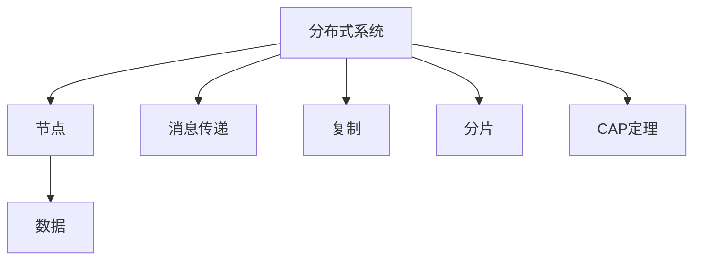

# 4.1.1 基本概念

## 1. 概念定义与背景

- **分布式系统（Distributed System）**：由多个自治计算节点通过网络协作完成共同任务的系统，节点间通过消息传递进行通信。
- **一致性（Consistency）**：分布式系统中各节点对数据状态的统一性要求。
- **可用性（Availability）**：系统在部分节点或网络故障时仍能对外提供服务的能力。
- **分区容忍性（Partition Tolerance）**：系统在网络分区情况下仍能继续运行的能力。

## 2. 相关术语

- 节点（Node）：分布式系统中的独立计算单元。
- 消息传递（Message Passing）：节点间通信的基本方式。
- 复制（Replication）：数据在多个节点间的冗余存储。
- 分片（Sharding）：将数据划分到不同节点以提升扩展性。
- CAP定理：一致性、可用性、分区容忍性三者不可兼得。

## 3. 结构化表达

- 概念图：

- 术语表：
| 编号 | 术语       | 定义 |
|------|------------|------|
| 4.1.1.1 | 分布式系统   | 多节点协作完成任务的系统 |
| 4.1.1.2 | 一致性       | 节点间数据状态统一 |
| 4.1.1.3 | 可用性       | 故障时仍能服务 |
| 4.1.1.4 | 分区容忍性   | 网络分区下系统可运行 |
| 4.1.1.5 | CAP定理     | 一致性、可用性、分区容忍性三者不可兼得 |

## 4. 发展脉络

- 1970s：分布式计算理论初步提出。
- 1980s：分布式文件系统、RPC等关键技术发展。
- 1990s：互联网推动大规模分布式系统应用。
- 2000s：云计算、NoSQL、区块链等新型分布式架构兴起。

## 5. 主要理论/流派

- CAP定理、BASE理论、Paxos/Raft一致性算法、分布式事务、分布式存储等。

## 6. 关键问题与挑战

- 一致性与可用性的权衡
- 网络分区与容错
- 数据复制与同步
- 扩展性与负载均衡
- 安全性与数据隔离

## 7. 典型案例

- 分布式数据库：如Cassandra、MongoDB、HBase。
- 分布式文件系统：如HDFS、GFS。
- 区块链系统：如Bitcoin、Ethereum。

## 8. 批判性分析

- CAP定理的实际适用性争议
- 一致性模型的复杂性与工程实现难题
- 分布式系统的安全隐患与攻击面

## 9. 形式化结构与符号表达

- DS = (N, C, R, S, CAP)
  - N：节点集合
  - C：通信机制
  - R：复制机制
  - S：分片机制
  - CAP：一致性、可用性、分区容忍性属性

## 10. 形式化命题与推理

- 命题：若系统满足分区容忍性与可用性，则无法同时保证强一致性。
- 证明：CAP定理推理链。

## 11. 多表征

- 结构层次图、通信流程图、数据一致性模型等

## 12. 形式语义

- “分布式系统”语义：多节点协作、数据一致性、容错与扩展。
- 语义模型：一致性协议状态机、消息传递模型
- 语义分析方法：一致性验证、容错分析

---
> 本文件为递归细化与内容补全示范，后续可继续分解为4.1.1.1、4.1.1.2等子主题，支持持续递归完善。
