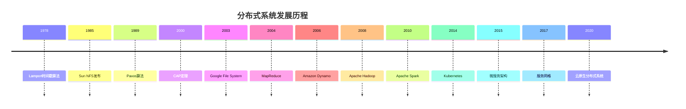

# 4.1.2 发展历程

## 目录

- [4.1.2 发展历程](#412-发展历程)
  - [目录](#目录)
  - [概述](#概述)
  - [理论基础阶段 (1960s-1970s)](#理论基础阶段-1960s-1970s)
    - [分布式计算理论萌芽](#分布式计算理论萌芽)
    - [关键理论突破](#关键理论突破)
    - [技术特征](#技术特征)
  - [技术实践阶段 (1980s-1990s)](#技术实践阶段-1980s-1990s)
    - [分布式系统架构](#分布式系统架构)
    - [通信协议发展](#通信协议发展)
    - [分布式数据库](#分布式数据库)
  - [互联网时代 (1990s-2000s)](#互联网时代-1990s-2000s)
    - [Web分布式系统](#web分布式系统)
    - [大规模分布式系统](#大规模分布式系统)
    - [分布式中间件](#分布式中间件)
  - [云计算时代 (2000s-2010s)](#云计算时代-2000s-2010s)
    - [云服务架构](#云服务架构)
    - [分布式存储系统](#分布式存储系统)
    - [分布式计算框架](#分布式计算框架)
  - [现代分布式系统 (2010s-至今)](#现代分布式系统-2010s-至今)
    - [微服务架构](#微服务架构)
    - [分布式数据库1](#分布式数据库1)
    - [区块链和去中心化](#区块链和去中心化)
  - [主要发展流派](#主要发展流派)
    - [一致性算法流派](#一致性算法流派)
    - [分布式存储流派](#分布式存储流派)
    - [分布式计算流派](#分布式计算流派)
    - [分布式通信流派](#分布式通信流派)
  - [关键技术里程碑](#关键技术里程碑)
    - [理论基础](#理论基础)
    - [系统架构](#系统架构)
    - [编程模型](#编程模型)
    - [数据管理](#数据管理)
  - [技术演进趋势](#技术演进趋势)
    - [架构演进](#架构演进)
    - [技术融合](#技术融合)
    - [智能化发展](#智能化发展)
  - [关键人物和贡献](#关键人物和贡献)
    - [学术贡献者](#学术贡献者)
    - [工业界贡献者](#工业界贡献者)
    - [开源社区贡献者](#开源社区贡献者)
  - [发展里程碑时间线](#发展里程碑时间线)
  - [未来发展趋势](#未来发展趋势)
    - [技术方向](#技术方向)
    - [应用领域](#应用领域)
    - [技术挑战](#技术挑战)
  - [总结](#总结)

## 概述

分布式系统的发展历程反映了计算机科学从单机计算到网络计算、从集中式到去中心化的演进过程，体现了可扩展性、可靠性和容错性需求的不断增长。

## 理论基础阶段 (1960s-1970s)

### 分布式计算理论萌芽

- **1960年代**: 多处理器系统理论研究
- **1970年代**: 分布式算法和协议理论发展
- **1978年**: Leslie Lamport发表"Time, Clocks, and the Ordering of Events"

### 关键理论突破

- **1978年**: Lamport时间戳算法，解决分布式系统中的事件排序问题
- **1979年**: 拜占庭将军问题提出，分布式容错理论
- **1980年**: 分布式一致性理论框架建立

### 技术特征

- 理论研究为主
- 算法和协议设计
- 形式化证明方法
- 基础概念定义

## 技术实践阶段 (1980s-1990s)

### 分布式系统架构

- **1980年代**: 分布式文件系统发展
- **1985年**: Sun NFS (Network File System)发布
- **1988年**: Andrew文件系统 (AFS)开发

### 通信协议发展

- **1980年**: RPC (Remote Procedure Call)概念提出
- **1984年**: Sun RPC协议标准化
- **1989年**: CORBA (Common Object Request Broker Architecture)

### 分布式数据库

- **1980年代**: 分布式数据库管理系统
- **1986年**: 两阶段提交协议 (2PC)
- **1990年代**: 分布式事务处理

## 互联网时代 (1990s-2000s)

### Web分布式系统

- **1990年代**: 万维网推动分布式应用
- **1994年**: 分布式对象技术 (DCOM, CORBA)
- **1998年**: Java RMI (Remote Method Invocation)

### 大规模分布式系统

- **1999年**: SETI@home分布式计算项目
- **2000年**: 网格计算技术发展
- **2001年**: 点对点 (P2P) 网络兴起

### 分布式中间件

- **1990年代**: 消息队列系统
- **1996年**: IBM MQSeries
- **1999年**: JMS (Java Message Service)

## 云计算时代 (2000s-2010s)

### 云服务架构

- **2006年**: Amazon Web Services (AWS) 发布
- **2008年**: Google App Engine
- **2010年**: Microsoft Azure

### 分布式存储系统

- **2003年**: Google File System (GFS) 论文
- **2004年**: Amazon Dynamo 论文
- **2006年**: Bigtable 分布式数据库

### 分布式计算框架

- **2004年**: MapReduce 编程模型
- **2008年**: Apache Hadoop 开源
- **2010年**: Apache Spark 项目启动

## 现代分布式系统 (2010s-至今)

### 微服务架构

- **2014年**: Netflix微服务架构实践
- **2015年**: Docker容器技术普及
- **2016年**: Kubernetes容器编排

### 分布式数据库1

- **2010年**: NoSQL数据库兴起
- **2012年**: NewSQL数据库发展
- **2015年**: 分布式SQL数据库

### 区块链和去中心化

- **2008年**: 比特币白皮书发布
- **2015年**: 以太坊智能合约
- **2017年**: 去中心化应用 (DApp)

## 主要发展流派

### 一致性算法流派

**发展历程**:

- **1989年**: Paxos算法提出
- **2001年**: 虚拟同步算法
- **2014年**: Raft算法发布
- **2015年**: ZAB算法 (ZooKeeper)

**技术特征**:

- 分布式共识算法
- 容错机制设计
- 一致性保证

**代表算法**:

- Paxos
- Raft
- ZAB
- PBFT (Practical Byzantine Fault Tolerance)

### 分布式存储流派

**发展历程**:

- **1980s**: 分布式文件系统
- **2000s**: 分布式数据库
- **2010s**: 云存储和对象存储

**技术特征**:

- 数据分片和复制
- 一致性模型
- 容错和恢复机制

**代表系统**:

- Google File System
- Amazon Dynamo
- Apache Cassandra
- MongoDB

### 分布式计算流派

**发展历程**:

- **1990s**: 集群计算
- **2000s**: 网格计算
- **2010s**: 云计算和边缘计算

**技术特征**:

- 任务分解和调度
- 资源管理和分配
- 负载均衡

**代表框架**:

- MapReduce
- Apache Hadoop
- Apache Spark
- Kubernetes

### 分布式通信流派

**发展历程**:

- **1980s**: RPC和消息传递
- **1990s**: 分布式对象
- **2000s**: Web服务
- **2010s**: 微服务和API网关

**技术特征**:

- 网络通信协议
- 服务发现和注册
- 负载均衡和路由

**代表技术**:

- gRPC
- Apache Kafka
- RabbitMQ
- Istio服务网格

## 关键技术里程碑

### 理论基础

- **1978年**: Lamport时间戳算法
- **1989年**: Paxos共识算法
- **2000年**: CAP定理
- **2012年**: PACELC定理

### 系统架构

- **1985年**: Sun NFS
- **2003年**: Google File System
- **2006年**: Amazon Dynamo
- **2014年**: Kubernetes

### 编程模型

- **2004年**: MapReduce
- **2008年**: Apache Hadoop
- **2010年**: Apache Spark
- **2015年**: Apache Flink

### 数据管理

- **2000年**: 分布式事务
- **2010年**: NoSQL数据库
- **2015年**: 分布式SQL
- **2020年**: 云原生数据库

## 技术演进趋势

### 架构演进

1. **单体 → 微服务**: 从集中式到分布式
2. **同构 → 异构**: 支持多种技术栈
3. **静态 → 动态**: 支持动态扩缩容
4. **手动 → 自动**: 自动化运维和管理

### 技术融合

1. **容器化**: Docker和Kubernetes
2. **服务网格**: Istio和Linkerd
3. **边缘计算**: 边缘节点和雾计算
4. **AI/ML**: 机器学习分布式训练

### 智能化发展

1. **自动化运维**: 自动故障检测和恢复
2. **智能调度**: AI驱动的资源调度
3. **预测性维护**: 基于机器学习的故障预测
4. **自适应优化**: 动态性能调优

## 关键人物和贡献

### 学术贡献者

- **Leslie Lamport**: 分布式算法理论，Paxos算法
- **Eric Brewer**: CAP定理，分布式系统理论
- **Barbara Liskov**: 分布式系统设计，Liskov替换原则
- **Nancy Lynch**: 分布式算法，形式化方法

### 工业界贡献者

- **Werner Vogels**: Amazon CTO，分布式系统架构
- **Jeff Dean**: Google AI，分布式系统设计
- **Sanjay Ghemawat**: Google，分布式文件系统
- **Brendan Burns**: Kubernetes联合创始人

### 开源社区贡献者

- **Doug Cutting**: Apache Hadoop创始人
- **Matei Zaharia**: Apache Spark创始人
- **Brendan Gregg**: 性能分析和调优
- **Kelsey Hightower**: Kubernetes和云原生技术

## 发展里程碑时间线

## 未来发展趋势

### 技术方向

1. **量子分布式系统**: 量子网络和量子计算
2. **边缘计算**: 边缘节点分布式处理
3. **AI/ML分布式**: 分布式机器学习
4. **区块链**: 去中心化分布式系统

### 应用领域

1. **物联网**: 大规模设备分布式管理
2. **自动驾驶**: 车联网分布式系统
3. **智慧城市**: 城市管理分布式平台
4. **医疗健康**: 分布式医疗数据系统

### 技术挑战

1. **可扩展性**: 超大规模分布式系统
2. **安全性**: 分布式安全机制
3. **一致性**: 强一致性和性能平衡
4. **智能化**: 自学习分布式系统

## 总结

分布式系统的发展历程体现了：

1. **理论演进**: 从基础理论到实践应用
2. **技术融合**: 从单一技术到综合解决方案
3. **架构创新**: 从集中式到分布式再到云原生
4. **智能化发展**: 从手动管理到自动化运维
5. **开源生态**: 从商业专有到开源开放

这一发展历程为现代云计算、大数据和人工智能技术奠定了坚实基础。
