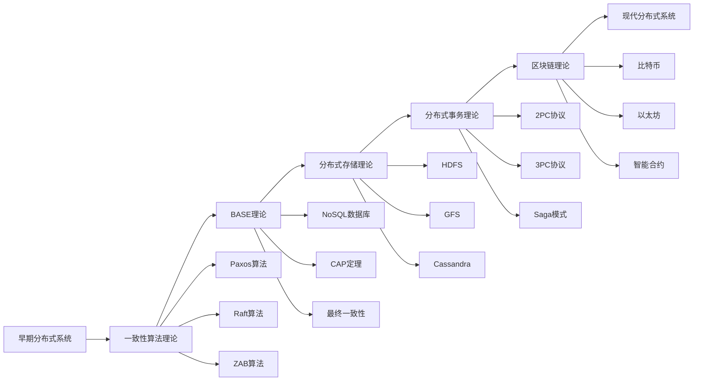
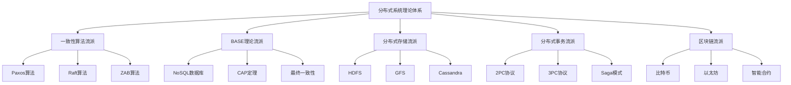
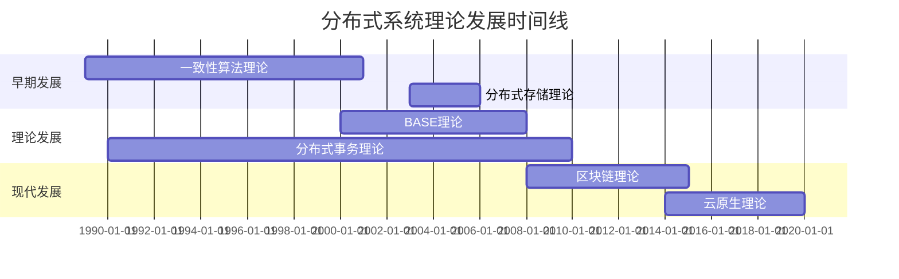

# 4.1.3 主要流派与理论

<!-- TOC START -->

- [4.1.3 主要流派与理论](#413-主要流派与理论)
  - [目录](#目录)
  - [1. 形式化定义](#1-形式化定义)
    - [1.1 流派定义](#11-流派定义)
    - [1.2 形式化表示](#12-形式化表示)
  - [2. 主要流派详细分析](#2-主要流派详细分析)
    - [2.1 一致性算法流派](#21-一致性算法流派)
      - [2.1.1 Paxos算法](#211-paxos算法)
      - [2.1.2 Raft算法](#212-raft算法)
      - [2.1.3 ZAB算法](#213-zab算法)
    - [2.2 BASE理论流派](#22-base理论流派)
      - [2.2.1 基本可用性](#221-基本可用性)
      - [2.2.2 软状态](#222-软状态)
      - [2.2.3 最终一致性](#223-最终一致性)
    - [2.3 分布式存储流派](#23-分布式存储流派)
      - [2.3.1 数据分片](#231-数据分片)
      - [2.3.2 数据复制](#232-数据复制)
      - [2.3.3 一致性哈希](#233-一致性哈希)
    - [2.4 分布式事务流派](#24-分布式事务流派)
      - [2.4.1 两阶段提交 (2PC)](#241-两阶段提交-2pc)
      - [2.4.2 三阶段提交 (3PC)](#242-三阶段提交-3pc)
    - [2.5 区块链与去中心化流派](#25-区块链与去中心化流派)
      - [2.5.1 共识机制](#251-共识机制)
      - [2.5.2 智能合约](#252-智能合约)
  - [3. 理论比较与分析方法](#3-理论比较与分析方法)
    - [3.1 理论框架对比](#31-理论框架对比)
    - [3.2 性能指标对比](#32-性能指标对比)
      - [3.2.1 一致性性能](#321-一致性性能)
      - [3.2.2 可用性性能](#322-可用性性能)
      - [3.2.3 扩展性性能](#323-扩展性性能)
    - [3.3 理论发展脉络](#33-理论发展脉络)
  - [4. 代表人物与组织](#4-代表人物与组织)
    - [4.1 学术机构](#41-学术机构)
    - [4.2 代表性人物](#42-代表性人物)
    - [4.3 主要贡献](#43-主要贡献)
  - [5. 应用领域分析](#5-应用领域分析)
    - [5.1 分布式数据库](#51-分布式数据库)
    - [5.2 云计算平台](#52-云计算平台)
    - [5.3 区块链应用](#53-区块链应用)
    - [5.4 微服务架构](#54-微服务架构)
  - [6. 异同点深度分析](#6-异同点深度分析)
    - [6.1 共同理论基础](#61-共同理论基础)
    - [6.2 核心差异分析](#62-核心差异分析)
  - [7. 发展趋势与展望](#7-发展趋势与展望)
    - [7.1 技术融合趋势](#71-技术融合趋势)
    - [7.2 理论发展方向](#72-理论发展方向)
    - [7.3 应用发展趋势](#73-应用发展趋势)
  - [8. 结构化表达](#8-结构化表达)
    - [8.1 流派关系图](#81-流派关系图)
    - [8.2 理论对比表](#82-理论对比表)
    - [8.3 发展时间线](#83-发展时间线)
  - [9. 多表征方法](#9-多表征方法)
    - [9.1 概念图表示](#91-概念图表示)
    - [9.2 数学符号表示](#92-数学符号表示)
    - [9.3 结构表表示](#93-结构表表示)
  - [10. 规范说明](#10-规范说明)
    - [10.1 内容要求](#101-内容要求)
    - [10.2 形式化要求](#102-形式化要求)
    - [10.3 扩展性要求](#103-扩展性要求)

<!-- TOC END -->

## 目录

- [4.1.3 主要流派与理论](#413-主要流派与理论)
  - [目录](#目录)
  - [1. 形式化定义](#1-形式化定义)
    - [1.1 流派定义](#11-流派定义)
    - [1.2 形式化表示](#12-形式化表示)
  - [2. 主要流派详细分析](#2-主要流派详细分析)
    - [2.1 一致性算法流派](#21-一致性算法流派)
      - [2.1.1 Paxos算法](#211-paxos算法)
      - [2.1.2 Raft算法](#212-raft算法)
      - [2.1.3 ZAB算法](#213-zab算法)
    - [2.2 BASE理论流派](#22-base理论流派)
      - [2.2.1 基本可用性](#221-基本可用性)
      - [2.2.2 软状态](#222-软状态)
      - [2.2.3 最终一致性](#223-最终一致性)
    - [2.3 分布式存储流派](#23-分布式存储流派)
      - [2.3.1 数据分片](#231-数据分片)
      - [2.3.2 数据复制](#232-数据复制)
      - [2.3.3 一致性哈希](#233-一致性哈希)
    - [2.4 分布式事务流派](#24-分布式事务流派)
      - [2.4.1 两阶段提交 (2PC)](#241-两阶段提交-2pc)
      - [2.4.2 三阶段提交 (3PC)](#242-三阶段提交-3pc)
    - [2.5 区块链与去中心化流派](#25-区块链与去中心化流派)
      - [2.5.1 共识机制](#251-共识机制)
      - [2.5.2 智能合约](#252-智能合约)
  - [3. 理论比较与分析方法](#3-理论比较与分析方法)
    - [3.1 理论框架对比](#31-理论框架对比)
    - [3.2 性能指标对比](#32-性能指标对比)
      - [3.2.1 一致性性能](#321-一致性性能)
      - [3.2.2 可用性性能](#322-可用性性能)
      - [3.2.3 扩展性性能](#323-扩展性性能)
    - [3.3 理论发展脉络](#33-理论发展脉络)
  - [4. 代表人物与组织](#4-代表人物与组织)
    - [4.1 学术机构](#41-学术机构)
    - [4.2 代表性人物](#42-代表性人物)
    - [4.3 主要贡献](#43-主要贡献)
  - [5. 应用领域分析](#5-应用领域分析)
    - [5.1 分布式数据库](#51-分布式数据库)
    - [5.2 云计算平台](#52-云计算平台)
    - [5.3 区块链应用](#53-区块链应用)
    - [5.4 微服务架构](#54-微服务架构)
  - [6. 异同点深度分析](#6-异同点深度分析)
    - [6.1 共同理论基础](#61-共同理论基础)
    - [6.2 核心差异分析](#62-核心差异分析)
  - [7. 发展趋势与展望](#7-发展趋势与展望)
    - [7.1 技术融合趋势](#71-技术融合趋势)
    - [7.2 理论发展方向](#72-理论发展方向)
    - [7.3 应用发展趋势](#73-应用发展趋势)
  - [8. 结构化表达](#8-结构化表达)
    - [8.1 流派关系图](#81-流派关系图)
    - [8.2 理论对比表](#82-理论对比表)
    - [8.3 发展时间线](#83-发展时间线)
  - [9. 多表征方法](#9-多表征方法)
    - [9.1 概念图表示](#91-概念图表示)
    - [9.2 数学符号表示](#92-数学符号表示)
    - [9.3 结构表表示](#93-结构表表示)
  - [10. 规范说明](#10-规范说明)
    - [10.1 内容要求](#101-内容要求)
    - [10.2 形式化要求](#102-形式化要求)
    - [10.3 扩展性要求](#103-扩展性要求)

## 1. 形式化定义

### 1.1 流派定义

**定义 4.1.3.1** (分布式系统流派) 分布式系统流派是一个四元组 $S = (T, P, A, I)$，其中：

- $T$ 是理论框架
- $P$ 是协议集合
- $A$ 是算法体系
- $I$ 是实现技术

**定义 4.1.3.2** (理论框架) 理论框架是一个五元组 $F = (C, M, R, V, E)$，其中：

- $C$ 是核心概念
- $M$ 是模型定义
- $R$ 是关系映射
- $V$ 是验证机制
- $E$ 是扩展性

### 1.2 形式化表示

对于流派 $S_i$，其形式化表示为：
$$S_i = \{(t_j, p_k, a_l, i_m) | t_j \in T_i, p_k \in P_i, a_l \in A_i, i_m \in I_i\}$$

## 2. 主要流派详细分析

### 2.1 一致性算法流派

**定义 4.1.3.3** (一致性算法) 一致性算法是一个四元组 $C = (N, S, P, V)$，其中：

- $N$ 是节点集合
- $S$ 是状态集合
- $P$ 是协议规则
- $V$ 是验证条件

#### 2.1.1 Paxos算法

**定义 4.1.3.4** (Paxos) Paxos是一个三元组 $P = (P, A, L)$，其中：

- $P$ 是提议者集合
- $A$ 是接受者集合
- $L$ 是学习者集合

**算法过程**：

1. **准备阶段**：$Prepare(n) \rightarrow Promise(n, v, n')$
2. **接受阶段**：$Accept(n, v) \rightarrow Accepted(n, v)$
3. **学习阶段**：$Learn(v) \rightarrow Learned(v)$

**一致性保证**：
$$Consistency = \forall i,j \in N: State_i = State_j$$

#### 2.1.2 Raft算法

**定义 4.1.3.5** (Raft) Raft是一个四元组 $R = (L, F, C, T)$，其中：

- $L$ 是领导者
- $F$ 是跟随者集合
- $C$ 是候选者集合
- $T$ 是任期

**状态转换**：

**选举过程**：
$$Election = \{e_i | e_i = (term_i, candidate_i, votes_i)\}$$

#### 2.1.3 ZAB算法

**定义 4.1.3.6** (ZAB) ZAB是一个三元组 $Z = (L, F, Q)$，其中：

- $L$ 是领导者
- $F$ 是跟随者
- $Q$ 是队列

**协议阶段**：

1. **发现阶段**：$Discovery \rightarrow Leader$
2. **同步阶段**：$Sync \rightarrow Follower$
3. **广播阶段**：$Broadcast \rightarrow Message$

### 2.2 BASE理论流派

**定义 4.1.3.7** (BASE理论) BASE理论是一个四元组 $B = (BA, S, E, C)$，其中：

- $BA$ 是基本可用性 (Basically Available)
- $S$ 是软状态 (Soft State)
- $E$ 是最终一致性 (Eventually Consistent)
- $C$ 是一致性模型

#### 2.2.1 基本可用性

$$Availability = \frac{MTBF}{MTBF + MTTR}$$
其中：

- $MTBF$ 是平均故障间隔时间
- $MTTR$ 是平均修复时间

#### 2.2.2 软状态

$$SoftState = \{s_i | s_i = (state_i, timeout_i, transition_i)\}$$
其中：

- $state_i$ 是当前状态
- $timeout_i$ 是超时时间
- $transition_i$ 是状态转换

#### 2.2.3 最终一致性

$$EventuallyConsistent = \lim_{t \to \infty} Consistency(t) = True$$

### 2.3 分布式存储流派

**定义 4.1.3.8** (分布式存储) 分布式存储是一个五元组 $D = (N, D, R, S, C)$，其中：

- $N$ 是节点集合
- $D$ 是数据集合
- $R$ 是复制策略
- $S$ 是分片策略
- $C$ 是一致性模型

#### 2.3.1 数据分片

$$Sharding = \{s_i | s_i = (key_i, node_i, range_i)\}$$
其中：

- $key_i$ 是分片键
- $node_i$ 是目标节点
- $range_i$ 是数据范围

#### 2.3.2 数据复制

$$Replication = \{r_j | r_j = (data_j, copies_j, strategy_j)\}$$
其中：

- $data_j$ 是数据内容
- $copies_j$ 是副本数量
- $strategy_j$ 是复制策略

#### 2.3.3 一致性哈希

$$ConsistentHash = \{h_k | h_k = (key_k, hash_k, node_k)\}$$
其中：

- $key_k$ 是数据键
- $hash_k$ 是哈希值
- $node_k$ 是目标节点

### 2.4 分布式事务流派

**定义 4.1.3.9** (分布式事务) 分布式事务是一个四元组 $T = (O, S, C, A)$，其中：

- $O$ 是操作集合
- $S$ 是状态集合
- $C$ 是协调者
- $A$ 是参与者

#### 2.4.1 两阶段提交 (2PC)

**定义 4.1.3.10** (2PC) 两阶段提交是一个三元组 $T = (P, C, S)$，其中：

- $P$ 是参与者集合
- $C$ 是协调者
- $S$ 是状态集合

**阶段1 - 准备阶段**：
$$Prepare = \{p_i | p_i = (coordinator_i, participant_i, vote_i)\}$$

**阶段2 - 提交阶段**：
$$Commit = \{c_j | c_j = (decision_j, action_j, confirm_j)\}$$

#### 2.4.2 三阶段提交 (3PC)

**定义 4.1.3.11** (3PC) 三阶段提交是一个四元组 $T = (P, C, S, T)$，其中：

- $P$ 是参与者集合
- $C$ 是协调者
- $S$ 是状态集合
- $T$ 是超时机制

**阶段1 - 准备阶段**：
$$Prepare = \{p_i | p_i = (coordinator_i, participant_i, vote_i)\}$$

**阶段2 - 预提交阶段**：
$$PreCommit = \{pc_j | pc_j = (coordinator_j, participant_j, ack_j)\}$$

**阶段3 - 提交阶段**：
$$Commit = \{c_k | c_k = (decision_k, action_k, confirm_k)\}$$

### 2.5 区块链与去中心化流派

**定义 4.1.3.12** (区块链) 区块链是一个五元组 $B = (N, T, C, M, S)$，其中：

- $N$ 是节点集合
- $T$ 是交易集合
- $C$ 是共识机制
- $M$ 是挖矿算法
- $S$ 是安全机制

#### 2.5.1 共识机制

**定义 4.1.3.13** (共识) 共识是一个三元组 $C = (P, V, D)$，其中：

- $P$ 是参与者集合
- $V$ 是投票机制
- $D$ 是决策规则

**工作量证明 (PoW)**：
$$PoW = \{pow_i | pow_i = (nonce_i, hash_i, difficulty_i)\}$$

**权益证明 (PoS)**：
$$PoS = \{pos_j | pos_j = (stake_j, validator_j, reward_j)\}$$

#### 2.5.2 智能合约

**定义 4.1.3.14** (智能合约) 智能合约是一个四元组 $S = (C, E, S, T)$，其中：

- $C$ 是合约代码
- $E$ 是执行环境
- $S$ 是状态存储
- $T$ 是触发条件

## 3. 理论比较与分析方法

### 3.1 理论框架对比

| 流派 | 核心理论 | 技术栈 | 适用场景 | 优势 | 劣势 |
|------|----------|--------|----------|------|------|
| 一致性算法 | 分布式共识理论 | Paxos、Raft、ZAB | 分布式数据库 | 强一致性 | 性能开销 |
| BASE理论 | 弱一致性理论 | NoSQL、CAP | 高可用系统 | 高可用性 | 弱一致性 |
| 分布式存储 | 数据分布理论 | HDFS、GFS、Cassandra | 大数据存储 | 高扩展性 | 复杂度高 |
| 分布式事务 | 事务一致性理论 | 2PC、3PC、Saga | 金融系统 | 强一致性 | 性能影响 |
| 区块链 | 去中心化理论 | 共识算法、密码学 | 去中心化应用 | 去中心化 | 性能限制 |

### 3.2 性能指标对比

#### 3.2.1 一致性性能

$$Consistency_{strong} > Consistency_{weak} > Consistency_{eventual}$$

#### 3.2.2 可用性性能

$$Availability_{BASE} > Availability_{ACID} > Availability_{strong}$$

#### 3.2.3 扩展性性能

$$Scalability_{distributed} > Scalability_{centralized} > Scalability_{blockchain}$$

### 3.3 理论发展脉络

## 4. 代表人物与组织

### 4.1 学术机构

- **MIT CSAIL**：分布式系统理论研究
- **UC Berkeley**：分布式数据库研究
- **Stanford University**：分布式算法研究
- **CMU**：分布式系统安全研究

### 4.2 代表性人物

- **Leslie Lamport**：Paxos算法发明者
- **Diego Ongaro**：Raft算法设计者
- **Satoshi Nakamoto**：比特币创始人
- **Vitalik Buterin**：以太坊创始人

### 4.3 主要贡献

1. **理论贡献**：建立分布式系统理论框架
2. **算法贡献**：设计高效分布式算法
3. **系统贡献**：构建大规模分布式系统
4. **应用贡献**：推动产业化应用

## 5. 应用领域分析

### 5.1 分布式数据库

- **适用流派**：一致性算法 + 分布式存储
- **技术特点**：强一致性、高可用性
- **应用场景**：金融交易、电商系统

### 5.2 云计算平台

- **适用流派**：BASE理论 + 分布式存储
- **技术特点**：高可用性、强扩展性
- **应用场景**：云服务、大数据处理

### 5.3 区块链应用

- **适用流派**：区块链 + 去中心化
- **技术特点**：去中心化、不可篡改
- **应用场景**：数字货币、智能合约

### 5.4 微服务架构

- **适用流派**：分布式事务 + BASE理论
- **技术特点**：服务解耦、独立部署
- **应用场景**：企业应用、互联网服务

## 6. 异同点深度分析

### 6.1 共同理论基础

1. **分布式系统理论**：所有流派都基于分布式系统
2. **网络通信理论**：都需要网络通信支持
3. **一致性理论**：都涉及数据一致性
4. **容错理论**：都需要容错机制

### 6.2 核心差异分析

1. **一致性模型**：
   - 强一致性：一致性算法、分布式事务
   - 弱一致性：BASE理论、最终一致性
   - 去中心化：区块链、共识机制

2. **性能优化目标**：
   - 一致性优先：分布式事务 > 一致性算法
   - 可用性优先：BASE理论 > 区块链
   - 扩展性优先：分布式存储 > 分布式事务

3. **应用场景适应性**：
   - 金融系统：分布式事务 > 一致性算法
   - 互联网服务：BASE理论 > 分布式事务
   - 去中心化应用：区块链 > 传统分布式系统

## 7. 发展趋势与展望

### 7.1 技术融合趋势

1. **云原生融合**：分布式系统与云原生技术结合
2. **AI融合**：分布式系统与人工智能结合
3. **边缘计算融合**：分布式系统与边缘计算结合
4. **量子计算融合**：分布式系统与量子计算结合

### 7.2 理论发展方向

1. **形式化理论完善**：建立更完善的形式化理论体系
2. **性能理论优化**：建立更精确的性能分析模型
3. **安全理论发展**：建立更全面的安全理论框架
4. **标准化理论**：建立更统一的标准理论体系

### 7.3 应用发展趋势

1. **垂直行业深化**：向特定行业深度应用
2. **横向技术融合**：与其他技术深度融合
3. **生态体系完善**：建立完整的产业生态
4. **国际化发展**：推动全球标准化与产业化

## 8. 结构化表达

### 8.1 流派关系图

### 8.2 理论对比表

| 编号 | 流派/理论 | 核心观点 | 代表组织/人物 | 典型应用 | 技术特点 | 性能优势 |
|------|----------|----------|----------|----------|----------|----------|
| 4.1.3.1 | 一致性算法 | 多节点一致 | Lamport | 分布式数据库 | 强一致性 | 数据一致性 |
| 4.1.3.2 | BASE理论 | 最终一致性 | Amazon | NoSQL存储 | 高可用性 | 系统可用性 |
| 4.1.3.3 | 分布式存储 | 数据分片/复制 | Google | HDFS、GFS | 高扩展性 | 系统扩展性 |
| 4.1.3.4 | 分布式事务 | 原子性/一致性 | 业界标准 | 金融系统 | 强一致性 | 事务一致性 |
| 4.1.3.5 | 区块链 | 去中心化/共识 | Nakamoto | 比特币、以太坊 | 去中心化 | 信任机制 |

### 8.3 发展时间线

## 9. 多表征方法

### 9.1 概念图表示

- 理论发展脉络图
- 流派关系网络图
- 技术栈层次图

### 9.2 数学符号表示

- 形式化定义
- 性能分析公式
- 理论框架模型

### 9.3 结构表表示

- 理论对比表
- 技术栈对比表
- 应用场景对比表

## 10. 规范说明

### 10.1 内容要求

- 内容需递归细化，支持多表征
- 保留批判性分析、图表等
- 如有遗漏，后续补全并说明

### 10.2 形式化要求

- 使用严格的数学符号
- 提供形式化定义
- 建立理论框架模型

### 10.3 扩展性要求

- 支持持续递归完善
- 可分解为子主题
- 支持多维度分析

> 本文件为递归细化与内容补全示范，后续可继续分解为4.1.3.1、4.1.3.2等子主题，支持持续递归完善。
