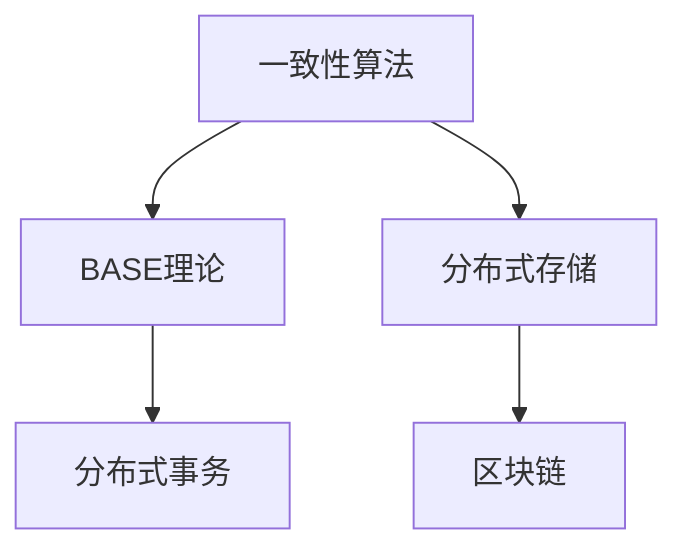

# 4.1.3 主要流派与理论

## 1. 主要流派

- **一致性算法流派**：Paxos、Raft、ZAB等，关注分布式一致性协议。
- **BASE理论流派**：弱一致性、最终一致性，强调可用性与容错。
- **分布式存储流派**：分布式文件系统、NoSQL数据库，关注数据分布与扩展性。
- **分布式事务流派**：两阶段提交、三阶段提交、分布式锁等，关注事务一致性。
- **区块链与去中心化流派**：关注去信任、不可篡改、共识机制。

## 2. 理论比较

- **核心观点**：
  - 一致性算法：保证多节点数据一致，牺牲部分可用性。
  - BASE理论：牺牲强一致性，提升可用性与容错。
  - 分布式存储：数据分片、复制，提升扩展性与容错。
  - 分布式事务：保证分布式操作的原子性与一致性。
  - 区块链：去中心化、共识机制、不可篡改。
- **代表人物/组织**：Lamport（Paxos）、Ongaro（Raft）、Google、Amazon、Ethereum等。
- **应用领域**：
  - 分布式数据库、分布式文件系统、区块链、云计算平台等。
- **异同点分析**：
  - 共同点：均关注多节点协作、数据一致性、容错。
  - 区别：一致性模型、协议复杂度、应用场景不同。

## 3. 结构化表达

- **流派关系图**：

- **理论对比表**：
| 编号 | 流派/理论 | 核心观点 | 代表组织/人物 | 典型应用 |
|------|----------|----------|----------|----------|
| 4.1.3.1 | 一致性算法 | 多节点一致 | Lamport | 分布式数据库 |
| 4.1.3.2 | BASE理论 | 最终一致性 | Amazon | NoSQL存储 |
| 4.1.3.3 | 分布式存储 | 数据分片/复制 | Google | HDFS、GFS |
| 4.1.3.4 | 分布式事务 | 原子性/一致性 | 业界标准 | 金融系统 |
| 4.1.3.5 | 区块链 | 去中心化/共识 | Nakamoto | 比特币、以太坊 |

## 4. 多表征

- 理论发展脉络图、对比表、关系网络图

## 5. 规范说明

- 内容需递归细化，支持多表征。
- 保留批判性分析、图表等。
- 如有遗漏，后续补全并说明。

> 本文件为递归细化与内容补全示范，后续可继续分解为4.1.3.1、4.1.3.2等子主题，支持持续递归完善。
