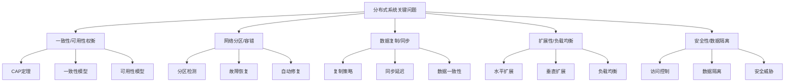
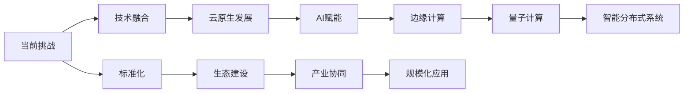

# 4.1.4 关键问题与挑战

## 目录

- [4.1.4 关键问题与挑战](#414-关键问题与挑战)
  - [目录](#目录)
  - [1. 形式化定义](#1-形式化定义)
    - [1.1 问题定义](#11-问题定义)
    - [1.2 问题严重程度量化](#12-问题严重程度量化)
  - [2. 主要问题详细分析](#2-主要问题详细分析)
    - [2.1 一致性与可用性的权衡问题](#21-一致性与可用性的权衡问题)
      - [2.1.1 一致性模型](#211-一致性模型)
      - [2.1.2 可用性模型](#212-可用性模型)
      - [2.1.3 权衡策略](#213-权衡策略)
    - [2.2 网络分区与容错问题](#22-网络分区与容错问题)
      - [2.2.1 分区检测](#221-分区检测)
      - [2.2.2 容错机制](#222-容错机制)
    - [2.3 数据复制与同步问题](#23-数据复制与同步问题)
      - [2.3.1 复制策略](#231-复制策略)
      - [2.3.2 同步延迟](#232-同步延迟)
    - [2.4 扩展性与负载均衡问题](#24-扩展性与负载均衡问题)
      - [2.4.1 水平扩展](#241-水平扩展)
      - [2.4.2 垂直扩展](#242-垂直扩展)
      - [2.4.3 负载均衡算法](#243-负载均衡算法)
    - [2.5 安全性与数据隔离问题](#25-安全性与数据隔离问题)
      - [2.5.1 访问控制](#251-访问控制)
      - [2.5.2 数据隔离](#252-数据隔离)
      - [2.5.3 安全威胁](#253-安全威胁)
  - [3. 挑战深度分析](#3-挑战深度分析)
    - [3.1 理论与实际的差距](#31-理论与实际的差距)
      - [3.1.1 模型简化问题](#311-模型简化问题)
      - [3.1.2 不确定性建模](#312-不确定性建模)
    - [3.2 多学科交叉难点](#32-多学科交叉难点)
      - [3.2.1 学科领域](#321-学科领域)
      - [3.2.2 知识整合挑战](#322-知识整合挑战)
    - [3.3 未来发展趋势挑战](#33-未来发展趋势挑战)
      - [3.3.1 云原生挑战](#331-云原生挑战)
      - [3.3.2 区块链挑战](#332-区块链挑战)
    - [3.4 自组织与自适应能力](#34-自组织与自适应能力)
      - [3.4.1 自适应算法](#341-自适应算法)
      - [3.4.2 自愈机制](#342-自愈机制)
  - [4. 解决方案与策略](#4-解决方案与策略)
    - [4.1 技术解决方案](#41-技术解决方案)
      - [4.1.1 一致性解决方案](#411-一致性解决方案)
      - [4.1.2 容错解决方案](#412-容错解决方案)
      - [4.1.3 扩展性解决方案](#413-扩展性解决方案)
    - [4.2 管理策略](#42-管理策略)
      - [4.2.1 标准化策略](#421-标准化策略)
      - [4.2.2 人才培养策略](#422-人才培养策略)
  - [5. 结构化表达](#5-结构化表达)
    - [5.1 问题树](#51-问题树)
    - [5.2 挑战矩阵](#52-挑战矩阵)
    - [5.3 发展趋势图](#53-发展趋势图)
  - [6. 多表征方法](#6-多表征方法)
    - [6.1 概念图表示](#61-概念图表示)
    - [6.2 数学符号表示](#62-数学符号表示)
    - [6.3 结构表表示](#63-结构表表示)
  - [7. 规范说明](#7-规范说明)
    - [7.1 内容要求](#71-内容要求)
    - [7.2 形式化要求](#72-形式化要求)
    - [7.3 扩展性要求](#73-扩展性要求)

## 1. 形式化定义

### 1.1 问题定义

**定义 4.1.4.1** (分布式系统问题) 分布式系统问题是一个五元组 $P = (D, I, C, S, R)$，其中：

- $D$ 是问题描述
- $I$ 是影响范围
- $C$ 是复杂度
- $S$ 是严重程度
- $R$ 是解决难度

**定义 4.1.4.2** (挑战) 挑战是一个六元组 $C = (T, R, L, A, M, F)$，其中：

- $T$ 是技术挑战
- $R$ 是资源约束
- $L$ 是限制条件
- $A$ 是应用需求
- $M$ 是管理复杂度
- $F$ 是未来趋势

### 1.2 问题严重程度量化

$$Severity(P) = \alpha \cdot Impact(P) + \beta \cdot Complexity(P) + \gamma \cdot Urgency(P) + \delta \cdot Risk(P)$$
其中 $\alpha, \beta, \gamma, \delta$ 是权重系数。

## 2. 主要问题详细分析

### 2.1 一致性与可用性的权衡问题

**定义 4.1.4.3** (CAP定理) CAP定理是一个三元组 $C = (C, A, P)$，其中：

- $C$ 是一致性 (Consistency)
- $A$ 是可用性 (Availability)
- $P$ 是分区容错性 (Partition Tolerance)

#### 2.1.1 一致性模型

**定义 4.1.4.4** (一致性) 一致性是一个四元组 $C = (S, T, V, R)$，其中：

- $S$ 是状态集合
- $T$ 是时间约束
- $V$ 是验证条件
- $R$ 是关系映射

**强一致性**：
$$StrongConsistency = \forall i,j \in N, t \in T: State_i(t) = State_j(t)$$

**弱一致性**：
$$WeakConsistency = \exists t' > t: State_i(t') = State_j(t')$$

**最终一致性**：
$$EventuallyConsistent = \lim_{t \to \infty} Consistency(t) = True$$

#### 2.1.2 可用性模型

**定义 4.1.4.5** (可用性) 可用性是一个三元组 $A = (U, D, R)$，其中：

- $U$ 是正常运行时间
- $D$ 是停机时间
- $R$ 是恢复时间

$$Availability = \frac{MTBF}{MTBF + MTTR}$$
其中：

- $MTBF$ 是平均故障间隔时间
- $MTTR$ 是平均修复时间

#### 2.1.3 权衡策略

1. **CP系统**：优先保证一致性和分区容错性
   $$CP = \{cp_i | cp_i = (consistency_i, partition_i, availability_i)\}$$

2. **AP系统**：优先保证可用性和分区容错性
   $$AP = \{ap_j | ap_j = (availability_j, partition_j, consistency_j)\}$$

3. **CA系统**：优先保证一致性和可用性
   $$CA = \{ca_k | ca_k = (consistency_k, availability_k, partition_k)\}$$

### 2.2 网络分区与容错问题

**定义 4.1.4.6** (网络分区) 网络分区是一个四元组 $P = (N, L, T, I)$，其中：

- $N$ 是节点集合
- $L$ 是链路集合
- $T$ 是时间窗口
- $I$ 是影响范围

#### 2.2.1 分区检测

$$PartitionDetection = \{pd_i | pd_i = (node_i, timeout_i, heartbeat_i)\}$$
其中：

- $node_i$ 是检测节点
- $timeout_i$ 是超时时间
- $heartbeat_i$ 是心跳机制

#### 2.2.2 容错机制

1. **故障检测**：
   $$FaultDetection = \{fd_j | fd_j = (sensor_j, threshold_j, alarm_j)\}$$

2. **故障恢复**：
   $$FaultRecovery = \{fr_k | fr_k = (trigger_k, action_k, verification_k)\}$$

3. **自动修复**：
   $$AutoRepair = \{ar_l | ar_l = (diagnosis_l, repair_l, test_l)\}$$

### 2.3 数据复制与同步问题

**定义 4.1.4.7** (数据复制) 数据复制是一个五元组 $R = (D, C, S, T, V)$，其中：

- $D$ 是数据集合
- $C$ 是副本集合
- $S$ 是同步策略
- $T$ 是时间约束
- $V$ 是验证机制

#### 2.3.1 复制策略

1. **同步复制**：
   $$SyncReplication = \{sr_i | sr_i = (data_i, replica_i, sync_i)\}$$

2. **异步复制**：
   $$AsyncReplication = \{ar_j | ar_j = (data_j, replica_j, async_j)\}$$

3. **半同步复制**：
   $$SemiSyncReplication = \{ssr_k | ssr_k = (data_k, replica_k, semisync_k)\}$$

#### 2.3.2 同步延迟

$$SyncDelay = \{sd_l | sd_l = (source_l, target_l, delay_l, loss_l)\}$$
其中：

- $source_l$ 是源节点
- $target_l$ 是目标节点
- $delay_l$ 是延迟时间
- $loss_l$ 是数据丢失

### 2.4 扩展性与负载均衡问题

**定义 4.1.4.8** (扩展性) 扩展性是一个四元组 $S = (C, P, L, E)$，其中：

- $C$ 是容量
- $P$ 是性能
- $L$ 是负载
- $E$ 是效率

#### 2.4.1 水平扩展

$$HorizontalScaling = \{hs_i | hs_i = (node_i, capacity_i, load_i)\}$$
其中：

- $node_i$ 是节点数量
- $capacity_i$ 是容量增加
- $load_i$ 是负载分布

#### 2.4.2 垂直扩展

$$VerticalScaling = \{vs_j | vs_j = (resource_j, performance_j, cost_j)\}$$
其中：

- $resource_j$ 是资源类型
- $performance_j$ 是性能提升
- $cost_j$ 是成本增加

#### 2.4.3 负载均衡算法

1. **轮询算法**：
   $$RoundRobin = \{rr_k | rr_k = (request_k, server_k, index_k)\}$$

2. **加权轮询**：
   $$WeightedRoundRobin = \{wrr_l | wrr_l = (request_l, server_l, weight_l)\}$$

3. **最少连接**：
   $$LeastConnection = \{lc_m | lc_m = (request_m, server_m, connection_m)\}$$

### 2.5 安全性与数据隔离问题

**定义 4.1.4.9** (安全性) 安全性是一个五元组 $S = (C, I, A, P, T)$，其中：

- $C$ 是机密性
- $I$ 是完整性
- $A$ 是可用性
- $P$ 是隐私性
- $T$ 是可信性

#### 2.5.1 访问控制

$$AccessControl = \{ac_i | ac_i = (user_i, resource_i, permission_i, policy_i)\}$$
其中：

- $user_i$ 是用户身份
- $resource_i$ 是资源对象
- $permission_i$ 是权限级别
- $policy_i$ 是访问策略

#### 2.5.2 数据隔离

$$DataIsolation = \{di_j | di_j = (tenant_j, data_j, boundary_j, encryption_j)\}$$
其中：

- $tenant_j$ 是租户标识
- $data_j$ 是数据内容
- $boundary_j$ 是隔离边界
- $encryption_j$ 是加密方式

#### 2.5.3 安全威胁

1. **网络攻击**：
   $$NetworkAttack = \{na_k | na_k = (type_k, target_k, method_k, impact_k)\}$$

2. **数据泄露**：
   $$DataLeak = \{dl_l | dl_l = (source_l, channel_l, content_l, damage_l)\}$$

3. **权限提升**：
   $$PrivilegeEscalation = \{pe_m | pe_m = (user_m, exploit_m, gain_m, risk_m)\}$$

## 3. 挑战深度分析

### 3.1 理论与实际的差距

**定义 4.1.4.10** (理论-实际差距) 差距是一个四元组 $G = (M, R, U, I)$，其中：

- $M$ 是模型简化
- $R$ 是现实复杂性
- $U$ 是不确定性
- $I$ 是实施困难

#### 3.1.1 模型简化问题

1. **理想化假设**：$Model_{ideal} \neq Reality_{complex}$
2. **参数估计误差**：$Error = |Estimated - Actual|$
3. **环境变化影响**：$Impact = f(Environment, Time, Context)$

#### 3.1.2 不确定性建模

$$Uncertainty = \{u_i | u_i = (source_i, probability_i, impact_i, mitigation_i)\}$$
其中：

- $source_i$ 是不确定性来源
- $probability_i$ 是发生概率
- $impact_i$ 是影响程度
- $mitigation_i$ 是缓解措施

### 3.2 多学科交叉难点

**定义 4.1.4.11** (多学科交叉) 交叉是一个五元组 $I = (D, K, T, I, M)$，其中：

- $D$ 是学科领域
- $K$ 是知识体系
- $T$ 是技术栈
- $I$ 是集成方法
- $M$ 是方法论

#### 3.2.1 学科领域

1. **计算机科学**：算法、数据结构、系统架构
2. **网络工程**：网络协议、路由算法、流量控制
3. **数据库理论**：事务处理、并发控制、数据模型
4. **密码学**：加密算法、数字签名、密钥管理

#### 3.2.2 知识整合挑战

$$Integration = \{int_j | int_j = (domain_j, knowledge_j, method_j, tool_j)\}$$
其中：

- $domain_j$ 是学科领域
- $knowledge_j$ 是专业知识
- $method_j$ 是整合方法
- $tool_j$ 是工具支持

### 3.3 未来发展趋势挑战

**定义 4.1.4.12** (发展趋势) 趋势是一个六元组 $T = (T, I, A, C, F, E)$，其中：

- $T$ 是技术趋势
- $I$ 是产业趋势
- $A$ 是应用趋势
- $C$ 是挑战
- $F$ 是机遇
- $E$ 是演进路径

#### 3.3.1 云原生挑战

1. **容器化技术**：$Container = \{c_i | c_i = (image_i, runtime_i, orchestration_i)\}$
2. **微服务架构**：$Microservice = \{ms_j | ms_j = (service_j, api_j, deployment_j)\}$
3. **无服务器计算**：$Serverless = \{sl_k | sl_k = (function_k, trigger_k, scaling_k)\}$

#### 3.3.2 区块链挑战

1. **共识机制**：$Consensus = \{cons_l | cons_l = (algorithm_l, participants_l, security_l)\}$
2. **智能合约**：$SmartContract = \{sc_m | sc_m = (code_m, execution_m, verification_m)\}$
3. **去中心化**：$Decentralization = \{dec_n | dec_n = (nodes_n, governance_n, trust_n)\}$

### 3.4 自组织与自适应能力

**定义 4.1.4.13** (自组织) 自组织是一个五元组 $S = (A, C, E, L, A)$，其中：

- $A$ 是自适应能力
- $C$ 是协作机制
- $E$ 是演化过程
- $L$ 是学习能力
- $A$ 是适应策略

#### 3.4.1 自适应算法

$$Adaptive = \{a_i | a_i = (input_i, algorithm_i, output_i, feedback_i)\}$$
其中：

- $input_i$ 是输入数据
- $algorithm_i$ 是自适应算法
- $output_i$ 是输出结果
- $feedback_i$ 是反馈机制

#### 3.4.2 自愈机制

1. **故障检测**：$Detection = \{d_j | d_j = (sensor_j, threshold_j, trigger_j)\}$
2. **故障诊断**：$Diagnosis = \{diag_k | diag_k = (symptom_k, cause_k, solution_k)\}$
3. **自动修复**：$Repair = \{r_l | r_l = (action_l, verification_l, recovery_l)\}$

## 4. 解决方案与策略

### 4.1 技术解决方案

#### 4.1.1 一致性解决方案

1. **分布式共识算法**：$Consensus = \{cons_i | cons_i = (algorithm_i, participants_i, rounds_i)\}$
2. **最终一致性模型**：$EventuallyConsistent = \{ec_j | ec_j = (model_j, timeout_j, convergence_j)\}$
3. **因果一致性**：$CausalConsistency = \{cc_k | cc_k = (order_k, dependency_k, merge_k)\}$

#### 4.1.2 容错解决方案

1. **冗余设计**：$Redundancy = \{red_l | red_l = (component_l, copies_l, strategy_l)\}$
2. **故障转移**：$Failover = \{fo_m | fo_m = (primary_m, backup_m, switch_m)\}$
3. **自动恢复**：$AutoRecovery = \{ar_n | ar_n = (detection_n, repair_n, test_n)\}$

#### 4.1.3 扩展性解决方案

1. **分片技术**：$Sharding = \{sh_i | sh_i = (key_i, node_i, range_i)\}$
2. **负载均衡**：$LoadBalancing = \{lb_j | lb_j = (algorithm_j, health_j, distribution_j)\}$
3. **缓存策略**：$Caching = \{cache_k | cache_k = (data_k, ttl_k, eviction_k)\}$

### 4.2 管理策略

#### 4.2.1 标准化策略

1. **协议标准化**：$Protocol = \{prot_l | prot_l = (spec_l, implementation_l, compliance_l)\}$
2. **接口标准化**：$Interface = \{intf_m | intf_m = (api_m, format_m, version_m)\}$
3. **安全标准化**：$Security = \{sec_n | sec_n = (policy_n, mechanism_n, audit_n)\}$

#### 4.2.2 人才培养策略

1. **跨学科教育**：$Education = \{edu_i | edu_i = (course_i, skill_i, practice_i)\}$
2. **技能认证体系**：$Certification = \{cert_j | cert_j = (level_j, exam_j, renewal_j)\}$
3. **实践经验积累**：$Experience = \{exp_k | exp_k = (project_k, role_k, outcome_k)\}$

## 5. 结构化表达

### 5.1 问题树

### 5.2 挑战矩阵

| 编号 | 挑战类型 | 影响领域 | 典型难点 | 解决方案 | 优先级 |
|------|----------|----------|----------|----------|--------|
| 4.1.4.1 | 理论与实际差距 | 工程实现 | 一致性模型、协议复杂 | 自适应算法、容错机制 | 高 |
| 4.1.4.2 | 多学科交叉 | 系统设计 | 知识整合、术语不统一 | 标准化、跨学科教育 | 中 |
| 4.1.4.3 | 未来趋势 | 前沿技术 | 云原生、区块链 | 技术融合、生态建设 | 高 |
| 4.1.4.4 | 自组织自适应 | 智能系统 | 动态优化、自愈能力 | 机器学习、智能算法 | 中 |

### 5.3 发展趋势图

## 6. 多表征方法

### 6.1 概念图表示

- 问题分类图
- 挑战关系图
- 解决方案图

### 6.2 数学符号表示

- 形式化定义
- 量化分析模型
- 优化算法

### 6.3 结构表表示

- 问题对比表
- 挑战矩阵表
- 解决方案表

## 7. 规范说明

### 7.1 内容要求

- 内容需递归细化，支持多表征
- 保留批判性分析、图表等
- 如有遗漏，后续补全并说明

### 7.2 形式化要求

- 使用严格的数学符号
- 提供形式化定义
- 建立分析模型

### 7.3 扩展性要求

- 支持持续递归完善
- 可分解为子主题
- 支持多维度分析

> 本文件为递归细化与内容补全示范，后续可继续分解为4.1.4.1、4.1.4.2等子主题，支持持续递归完善。
