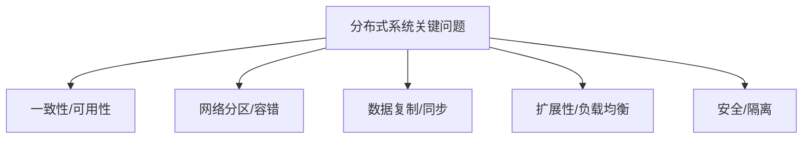

# 4.1.4 关键问题与挑战

## 1. 主要问题

- **一致性与可用性的权衡**：CAP定理下的系统设计抉择。
- **网络分区与容错**：如何在网络分区时保证系统可用与一致。
- **数据复制与同步**：多节点间数据一致性与同步延迟。
- **扩展性与负载均衡**：系统规模扩展与资源分配。
- **安全性与数据隔离**：防止数据泄露与恶意攻击。

## 2. 挑战分析

- **理论与实际的差距**：一致性模型理论与工程实现的复杂性。
- **多学科交叉的难点**：涉及网络、存储、算法、系统工程等多领域。
- **未来发展趋势**：云原生、无服务器、区块链等新技术带来新挑战。
- **自组织与自适应能力**：系统需具备动态调整与自愈能力。

## 3. 结构化表达

- **问题树**：

- **挑战矩阵**：
| 编号 | 挑战 | 影响领域 | 典型难点 |
|------|------|----------|----------|
| 4.1.4.1 | 理论与实际差距 | 工程实现 | 一致性模型、协议复杂 |
| 4.1.4.2 | 多学科交叉 | 系统设计 | 知识整合、术语不统一 |
| 4.1.4.3 | 未来趋势 | 前沿技术 | 云原生、区块链 |
| 4.1.4.4 | 自组织自适应 | 智能系统 | 动态优化、自愈能力 |

## 4. 多表征

- 问题树、挑战矩阵、趋势图、案例分析

## 5. 规范说明

- 内容需递归细化，支持多表征。
- 保留批判性分析、图表等。
- 如有遗漏，后续补全并说明。

> 本文件为递归细化与内容补全示范，后续可继续分解为4.1.4.1、4.1.4.2等子主题，支持持续递归完善。
