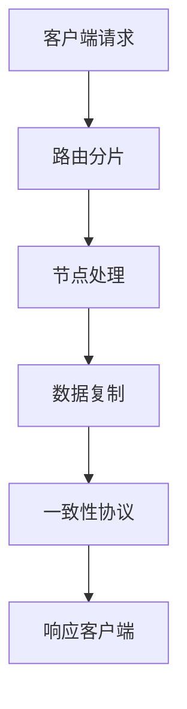

# 4.1.5 相关案例

## 1. 典型案例

- **分布式数据库案例**：如Cassandra、MongoDB、HBase，支持大规模数据分布与高可用。
- **分布式文件系统案例**：如HDFS、GFS，支撑大数据存储与处理。
- **区块链系统案例**：如Bitcoin、Ethereum，去中心化、不可篡改。

## 2. 案例分析

### 2.1 分布式数据库案例：Cassandra

- **案例背景**：面向大规模数据、高可用需求的分布式NoSQL数据库。
- **系统结构与要素**：节点、分片、复制、Gossip协议、最终一致性。
- **关键问题与解决方案**：一致性与可用性权衡、分区容忍、数据同步。
- **案例启示**：灵活的CAP权衡与可扩展架构。

### 2.2 分布式文件系统案例：HDFS

- **案例背景**：大数据存储与处理的基础设施。
- **系统结构与要素**：NameNode、DataNode、块存储、复制机制。
- **关键问题与解决方案**：容错、负载均衡、数据恢复。
- **案例启示**：主从架构与高可用设计。

### 2.3 区块链系统案例：Bitcoin

- **案例背景**：去中心化的加密货币系统。
- **系统结构与要素**：节点、区块、共识机制、P2P网络。
- **关键问题与解决方案**：共识安全、分布式账本、抗攻击能力。
- **案例启示**：去信任与不可篡改的分布式创新。

## 3. 结构化表达

- **案例流程图**：

- **结构表**：
| 编号 | 案例类型 | 主要要素 | 关键机制 | 启示 |
|------|----------|----------|----------|------|
| 4.1.5.1 | 分布式数据库 | 分片、复制 | 最终一致性 | CAP权衡 |
| 4.1.5.2 | 分布式文件系统 | NameNode、DataNode | 容错、负载均衡 | 高可用设计 |
| 4.1.5.3 | 区块链系统 | 区块、共识机制 | 去中心化 | 不可篡改 |

## 4. 多表征

- 案例流程图、结构表、对比分析、符号化描述

## 5. 规范说明

- 内容需递归细化，支持多表征。
- 保留批判性分析、图表等。
- 如有遗漏，后续补全并说明。

> 本文件为递归细化与内容补全示范，后续可继续分解为4.1.5.1、4.1.5.2等子主题，支持持续递归完善。
