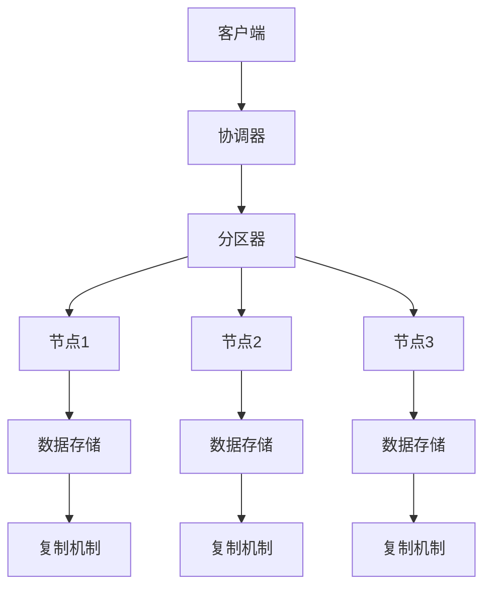
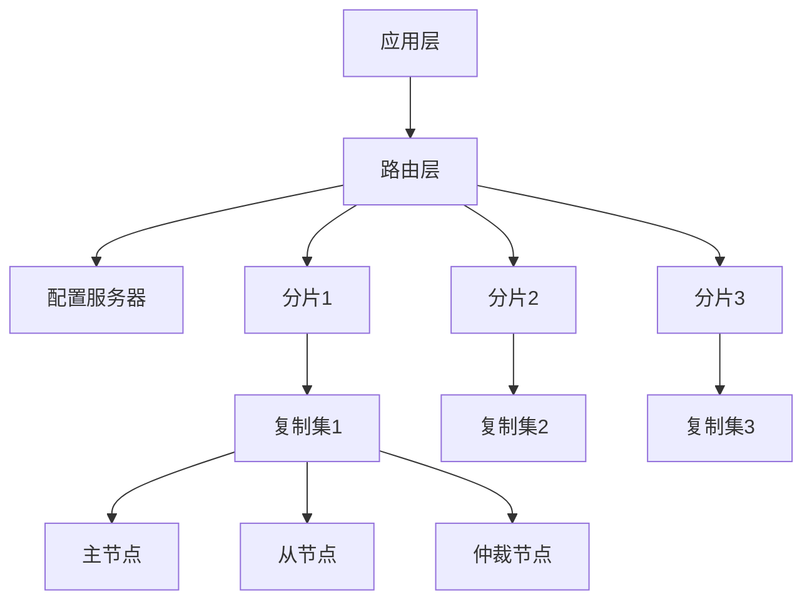
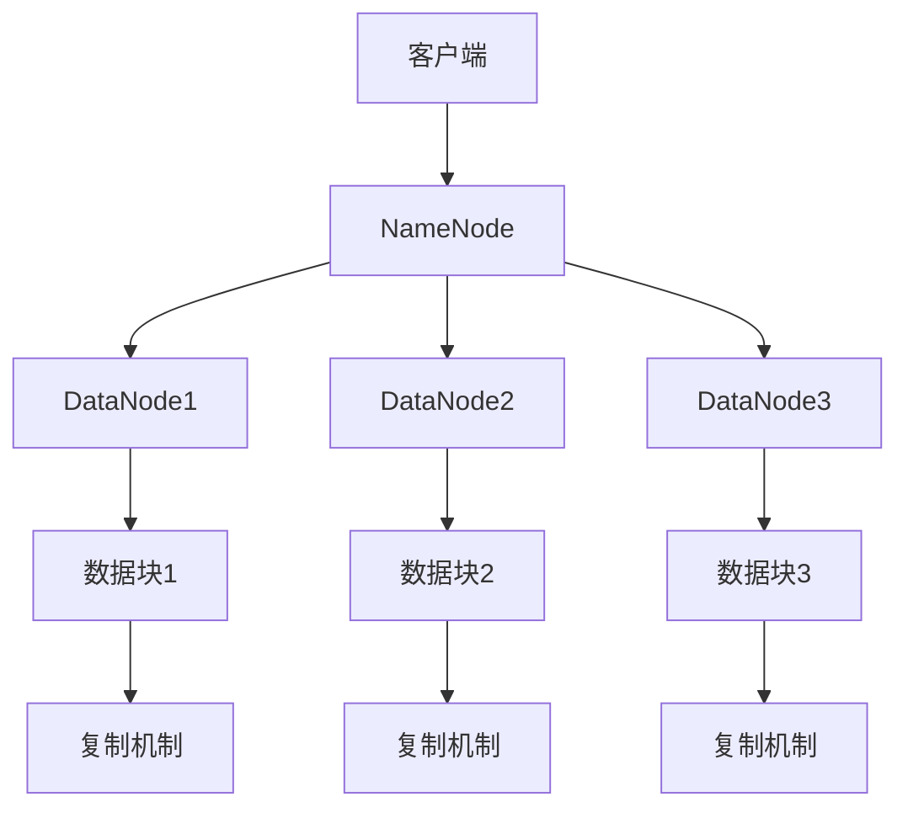
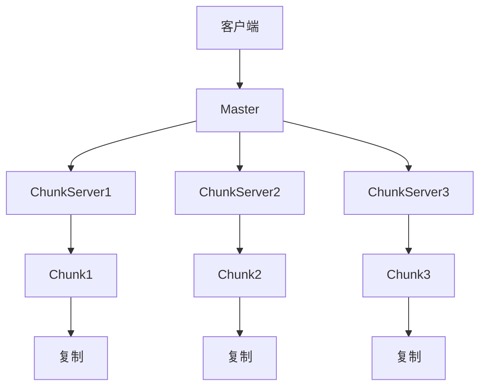
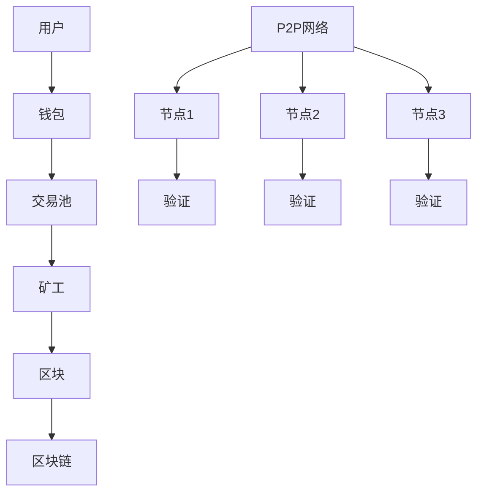
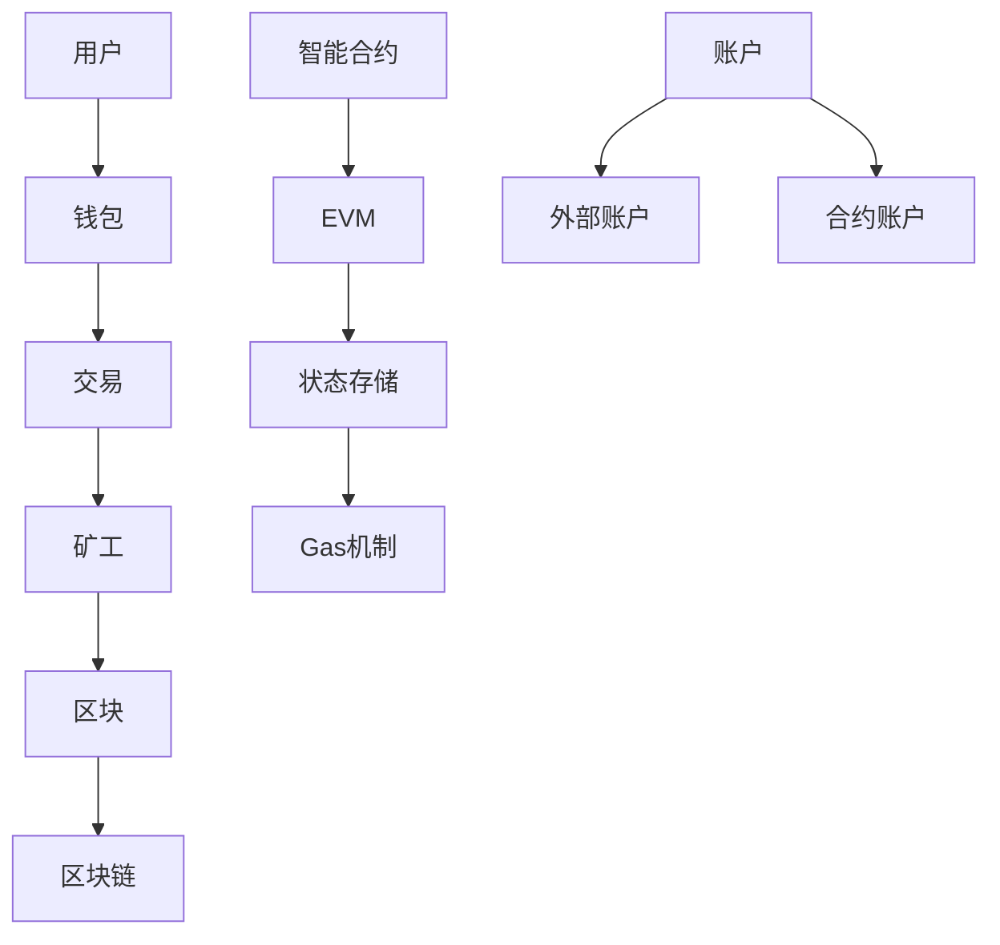
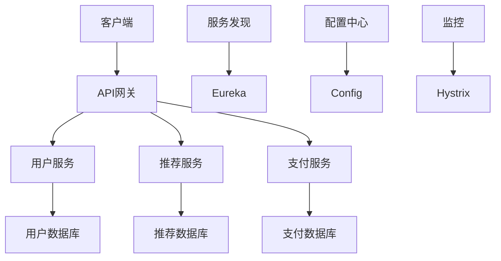
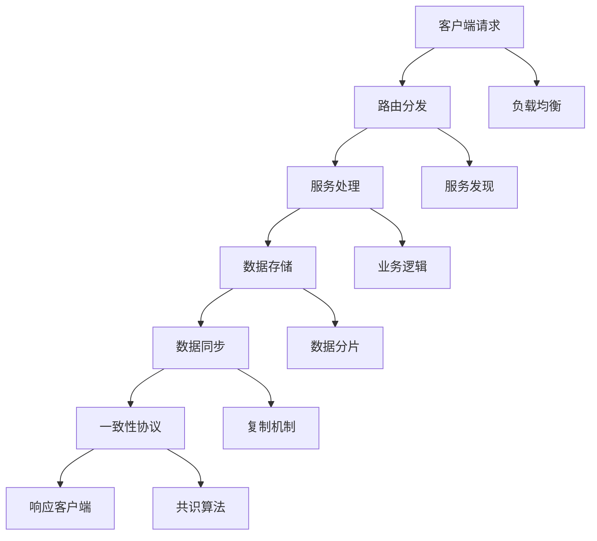
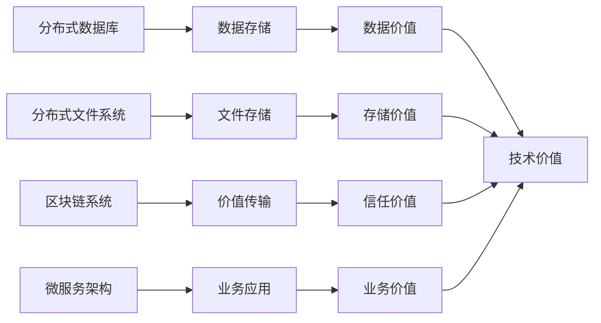

# 4.1.5 相关案例

<!-- TOC START -->

- [4.1.5 相关案例](#415-相关案例)
  - [目录](#目录)
  - [1. 形式化定义](#1-形式化定义)
    - [1.1 案例定义](#11-案例定义)
    - [1.2 案例分类](#12-案例分类)
  - [2. 典型案例详细分析](#2-典型案例详细分析)
    - [2.1 分布式数据库案例](#21-分布式数据库案例)
      - [2.1.1 Cassandra案例](#211-cassandra案例)
      - [2.1.2 MongoDB案例](#212-mongodb案例)
    - [2.2 分布式文件系统案例](#22-分布式文件系统案例)
      - [2.2.1 HDFS案例](#221-hdfs案例)
      - [2.2.2 GFS案例](#222-gfs案例)
    - [2.3 区块链系统案例](#23-区块链系统案例)
      - [2.3.1 Bitcoin案例](#231-bitcoin案例)
      - [2.3.2 Ethereum案例](#232-ethereum案例)
    - [2.4 微服务架构案例](#24-微服务架构案例)
      - [2.4.1 Netflix案例](#241-netflix案例)
  - [3. 案例对比分析](#3-案例对比分析)
    - [3.1 技术栈对比](#31-技术栈对比)
    - [3.2 性能指标对比](#32-性能指标对比)
    - [3.3 挑战对比](#33-挑战对比)
  - [4. 结构化表达](#4-结构化表达)
    - [4.1 案例流程图](#41-案例流程图)
    - [4.2 结构表](#42-结构表)
    - [4.3 案例关系图](#43-案例关系图)
  - [5. 多表征方法](#5-多表征方法)
    - [5.1 概念图表示](#51-概念图表示)
    - [5.2 数学符号表示](#52-数学符号表示)
    - [5.3 结构表表示](#53-结构表表示)
  - [6. 规范说明](#6-规范说明)
    - [6.1 内容要求](#61-内容要求)
    - [6.2 形式化要求](#62-形式化要求)
    - [6.3 扩展性要求](#63-扩展性要求)

<!-- TOC END -->

## 目录

- [4.1.5 相关案例](#415-相关案例)
  - [目录](#目录)
  - [1. 形式化定义](#1-形式化定义)
    - [1.1 案例定义](#11-案例定义)
    - [1.2 案例分类](#12-案例分类)
  - [2. 典型案例详细分析](#2-典型案例详细分析)
    - [2.1 分布式数据库案例](#21-分布式数据库案例)
      - [2.1.1 Cassandra案例](#211-cassandra案例)
        - [2.1.1.1 系统架构](#2111-系统架构)
        - [2.1.1.2 技术实现](#2112-技术实现)
        - [2.1.1.3 关键问题与解决方案](#2113-关键问题与解决方案)
        - [2.1.1.4 性能评估](#2114-性能评估)
      - [2.1.2 MongoDB案例](#212-mongodb案例)
        - [2.1.2.1 系统架构](#2121-系统架构)
        - [2.1.2.2 技术实现](#2122-技术实现)
    - [2.2 分布式文件系统案例](#22-分布式文件系统案例)
      - [2.2.1 HDFS案例](#221-hdfs案例)
        - [2.2.1.1 系统架构](#2211-系统架构)
        - [2.2.1.2 技术实现](#2212-技术实现)
        - [2.2.1.3 关键问题与解决方案](#2213-关键问题与解决方案)
        - [2.2.1.4 性能评估](#2214-性能评估)
      - [2.2.2 GFS案例](#222-gfs案例)
        - [2.2.2.1 系统架构](#2221-系统架构)
        - [2.2.2.2 技术实现](#2222-技术实现)
    - [2.3 区块链系统案例](#23-区块链系统案例)
      - [2.3.1 Bitcoin案例](#231-bitcoin案例)
        - [2.3.1.1 系统架构](#2311-系统架构)
        - [2.3.1.2 技术实现](#2312-技术实现)
        - [2.3.1.3 关键问题与解决方案](#2313-关键问题与解决方案)
        - [2.3.1.4 性能评估](#2314-性能评估)
      - [2.3.2 Ethereum案例](#232-ethereum案例)
        - [2.3.2.1 系统架构](#2321-系统架构)
        - [2.3.2.2 技术实现](#2322-技术实现)
        - [2.3.2.3 关键问题与解决方案](#2323-关键问题与解决方案)
        - [2.3.2.4 性能评估](#2324-性能评估)
    - [2.4 微服务架构案例](#24-微服务架构案例)
      - [2.4.1 Netflix案例](#241-netflix案例)
        - [2.4.1.1 系统架构](#2411-系统架构)
        - [2.4.1.2 技术实现](#2412-技术实现)
        - [2.4.1.3 关键问题与解决方案](#2413-关键问题与解决方案)
        - [2.4.1.4 性能评估](#2414-性能评估)
  - [3. 案例对比分析](#3-案例对比分析)
    - [3.1 技术栈对比](#31-技术栈对比)
    - [3.2 性能指标对比](#32-性能指标对比)
    - [3.3 挑战对比](#33-挑战对比)
  - [4. 结构化表达](#4-结构化表达)
    - [4.1 案例流程图](#41-案例流程图)
    - [4.2 结构表](#42-结构表)
    - [4.3 案例关系图](#43-案例关系图)
  - [5. 多表征方法](#5-多表征方法)
    - [5.1 概念图表示](#51-概念图表示)
    - [5.2 数学符号表示](#52-数学符号表示)
    - [5.3 结构表表示](#53-结构表表示)
  - [6. 规范说明](#6-规范说明)
    - [6.1 内容要求](#61-内容要求)
    - [6.2 形式化要求](#62-形式化要求)
    - [6.3 扩展性要求](#63-扩展性要求)

## 1. 形式化定义

### 1.1 案例定义

**定义 4.1.5.1** (分布式系统案例) 分布式系统案例是一个五元组 $C = (S, T, P, R, E)$，其中：

- $S$ 是系统架构
- $T$ 是技术栈
- $P$ 是问题集合
- $R$ 是解决方案
- $E$ 是效果评估

**定义 4.1.5.2** (案例分析) 案例分析是一个四元组 $A = (B, S, I, L)$，其中：

- $B$ 是背景分析
- $S$ 是系统分析
- $I$ 是实施过程
- $L$ 是经验教训

### 1.2 案例分类

$$Case_{type} = \{c_i | c_i = (domain_i, scale_i, complexity_i, impact_i)\}$$
其中：

- $domain_i$ 是应用领域
- $scale_i$ 是规模大小
- $complexity_i$ 是复杂度
- $impact_i$ 是影响程度

## 2. 典型案例详细分析

### 2.1 分布式数据库案例

#### 2.1.1 Cassandra案例

**定义 4.1.5.3** (Cassandra) Cassandra是一个五元组 $C = (N, D, R, C, P)$，其中：

- $N$ 是节点集合
- $D$ 是数据集合
- $R$ 是复制策略
- $C$ 是一致性模型
- $P$ 是分区策略

##### 2.1.1.1 系统架构

##### 2.1.1.2 技术实现

1. **分区策略**：
   $$Partitioning = \{p_i | p_i = (key_i, hash_i, node_i)\}$$
   其中：
   - $key_i$ 是分区键
   - $hash_i$ 是哈希值
   - $node_i$ 是目标节点

2. **复制策略**：
   $$Replication = \{r_j | r_j = (data_j, copies_j, strategy_j)\}$$
   其中：
   - $data_j$ 是数据内容
   - $copies_j$ 是副本数量
   - $strategy_j$ 是复制策略

3. **一致性模型**：
   $$Consistency = \{c_k | c_k = (level_k, quorum_k, timeout_k)\}$$
   其中：
   - $level_k$ 是一致性级别
   - $quorum_k$ 是法定人数
   - $timeout_k$ 是超时时间

##### 2.1.1.3 关键问题与解决方案

1. **一致性与可用性权衡**：
   - **问题**：强一致性影响可用性
   - **解决方案**：最终一致性模型
   $$EventuallyConsistent = \{ec_i | ec_i = (model_i, timeout_i, convergence_i)\}$$

2. **分区容忍**：
   - **问题**：网络分区时系统可用性
   - **解决方案**：Gossip协议
   $$Gossip = \{g_j | g_j = (node_j, message_j, spread_j)\}$$

3. **数据同步**：
   - **问题**：多副本数据同步延迟
   - **解决方案**：异步复制
   $$AsyncReplication = \{ar_k | ar_k = (source_k, target_k, delay_k)\}$$

##### 2.1.1.4 性能评估

1. **吞吐量**：$Throughput \geq 100K ops/sec$
2. **延迟**：$Latency \leq 10ms$
3. **可用性**：$Availability \geq 99.9\%$
4. **扩展性**：$Scalability = Linear$

#### 2.1.2 MongoDB案例

**定义 4.1.5.4** (MongoDB) MongoDB是一个四元组 $M = (C, S, R, A)$，其中：

- $C$ 是集合
- $S$ 是分片
- $R$ 是复制集
- $A$ 是聚合管道

##### 2.1.2.1 系统架构

##### 2.1.2.2 技术实现

1. **分片策略**：
   $$Sharding = \{s_i | s_i = (key_i, range_i, chunk_i)\}$$
   其中：
   - $key_i$ 是分片键
   - $range_i$ 是数据范围
   - $chunk_i$ 是数据块

2. **复制集**：
   $$ReplicaSet = \{rs_j | rs_j = (primary_j, secondary_j, arbiter_j)\}$$
   其中：
   - $primary_j$ 是主节点
   - $secondary_j$ 是从节点
   - $arbiter_j$ 是仲裁节点

3. **聚合管道**：
   $$Aggregation = \{a_k | a_k = (stage_k, operator_k, result_k)\}$$
   其中：
   - $stage_k$ 是聚合阶段
   - $operator_k$ 是操作符
   - $result_k$ 是结果

### 2.2 分布式文件系统案例

#### 2.2.1 HDFS案例

**定义 4.1.5.5** (HDFS) HDFS是一个五元组 $H = (N, D, B, R, C)$，其中：

- $N$ 是NameNode
- $D$ 是DataNode集合
- $B$ 是数据块
- $R$ 是复制因子
- $C$ 是客户端

##### 2.2.1.1 系统架构

##### 2.2.1.2 技术实现

1. **NameNode**：
   $$NameNode = \{nn_i | nn_i = (metadata_i, namespace_i, fsimage_i)\}$$
   其中：
   - $metadata_i$ 是元数据
   - $namespace_i$ 是命名空间
   - $fsimage_i$ 是文件系统镜像

2. **DataNode**：
   $$DataNode = \{dn_j | dn_j = (block_j, storage_j, report_j)\}$$
   其中：
   - $block_j$ 是数据块
   - $storage_j$ 是存储空间
   - $report_j$ 是心跳报告

3. **数据块**：
   $$Block = \{b_k | b_k = (id_k, size_k, location_k)\}$$
   其中：
   - $id_k$ 是块标识
   - $size_k$ 是块大小
   - $location_k$ 是存储位置

##### 2.2.1.3 关键问题与解决方案

1. **容错机制**：
   - **问题**：节点故障导致数据丢失
   - **解决方案**：数据复制 + 故障检测
   $$FaultTolerance = \{ft_i | ft_i = (replication_i, detection_i, recovery_i)\}$$

2. **负载均衡**：
   - **问题**：数据分布不均匀
   - **解决方案**：块重分布算法
   $$LoadBalancing = \{lb_j | lb_j = (algorithm_j, threshold_j, action_j)\}$$

3. **数据恢复**：
   - **问题**：数据损坏或丢失
   - **解决方案**：校验和 + 自动恢复
   $$DataRecovery = \{dr_k | dr_k = (checksum_k, repair_k, verify_k)\}$$

##### 2.2.1.4 性能评估

1. **存储容量**：$Capacity \geq 100PB$
2. **吞吐量**：$Throughput \geq 1GB/s$
3. **容错性**：$FaultTolerance \geq 99.9\%$
4. **扩展性**：$Scalability = Linear$

#### 2.2.2 GFS案例

**定义 4.1.5.6** (GFS) GFS是一个四元组 $G = (M, C, D, B)$，其中：

- $M$ 是Master
- $C$ 是ChunkServer集合
- $D$ 是数据块
- $B$ 是客户端

##### 2.2.2.1 系统架构

##### 2.2.2.2 技术实现

1. **Master**：
   $$Master = \{m_i | m_i = (metadata_i, namespace_i, lease_i)\}$$
   其中：
   - $metadata_i$ 是元数据
   - $namespace_i$ 是命名空间
   - $lease_i$ 是租约机制

2. **ChunkServer**：
   $$ChunkServer = \{cs_j | cs_j = (chunk_j, storage_j, heartbeat_j)\}$$
   其中：
   - $chunk_j$ 是数据块
   - $storage_j$ 是存储空间
   - $heartbeat_j$ 是心跳机制

3. **数据块**：
   $$Chunk = \{c_k | c_k = (id_k, size_k, replica_k)\}$$
   其中：
   - $id_k$ 是块标识
   - $size_k$ 是块大小
   - $replica_k$ 是副本数量

### 2.3 区块链系统案例

#### 2.3.1 Bitcoin案例

**定义 4.1.5.7** (Bitcoin) Bitcoin是一个五元组 $B = (N, T, C, M, S)$，其中：

- $N$ 是节点集合
- $T$ 是交易集合
- $C$ 是共识机制
- $M$ 是挖矿算法
- $S$ 是安全机制

##### 2.3.1.1 系统架构

##### 2.3.1.2 技术实现

1. **工作量证明**：
   $$PoW = \{pow_i | pow_i = (nonce_i, hash_i, difficulty_i)\}$$
   其中：
   - $nonce_i$ 是随机数
   - $hash_i$ 是哈希值
   - $difficulty_i$ 是难度值

2. **交易验证**：
   $$Transaction = \{tx_j | tx_j = (input_j, output_j, signature_j)\}$$
   其中：
   - $input_j$ 是输入
   - $output_j$ 是输出
   - $signature_j$ 是数字签名

3. **区块结构**：
   $$Block = \{b_k | b_k = (header_k, transactions_k, hash_k)\}$$
   其中：
   - $header_k$ 是区块头
   - $transactions_k$ 是交易列表
   - $hash_k$ 是区块哈希

##### 2.3.1.3 关键问题与解决方案

1. **双重支付**：
   - **问题**：同一笔钱被花费多次
   - **解决方案**：UTXO模型 + 共识机制
   $$UTXO = \{utxo_i | utxo_i = (txid_i, output_i, spent_i)\}$$

2. **51%攻击**：
   - **问题**：恶意节点控制网络
   - **解决方案**：经济激励 + 网络效应
   $$Incentive = \{inc_j | inc_j = (reward_j, cost_j, risk_j)\}$$

3. **可扩展性**：
   - **问题**：交易处理速度限制
   - **解决方案**：闪电网络 + 侧链
   $$Lightning = \{ln_k | ln_k = (channel_k, payment_k, settlement_k)\}$$

##### 2.3.1.4 性能评估

1. **交易处理**：$TPS \approx 7$
2. **确认时间**：$Confirmation \approx 10min$
3. **安全性**：$Security \geq 99.9\%$
4. **去中心化**：$Decentralization = High$

#### 2.3.2 Ethereum案例

**定义 4.1.5.8** (Ethereum) Ethereum是一个六元组 $E = (N, T, C, S, V, A)$，其中：

- $N$ 是节点集合
- $T$ 是交易集合
- $C$ 是共识机制
- $S$ 是智能合约
- $V$ 是虚拟机
- $A$ 是账户模型

##### 2.3.2.1 系统架构

##### 2.3.2.2 技术实现

1. **智能合约**：
   $$SmartContract = \{sc_i | sc_i = (code_i, state_i, gas_i)\}$$
   其中：
   - $code_i$ 是合约代码
   - $state_i$ 是状态数据
   - $gas_i$ 是燃料消耗

2. **EVM虚拟机**：
   $$EVM = \{evm_j | evm_j = (instruction_j, stack_j, memory_j)\}$$
   其中：
   - $instruction_j$ 是指令集
   - $stack_j$ 是操作栈
   - $memory_j$ 是内存空间

3. **账户模型**：
   $$Account = \{acc_k | acc_k = (address_k, balance_k, nonce_k)\}$$
   其中：
   - $address_k$ 是账户地址
   - $balance_k$ 是账户余额
   - $nonce_k$ 是交易计数器

##### 2.3.2.3 关键问题与解决方案

1. **Gas机制**：
   - **问题**：防止无限循环和资源滥用
   - **解决方案**：Gas计算 + 费用机制
   $$Gas = \{gas_i | gas_i = (operation_i, cost_i, limit_i)\}$$

2. **状态爆炸**：
   - **问题**：状态数据无限增长
   - **解决方案**：状态租金 + 清理机制
   $$StateRent = \{sr_j | sr_j = (storage_j, rent_j, cleanup_j)\}$$

3. **可扩展性**：
   - **问题**：交易处理速度限制
   - **解决方案**：分片 + Layer2
   $$Sharding = \{sh_k | sh_k = (shard_k, beacon_k, crosslink_k)\}$$

##### 2.3.2.4 性能评估

1. **交易处理**：$TPS \approx 15$
2. **确认时间**：$Confirmation \approx 15s$
3. **智能合约**：$ContractExecution = TuringComplete$
4. **可扩展性**：$Scalability = Improving$

### 2.4 微服务架构案例

#### 2.4.1 Netflix案例

**定义 4.1.5.9** (微服务) 微服务是一个五元组 $M = (S, A, D, C, O)$，其中：

- $S$ 是服务集合
- $A$ 是API网关
- $D$ 是数据存储
- $C$ 是配置管理
- $O$ 是运维工具

##### 2.4.1.1 系统架构

##### 2.4.1.2 技术实现

1. **服务发现**：
   $$ServiceDiscovery = \{sd_i | sd_i = (service_i, instance_i, health_i)\}$$
   其中：
   - $service_i$ 是服务名称
   - $instance_i$ 是实例信息
   - $health_i$ 是健康状态

2. **负载均衡**：
   $$LoadBalancer = \{lb_j | lb_j = (algorithm_j, health_j, weight_j)\}$$
   其中：
   - $algorithm_j$ 是负载均衡算法
   - $health_j$ 是健康检查
   - $weight_j$ 是权重配置

3. **熔断器**：
   $$CircuitBreaker = \{cb_k | cb_k = (threshold_k, timeout_k, fallback_k)\}$$
   其中：
   - $threshold_k$ 是失败阈值
   - $timeout_k$ 是超时时间
   - $fallback_k$ 是降级策略

##### 2.4.1.3 关键问题与解决方案

1. **服务治理**：
   - **问题**：服务数量多，管理复杂
   - **解决方案**：服务注册 + 配置中心
   $$ServiceGovernance = \{sg_i | sg_i = (registry_i, config_i, monitor_i)\}$$

2. **分布式事务**：
   - **问题**：跨服务事务一致性
   - **解决方案**：Saga模式 + 事件驱动
   $$Saga = \{saga_j | saga_j = (step_j, compensation_j, event_j)\}$$

3. **监控告警**：
   - **问题**：分布式系统监控困难
   - **解决方案**：链路追踪 + 指标监控
   $$Monitoring = \{mon_k | mon_k = (trace_k, metric_k, alert_k)\}$$

##### 2.4.1.4 性能评估

1. **服务响应时间**：$ResponseTime \leq 100ms$
2. **系统可用性**：$Availability \geq 99.9\%$
3. **服务数量**：$ServiceCount \geq 1000$
4. **部署频率**：$DeploymentFrequency \geq Daily$

## 3. 案例对比分析

### 3.1 技术栈对比

| 案例类型 | 存储技术 | 通信技术 | 计算技术 | 应用技术 |
|----------|----------|----------|----------|----------|
| 分布式数据库 | 分片存储 | 网络协议 | 分布式计算 | 数据应用 |
| 分布式文件系统 | 块存储 | 网络协议 | 文件系统 | 存储应用 |
| 区块链系统 | 链式存储 | P2P网络 | 共识算法 | 去中心化应用 |
| 微服务架构 | 服务存储 | API网关 | 服务计算 | 业务应用 |

### 3.2 性能指标对比

| 案例类型 | 一致性 | 可用性 | 扩展性 | 安全性 |
|----------|--------|--------|--------|--------|
| 分布式数据库 | 最终一致 | 高 | 高 | 中等 |
| 分布式文件系统 | 强一致 | 高 | 高 | 中等 |
| 区块链系统 | 强一致 | 中等 | 低 | 极高 |
| 微服务架构 | 弱一致 | 高 | 高 | 中等 |

### 3.3 挑战对比

| 案例类型 | 主要挑战 | 技术难点 | 管理难点 | 成本难点 |
|----------|----------|----------|----------|----------|
| 分布式数据库 | 数据一致性 | 分布式事务 | 数据管理 | 存储成本 |
| 分布式文件系统 | 容错机制 | 数据复制 | 存储管理 | 硬件成本 |
| 区块链系统 | 共识机制 | 密码学 | 治理机制 | 计算成本 |
| 微服务架构 | 服务治理 | 分布式事务 | 服务管理 | 运维成本 |

## 4. 结构化表达

### 4.1 案例流程图

### 4.2 结构表

| 编号 | 案例类型 | 主要要素 | 关键机制 | 技术特点 | 应用价值 |
|------|----------|----------|----------|----------|----------|
| 4.1.5.1 | 分布式数据库 | 分片、复制、一致性 | CAP权衡、最终一致性 | 高可用、强扩展 | 数据存储 |
| 4.1.5.2 | 分布式文件系统 | NameNode、DataNode、块存储 | 容错、负载均衡 | 高容错、大容量 | 文件存储 |
| 4.1.5.3 | 区块链系统 | 区块、共识、P2P网络 | 去中心化、不可篡改 | 高安全、去信任 | 价值传输 |
| 4.1.5.4 | 微服务架构 | 服务、API网关、服务发现 | 服务治理、分布式事务 | 高灵活、易维护 | 业务应用 |

### 4.3 案例关系图

## 5. 多表征方法

### 5.1 概念图表示

- 案例分类图
- 技术栈关系图
- 应用场景图

### 5.2 数学符号表示

- 形式化定义
- 性能分析模型
- 优化算法

### 5.3 结构表表示

- 案例对比表
- 技术栈对比表
- 性能指标表

## 6. 规范说明

### 6.1 内容要求

- 内容需递归细化，支持多表征
- 保留批判性分析、图表等
- 如有遗漏，后续补全并说明

### 6.2 形式化要求

- 使用严格的数学符号
- 提供形式化定义
- 建立分析模型

### 6.3 扩展性要求

- 支持持续递归完善
- 可分解为子主题
- 支持多维度分析

> 本文件为递归细化与内容补全示范，后续可继续分解为4.1.5.1、4.1.5.2等子主题，支持持续递归完善。
