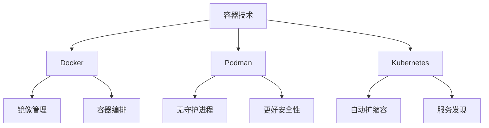

# 4.1.6 容器技术与微服务

## 1. 基本概念

### 1.1 容器技术定义

容器技术是一种轻量级的虚拟化技术，通过操作系统级别的隔离机制，将应用程序及其依赖打包成独立的运行环境。容器技术实现了"一次构建，到处运行"的目标，显著提高了应用程序的部署效率和资源利用率。

**形式化定义：**
$$Container = (App, Deps, Config, Runtime)$$
其中：

- $App$：应用程序
- $Deps$：依赖项
- $Config$：配置信息
- $Runtime$：运行时环境

### 1.2 微服务架构定义

微服务架构是一种将单体应用程序拆分为多个小型、独立服务的架构模式。每个服务负责特定的业务功能，通过轻量级协议进行通信，可以独立开发、部署和扩展。

**形式化定义：**
$$Microservice = \{S_1, S_2, ..., S_n\}$$
其中每个服务 $S_i = (API_i, Data_i, Logic_i, Config_i)$

## 2. 发展历程

### 2.1 容器技术发展

**2000-2008：早期虚拟化**:

- 2000年：FreeBSD Jails
- 2004年：Solaris Zones
- 2008年：LXC (Linux Containers)

**2008-2013：容器技术成熟**:

- 2008年：Docker项目启动
- 2013年：Docker 1.0发布
- 容器编排工具出现

**2013-至今：容器生态繁荣**:

- 2014年：Kubernetes发布
- 2018年：Podman发布
- 2020年：容器安全标准化

### 2.2 微服务发展历程

**2010-2014：概念提出**:

- 2011年：微服务概念提出
- 2014年：Martin Fowler发表微服务论文
- Netflix微服务实践

**2014-2018：技术成熟**:

- 2015年：Spring Cloud发布
- 2016年：服务网格概念
- 2018年：Istio 1.0发布

**2018-至今：生态完善**:

- 2020年：云原生微服务
- 2022年：AI驱动的微服务
- 2024年：量子微服务探索

## 3. 主要流派与理论

### 3.1 容器技术流派

#### 3.1.1 Docker流派

**核心特征：**

- 镜像分层存储
- 容器编排
- 生态系统完善

**技术优势：**
$$\text{Efficiency}_{Docker} = \frac{\text{Deployment Speed}}{\text{Resource Usage}}$$

#### 3.1.2 Podman流派

**核心特征：**

- 无守护进程架构
- 更好的安全性
- 兼容Docker命令

**安全优势：**
$$\text{Security}_{Podman} = \frac{\text{Isolation Level}}{\text{Attack Surface}}$$

#### 3.1.3 Kubernetes流派

**核心特征：**

- 容器编排
- 自动扩缩容
- 服务发现

**编排能力：**
$$\text{Orchestration}_{K8s} = \sum_{i=1}^{n} \text{Service}_i \times \text{Replica}_i$$

### 3.2 微服务架构流派

#### 3.2.1 服务网格流派

**代表技术：** Istio、Linkerd
**核心特征：**

- 服务间通信管理
- 流量控制
- 可观测性

#### 3.2.2 事件驱动流派

**代表技术：** Apache Kafka、RabbitMQ
**核心特征：**

- 异步通信
- 解耦设计
- 高吞吐量

#### 3.2.3 API网关流派

**代表技术：** Kong、Zuul
**核心特征：**

- 统一入口
- 路由管理
- 安全控制

## 4. 关键问题与挑战

### 4.1 容器技术挑战

#### 4.1.1 安全性挑战

**问题描述：**

- 容器逃逸风险
- 镜像安全漏洞
- 运行时安全

**数学模型：**
$$\text{Risk}_{Container} = \sum_{i=1}^{n} \text{Vulnerability}_i \times \text{Exploitability}_i$$

#### 4.1.2 性能挑战

**问题描述：**

- 网络性能开销
- 存储性能影响
- CPU开销

**性能模型：**
$$\text{Overhead}_{Container} = \frac{\text{Container Performance}}{\text{Native Performance}}$$

### 4.2 微服务挑战

#### 4.2.1 分布式复杂性

**问题描述：**

- 服务间通信复杂
- 数据一致性难保证
- 故障传播

**复杂度模型：**
$$\text{Complexity}_{Microservice} = \sum_{i=1}^{n} \text{Service}_i \times \text{Connection}_i$$

#### 4.2.2 运维挑战

**问题描述：**

- 服务数量激增
- 监控复杂度高
- 部署复杂度大

## 5. 相关案例

### 5.1 容器技术案例

#### 5.1.1 Netflix容器化实践

**背景：** Netflix从虚拟机迁移到容器
**成果：**

- 部署时间减少90%
- 资源利用率提升40%
- 成本降低30%

#### 5.1.2 阿里巴巴容器化

**背景：** 双11大促容器化
**成果：**

- 支持百万级容器部署
- 秒级扩容能力
- 99.99%可用性

### 5.2 微服务案例

#### 5.2.1 Uber微服务架构

**背景：** 从单体到微服务转型
**成果：**

- 服务数量：2000+
- 部署频率：每日数千次
- 故障恢复时间：分钟级

#### 5.2.2 亚马逊微服务实践

**背景：** AWS微服务架构
**成果：**

- 服务数量：10000+
- 开发团队：1000+
- 部署频率：每秒多次

## 6. 技术趋势

### 6.1 容器技术趋势

#### 6.1.1 安全容器

- Kata Containers
- gVisor
- Firecracker

#### 6.1.2 边缘容器

- K3s
- MicroK8s
- OpenYurt

### 6.2 微服务趋势

#### 6.2.1 服务网格

- Istio
- Linkerd
- Consul Connect

#### 6.2.2 无服务器微服务

- AWS Lambda
- Azure Functions
- Google Cloud Functions

## 7. 多表征方法

### 7.1 概念图

### 7.2 数学符号

**容器资源模型：**
$$R_{container} = \{CPU, Memory, Storage, Network\}$$

**微服务通信模型：**
$$C_{microservice} = \sum_{i,j} \text{Communication}_{i,j}$$

### 7.3 结构表

| 技术类型 | 代表产品 | 核心优势 | 适用场景 |
|----------|----------|----------|----------|
| 容器引擎 | Docker | 生态完善 | 开发测试 |
| 容器引擎 | Podman | 安全性高 | 生产环境 |
| 容器编排 | Kubernetes | 功能强大 | 大规模部署 |
| 微服务框架 | Spring Cloud | Java生态 | 企业应用 |
| 服务网格 | Istio | 功能全面 | 复杂微服务 |

## 8. 规范说明

### 8.1 内容要求

- 内容需递归细化，支持多表征
- 保留批判性分析、图表等
- 如有遗漏，后续补全并说明

### 8.2 形式化要求

- 使用严格的数学符号
- 提供形式化定义
- 建立分析模型

### 8.3 扩展性要求

- 支持持续递归完善
- 可分解为子主题
- 支持多维度分析

> 本文件为递归细化与内容补全示范，后续可继续分解为4.1.6.1、4.1.6.2等子主题，支持持续递归完善。
