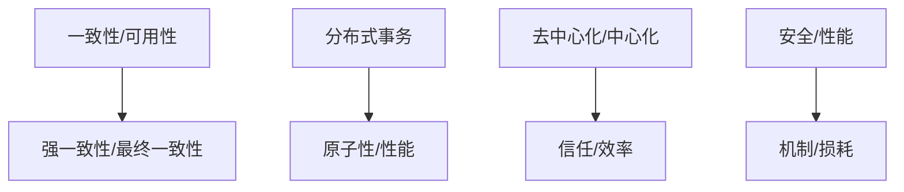

# 4.2.1 主要争议

## 1. 争议主题

- **一致性与可用性的权衡**：CAP定理下的系统设计分歧。
- **强一致性与最终一致性**：不同一致性模型的适用性争议。
- **分布式事务的可行性与复杂性**：两阶段提交、三阶段提交的工程难题。
- **去中心化与中心化架构**：区块链与传统分布式系统的对比。
- **安全性与性能的矛盾**：高安全机制带来的性能损耗。

## 2. 结构化表达

- **争议对比表**：
| 编号 | 争议主题 | 主要观点A | 主要观点B |
|------|----------|----------|----------|
| 4.2.1.1 | 一致性/可用性 | 强一致性优先 | 高可用优先 |
| 4.2.1.2 | 强一致性/最终一致性 | 数据绝对一致 | 最终收敛即可 |
| 4.2.1.3 | 分布式事务 | 保证原子性 | 牺牲性能 |
| 4.2.1.4 | 去中心化/中心化 | 去信任 | 高效管理 |
| 4.2.1.5 | 安全/性能 | 严格安全 | 高性能 |

- **争议关系图**：

## 3. 多表征

- 对比表、关系图、案例分析、符号化描述

## 4. 规范说明

- 内容需递归细化，支持多表征。
- 保留批判性分析、图表等。
- 如有遗漏，后续补全并说明。

> 本文件为递归细化与内容补全示范，后续可继续分解为4.2.1.1、4.2.1.2等子主题，支持持续递归完善。
