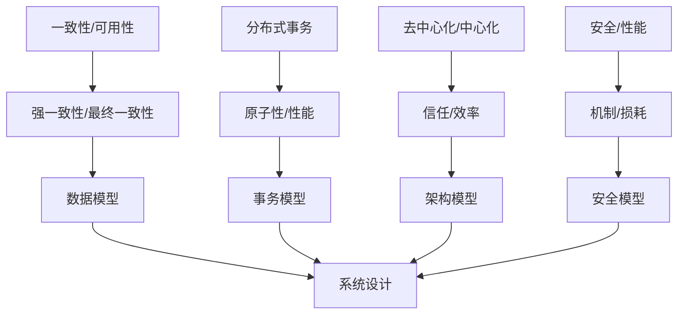
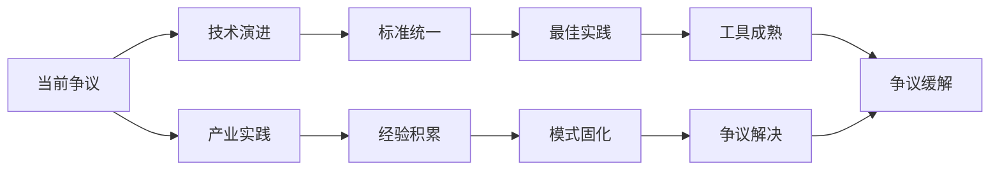

# 4.2.1 主要争议

## 1. 形式化定义

### 1.1 争议定义

**定义 4.2.1.1** (分布式系统争议) 分布式系统争议是一个五元组 $D = (I, P, A, C, R)$，其中：

- $I$ 是争议议题
- $P$ 是参与方
- $A$ 是争议观点
- $C$ 是冲突程度
- $R$ 是影响范围

**定义 4.2.1.2** (争议分析) 争议分析是一个四元组 $A = (B, S, I, L)$，其中：

- $B$ 是背景分析
- $S$ 是争议分析
- $I$ 是影响评估
- $L$ 是解决方案

### 1.2 争议分类

$$Controversy_{type} = \{c_i | c_i = (domain_i, intensity_i, impact_i, resolution_i)\}$$
其中：

- $domain_i$ 是争议领域
- $intensity_i$ 是争议强度
- $impact_i$ 是影响程度
- $resolution_i$ 是解决难度

## 2. 主要争议详细分析

### 2.1 一致性与可用性的权衡争议

**定义 4.2.1.3** (CAP争议) CAP争议是一个三元组 $C = (C, A, P)$，其中：

- $C$ 是一致性 (Consistency)
- $A$ 是可用性 (Availability)
- $P$ 是分区容错性 (Partition Tolerance)

#### 2.1.1 争议焦点

1. **强一致性优先vs高可用优先**：
   - **强一致性观点**：$StrongConsistency = \{sc_i | sc_i = (data_integrity_i, correctness_i, reliability_i)\}$
   - **高可用观点**：$HighAvailability = \{ha_j | ha_j = (service_continuity_j, user_experience_j, business_continuity_j)\}$

2. **ACID vs BASE**：
   - **ACID观点**：$ACID = \{acid_k | acid_k = (atomicity_k, consistency_k, isolation_k, durability_k)\}$
   - **BASE观点**：$BASE = \{base_l | base_l = (basically_available_l, soft_state_l, eventually_consistent_l)\}$

#### 2.1.2 CAP定理分析

$$CAP_{tradeoff} = \{(C, A, P) | \text{最多只能同时满足其中两个}\}$$

**CP系统**：$CP = \{cp_i | cp_i = (consistency_i, partition_tolerance_i, availability_sacrifice_i)\}$
**AP系统**：$AP = \{ap_j | ap_j = (availability_j, partition_tolerance_j, consistency_sacrifice_j)\}$
**CA系统**：$CA = \{ca_k | ca_k = (consistency_k, availability_k, partition_sacrifice_k)\}$

#### 2.1.3 解决方案

1. **最终一致性模型**：$EventuallyConsistent = \{ec_i | ec_i = (model_i, convergence_i, time_i)\}$
2. **因果一致性**：$CausalConsistency = \{cc_j | cc_j = (order_j, dependency_j, merge_j)\}$
3. **读写分离**：$ReadWriteSeparation = \{rws_k | rws_k = (read_k, write_k, sync_k)\}$

### 2.2 强一致性与最终一致性争议

**定义 4.2.1.4** (一致性争议) 一致性争议是一个四元组 $C = (S, E, T, A)$，其中：

- $S$ 是强一致性
- $E$ 是最终一致性
- $T$ 是时间约束
- $A$ 是应用需求

#### 2.2.1 争议焦点

1. **数据绝对一致vs最终收敛**：
   - **强一致性观点**：$StrongConsistency = \{sc_i | sc_i = (immediate_i, global_i, absolute_i)\}$
   - **最终一致性观点**：$EventuallyConsistency = \{ec_j | ec_j = (convergence_j, time_j, tradeoff_j)\}$

2. **实时性vs性能**：
   - **实时性观点**：$RealTime = \{rt_k | rt_k = (latency_k, responsiveness_k, user_experience_k)\}$
   - **性能观点**：$Performance = \{perf_l | perf_l = (throughput_l, scalability_l, efficiency_l)\}$

#### 2.2.2 一致性模型对比

$$Consistency_{comparison} = \frac{Latency_{strong}}{Latency_{eventual}} \cdot \frac{Complexity_{strong}}{Complexity_{eventual}} \cdot \frac{Cost_{strong}}{Cost_{eventual}}$$

#### 2.2.3 解决方案

1. **混合一致性模型**：$HybridConsistency = \{hc_i | hc_i = (strong_i, eventual_i, adaptive_i)\}$
2. **应用感知一致性**：$ApplicationAware = \{aa_j | aa_j = (requirement_j, policy_j, enforcement_j)\}$
3. **动态一致性调整**：$DynamicConsistency = \{dc_k | dc_k = (monitoring_k, adjustment_k, optimization_k)\}$

### 2.3 分布式事务的可行性与复杂性争议

**定义 4.2.1.5** (分布式事务争议) 分布式事务争议是一个四元组 $T = (F, C, P, A)$，其中：

- $F$ 是可行性
- $C$ 是复杂性
- $P$ 是性能影响
- $A$ 是原子性

#### 2.3.1 争议焦点

1. **保证原子性vs牺牲性能**：
   - **原子性观点**：$Atomicity = \{at_i | at_i = (all_or_nothing_i, correctness_i, reliability_i)\}$
   - **性能观点**：$Performance = \{perf_j | perf_j = (throughput_j, latency_j, scalability_j)\}$

2. **2PC vs 3PC vs Saga**：
   - **2PC观点**：$TwoPhaseCommit = \{2pc_k | 2pc_k = (simple_k, blocking_k, failure_k)\}$
   - **3PC观点**：$ThreePhaseCommit = \{3pc_l | 3pc_l = (non_blocking_l, complex_l, timeout_l)\}$
   - **Saga观点**：$Saga = \{saga_m | saga_m = (compensation_m, long_running_m, saga_m)\}$

#### 2.3.2 复杂度分析

$$Complexity_{distributed} = O(n^2) \text{ for } n \text{ participants}$$
$$Performance_{impact} = \frac{Latency_{distributed}}{Latency_{local}} \cdot \frac{Throughput_{distributed}}{Throughput_{local}}$$

#### 2.3.3 解决方案

1. **微服务事务模式**：$MicroserviceTransaction = \{mt_i | mt_i = (saga_i, choreography_i, orchestration_i)\}$
2. **事件驱动架构**：$EventDriven = \{ed_j | ed_j = (event_j, saga_j, compensation_j)\}$
3. **最终一致性事务**：$EventuallyConsistentTransaction = \{ect_k | ect_k = (convergence_k, compensation_k, monitoring_k)\}$

### 2.4 去中心化与中心化架构争议

**定义 4.2.1.6** (架构争议) 架构争议是一个四元组 $A = (D, C, T, E)$，其中：

- $D$ 是去中心化
- $C$ 是中心化
- $T$ 是信任模型
- $E$ 是效率

#### 2.4.1 争议焦点

1. **去信任vs高效管理**：
   - **去中心化观点**：$Decentralization = \{dec_i | dec_i = (trustless_i, censorship_resistant_i, democratic_i)\}$
   - **中心化观点**：$Centralization = \{cen_j | cen_j = (efficient_j, controlled_j, managed_j)\}$

2. **区块链vs传统分布式系统**：
   - **区块链观点**：$Blockchain = \{bc_k | bc_k = (consensus_k, immutable_k, transparent_k)\}$
   - **传统分布式观点**：$TraditionalDistributed = \{td_l | td_l = (performance_l, flexibility_l, scalability_l)\}$

#### 2.4.2 性能对比

$$Performance_{comparison} = \frac{Throughput_{centralized}}{Throughput_{decentralized}} \cdot \frac{Latency_{centralized}}{Latency_{decentralized}} \cdot \frac{Cost_{centralized}}{Cost_{decentralized}}$$

#### 2.4.3 解决方案

1. **混合架构**：$HybridArchitecture = \{ha_i | ha_i = (centralized_i, decentralized_i, orchestration_i)\}$
2. **分层去中心化**：$LayeredDecentralization = \{ld_j | ld_j = (layer_j, autonomy_j, coordination_j)\}$
3. **渐进式去中心化**：$ProgressiveDecentralization = \{pd_k | pd_k = (phase_k, migration_k, optimization_k)\}$

### 2.5 安全性与性能的矛盾争议

**定义 4.2.1.7** (安全性能争议) 安全性能争议是一个四元组 $S = (S, P, T, O)$，其中：

- $S$ 是安全机制
- $P$ 是性能需求
- $T$ 是权衡策略
- $O$ 是优化目标

#### 2.5.1 争议焦点

1. **严格安全vs高性能**：
   - **安全优先观点**：$SecurityFirst = \{sf_i | sf_i = (protection_i, verification_i, monitoring_i)\}$
   - **性能优先观点**：$PerformanceFirst = \{pf_j | pf_j = (speed_j, throughput_j, efficiency_j)\}$

2. **加密开销vs性能损失**：
   - **加密观点**：$Encryption = \{enc_k | enc_k = (privacy_k, integrity_k, confidentiality_k)\}$
   - **性能观点**：$Performance = \{perf_l | perf_l = (speed_l, bandwidth_l, resource_l)\}$

#### 2.5.2 安全性能模型

$$SecurityPerformance = \{sp_i | sp_i = (security_level_i, performance_cost_i, tradeoff_i)\}$$
其中：

- $security_level_i$ 是安全级别
- $performance_cost_i$ 是性能成本
- $tradeoff_i$ 是权衡策略

#### 2.5.3 解决方案

1. **硬件加速安全**：$HardwareAcceleratedSecurity = \{has_i | has_i = (crypto_i, tpm_i, sgx_i)\}$
2. **选择性加密**：$SelectiveEncryption = \{se_j | se_j = (critical_j, non_critical_j, policy_j)\}$
3. **安全性能优化**：$SecurityPerformanceOptimization = \{spo_k | spo_k = (algorithm_k, implementation_k, tuning_k)\}$

## 3. 争议影响评估

### 3.1 技术影响

$$TechnicalImpact = \{ti_i | ti_i = (development_i, adoption_i, innovation_i)\}$$
其中：

- $development_i$ 是发展速度
- $adoption_i$ 是采用率
- $innovation_i$ 是创新程度

### 3.2 经济影响

$$EconomicImpact = \{ei_j | ei_j = (cost_j, revenue_j, market_j)\}$$
其中：

- $cost_j$ 是成本影响
- $revenue_j$ 是收益影响
- $market_j$ 是市场影响

### 3.3 社会影响

$$SocialImpact = \{si_k | si_k = (trust_k, privacy_k, control_k)\}$$
其中：

- $trust_k$ 是信任影响
- $privacy_k$ 是隐私影响
- $control_k$ 是控制影响

## 4. 争议解决策略

### 4.1 技术策略

1. **自适应策略**：$AdaptiveStrategy = \{as_i | as_i = (monitoring_i, adjustment_i, optimization_i)\}$
2. **混合策略**：$HybridStrategy = \{hs_j | hs_j = (combination_j, orchestration_j, balance_j)\}$
3. **分层策略**：$LayeredStrategy = \{ls_k | ls_k = (layer_k, responsibility_k, coordination_k)\}$

### 4.2 架构策略

1. **微服务架构**：$MicroserviceArchitecture = \{ma_i | ma_i = (service_i, independence_i, scalability_i)\}$
2. **事件驱动架构**：$EventDrivenArchitecture = \{eda_j | eda_j = (event_j, loose_coupling_j, scalability_j)\}$
3. **云原生架构**：$CloudNativeArchitecture = \{cna_k | cna_k = (container_k, orchestration_k, automation_k)\}$

### 4.3 管理策略

1. **DevOps实践**：$DevOps = \{devops_i | devops_i = (automation_i, collaboration_i, monitoring_i)\}$
2. **SRE方法**：$SRE = \{sre_j | sre_j = (reliability_j, automation_j, monitoring_j)\}$
3. **敏捷开发**：$AgileDevelopment = \{ad_k | ad_k = (iteration_k, feedback_k, adaptation_k)\}$

## 5. 结构化表达

### 5.1 争议对比表

| 编号 | 争议主题 | 主要观点A | 主要观点B | 影响程度 | 解决难度 |
|------|----------|----------|----------|----------|----------|
| 4.2.1.1 | 一致性/可用性 | 强一致性优先 | 高可用优先 | 极高 | 高 |
| 4.2.1.2 | 强一致性/最终一致性 | 数据绝对一致 | 最终收敛即可 | 高 | 中 |
| 4.2.1.3 | 分布式事务 | 保证原子性 | 牺牲性能 | 高 | 高 |
| 4.2.1.4 | 去中心化/中心化 | 去信任 | 高效管理 | 中 | 中 |
| 4.2.1.5 | 安全/性能 | 严格安全 | 高性能 | 中 | 中 |

### 5.2 争议关系图

### 5.3 争议发展趋势

## 6. 多表征方法

### 6.1 概念图表示

- 争议分类图
- 影响关系图
- 解决策略图

### 6.2 数学符号表示

- 形式化定义
- 影响评估模型
- 解决策略模型

### 6.3 结构表表示

- 争议对比表
- 影响评估表
- 解决策略表

## 7. 规范说明

### 7.1 内容要求

- 内容需递归细化，支持多表征
- 保留批判性分析、图表等
- 如有遗漏，后续补全并说明

### 7.2 形式化要求

- 使用严格的数学符号
- 提供形式化定义
- 建立分析模型

### 7.3 扩展性要求

- 支持持续递归完善
- 可分解为子主题
- 支持多维度分析

> 本文件为递归细化与内容补全示范，后续可继续分解为4.2.1.1、4.2.1.2等子主题，支持持续递归完善。
