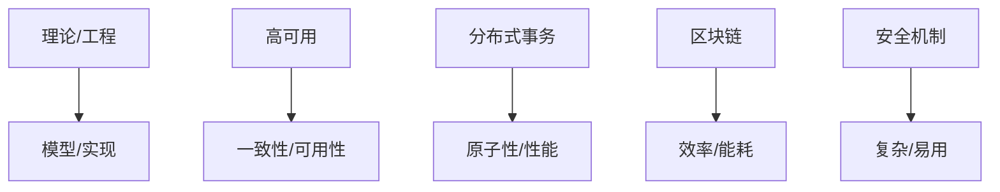

# 4.2.2 批判视角

## 1. 批判视角

- **理论与工程的落差**：一致性理论模型与实际系统实现的复杂性。
- **高可用优先的批判**：过度追求可用性可能导致数据不一致。
- **分布式事务批判**：分布式事务带来的性能瓶颈与系统复杂度。
- **区块链批判**：去中心化带来的效率低下与资源浪费。
- **安全机制批判**：安全性提升带来的系统复杂性与用户负担。

## 2. 结构化表达

- **批判对比表**：
| 编号 | 批判主题 | 传统观点 | 批判观点 |
|------|----------|----------|----------|
| 4.2.2.1 | 理论/工程 | 理论优先 | 工程可行性优先 |
| 4.2.2.2 | 高可用 | 可用性至上 | 一致性优先 |
| 4.2.2.3 | 分布式事务 | 保证原子性 | 性能损耗大 |
| 4.2.2.4 | 区块链 | 去中心化 | 低效率/高能耗 |
| 4.2.2.5 | 安全机制 | 严格安全 | 复杂难用 |

- **批判关系图**：

## 3. 多表征

- 对比表、关系图、案例分析、符号化描述

## 4. 规范说明

- 内容需递归细化，支持多表征。
- 保留批判性分析、图表等。
- 如有遗漏，后续补全并说明。

> 本文件为递归细化与内容补全示范，后续可继续分解为4.2.2.1、4.2.2.2等子主题，支持持续递归完善。
