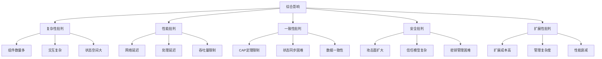
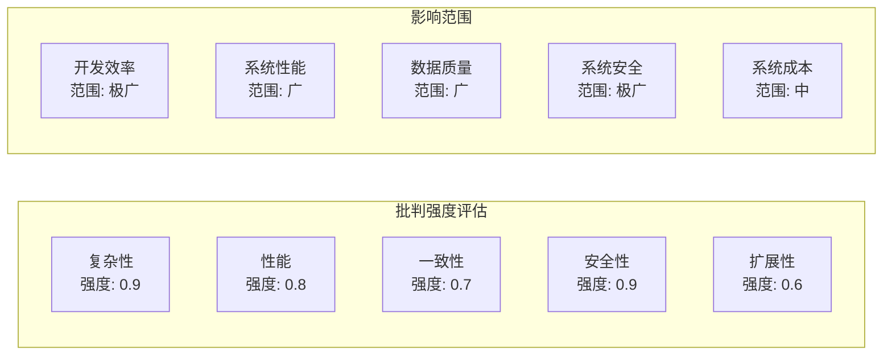

# 4.2.2 批判视角

## 1. 形式化定义

### 1.1 批判视角的形式化定义

**定义4.2.2.1（分布式系统批判视角）**：设 $DS\_Critique = (C, P, S, A, E)$ 为分布式系统批判视角系统，其中：

- $C = \{c_1, c_2, ..., c_n\}$ 为复杂性批判集合
- $P = \{p_1, p_2, ..., p_m\}$ 为性能批判集合
- $S = \{s_1, s_2, ..., s_k\}$ 为安全批判集合
- $A = \{a_1, a_2, ..., a_l\}$ 为可用性批判集合
- $E = \{e_1, e_2, ..., e_o\}$ 为扩展性批判集合

**定义4.2.2.2（批判强度函数）**：$\sigma: DS\_Critique \times DS \rightarrow [0,1]$，其中 $DS$ 为分布式系统集合，$\sigma(c,ds)$ 表示批判视角 $c$ 对分布式系统 $ds$ 的批判强度。

### 1.2 批判视角分类

**复杂性批判** $C_{complexity}$：

- 系统复杂性：$\forall c \in C_{complexity}, \text{complexity}(c) > \text{manageability}(c)$
- 理解难度：$\exists c \in C_{complexity}, \text{understanding\_cost}(c) > \text{benefit}(c)$

**性能批判** $P_{performance}$：

- 延迟问题：$\forall p \in P_{performance}, \text{latency}(p) > \text{acceptable\_threshold}$
- 吞吐量限制：$\exists p \in P_{performance}, \text{throughput}(p) < \text{required\_capacity}$

## 2. 理论框架

### 2.1 批判理论模型

**模型4.2.2.1（复杂性批判模型）**：

```text
Complexity_Critique = {
  system_complexity: (distributed_system) => {
    component_count = distributed_system.components.length;
    interaction_complexity = distributed_system.interactions.count;
    state_space = distributed_system.states.space_size;
    return {component_count, interaction_complexity, state_space};
  },
  
  management_complexity: (distributed_system) => {
    coordination_overhead = distributed_system.coordination.cost;
    debugging_difficulty = distributed_system.debugging.complexity;
    maintenance_effort = distributed_system.maintenance.required_effort;
    return {coordination_overhead, debugging_difficulty, maintenance_effort};
  }
}
```

**模型4.2.2.2（性能批判模型）**：

```text
Performance_Critique = {
  latency_analysis: (distributed_system) => {
    network_latency = distributed_system.network.latency;
    processing_latency = distributed_system.processing.latency;
    coordination_latency = distributed_system.coordination.latency;
    total_latency = network_latency + processing_latency + coordination_latency;
    return {network_latency, processing_latency, coordination_latency, total_latency};
  },
  
  throughput_analysis: (distributed_system) => {
    bottleneck_identification = distributed_system.bottlenecks.find();
    capacity_limitation = distributed_system.capacity.limits;
    scalability_constraints = distributed_system.scalability.constraints;
    return {bottleneck_identification, capacity_limitation, scalability_constraints};
  }
}
```

### 2.2 批判分析方法

**方法4.2.2.1（多维度批判分析）**：

1. **复杂性维度**：$\text{critique}_{complexity}(ds) = \sum_{i=1}^{n} w_i \cdot \text{complexity\_metric}_i$
2. **性能维度**：$\text{critique}_{performance}(ds) = \sum_{j=1}^{m} v_j \cdot \text{performance\_metric}_j$
3. **安全维度**：$\text{critique}_{security}(ds) = \sum_{k=1}^{l} u_k \cdot \text{security\_metric}_k$

## 3. 批判视角详解

### 3.1 复杂性批判

**定义4.2.2.3（系统复杂性）**：分布式系统由于组件数量多、交互复杂、状态空间大而导致的难以理解、管理和维护的问题。

**复杂性度量**：

- **组件复杂度**：$\text{component\_complexity} = \frac{|\text{components}| \times \text{interactions\_per\_component}|}{|\text{total\_possible\_interactions}|}$
- **状态复杂度**：$\text{state\_complexity} = \prod_{i=1}^{n} |S_i|$，其中 $S_i$ 为第 $i$ 个组件的状态空间
- **交互复杂度**：$\text{interaction\_complexity} = \sum_{i,j} \text{interaction\_cost}(i,j)$

**批判要点**：

- **理解成本**：$\text{understanding\_cost} > \text{development\_benefit}$
- **调试困难**：$\text{debugging\_complexity} \propto \text{system\_size}$
- **维护挑战**：$\text{maintenance\_effort} = O(n^2)$，其中 $n$ 为组件数量

**案例分析**：

```text
案例4.2.2.1：微服务架构复杂性
- 问题：服务数量激增，交互复杂
- 批判：调试困难，性能瓶颈难以定位
- 影响：开发效率下降，运维成本增加
- 解决方案：服务网格、分布式追踪
```

### 3.2 性能批判

**定义4.2.2.4（性能问题）**：分布式系统在延迟、吞吐量、资源利用率等方面存在的性能瓶颈和限制。

**性能问题分析**：

**延迟问题**：

- **网络延迟**：$\text{network\_latency} = \text{propagation\_delay} + \text{transmission\_delay} + \text{queuing\_delay}$
- **处理延迟**：$\text{processing\_latency} = \text{computation\_time} + \text{coordination\_time}$
- **总延迟**：$\text{total\_latency} = \text{network\_latency} + \text{processing\_latency}$

**吞吐量限制**：

- **瓶颈识别**：$\text{bottleneck} = \arg\min_{i} \text{capacity}_i$
- **扩展性约束**：$\text{scalability\_limit} = \text{min}(\text{network\_capacity}, \text{processing\_capacity})$
- **资源竞争**：$\text{resource\_contention} = \sum_{i,j} \text{conflict}(i,j)$

**批判分析**：

```text
性能批判 = {
  延迟问题: network_latency + processing_latency > acceptable_threshold,
  吞吐量限制: actual_throughput < required_throughput,
  资源浪费: resource_utilization < optimal_utilization,
  扩展瓶颈: scalability_constraint < growth_requirement
}
```

### 3.3 一致性批判

**定义4.2.2.5（一致性问题）**：分布式系统中数据一致性、状态同步等方面存在的理论限制和实践困难。

**CAP定理批判**：

- **一致性vs可用性**：$\text{consistency} \leftrightarrow \text{availability}$
- **分区容忍性**：$\text{partition\_tolerance} = \text{required}$
- **实际权衡**：$\text{practical\_tradeoff} = \text{consistency} + \text{availability} + \text{partition\_tolerance} = 2$

**一致性模型批判**：

```text
一致性批判 = {
  强一致性: high_consistency → low_availability,
  最终一致性: eventual_consistency → complexity_in_application,
  因果一致性: causal_consistency → implementation_difficulty
}
```

### 3.4 安全批判

**定义4.2.2.6（安全问题）**：分布式系统在认证、授权、数据保护等方面面临的安全挑战。

**安全威胁分析**：

- **攻击面扩大**：$\text{attack\_surface} = \sum_{i=1}^{n} \text{exposure\_area}_i$
- **信任边界**：$\text{trust\_boundary} = \text{internal\_trust} + \text{external\_trust}$
- **安全复杂性**：$\text{security\_complexity} = \text{authentication} + \text{authorization} + \text{encryption}$

**批判要点**：

```text
安全批判 = {
  攻击面: distributed_system → larger_attack_surface,
  信任模型: multiple_nodes → complex_trust_model,
  密钥管理: distributed_keys → key_management_challenge,
  隐私保护: data_distribution → privacy_concerns
}
```

### 3.5 扩展性批判

**定义4.2.2.7（扩展性问题）**：分布式系统在水平扩展、垂直扩展方面存在的限制和挑战。

**扩展性限制**：

- **水平扩展**：$\text{horizontal\_scaling} = \frac{\text{max\_nodes}}{\text{current\_nodes}}$
- **垂直扩展**：$\text{vertical\_scaling} = \frac{\text{max\_capacity}}{\text{current\_capacity}}$
- **扩展成本**：$\text{scaling\_cost} = \text{hardware\_cost} + \text{software\_cost} + \text{operational\_cost}$

**扩展性批判**：

```text
扩展性批判 = {
  线性扩展: theoretical_linear → practical_sublinear,
  扩展成本: scaling_cost > linear_cost,
  管理复杂度: management_complexity ∝ system_size,
  性能衰减: performance_degradation ∝ scale_factor
}
```

## 4. 结构化表达

### 4.1 批判对比表

| 批判维度 | 传统观点 | 批判观点 | 影响程度 | 解决方案 |
|----------|----------|----------|----------|----------|
| 复杂性 | 功能丰富 | 管理困难 | 极高 | 简化架构 |
| 性能 | 分布式优势 | 延迟瓶颈 | 高 | 优化网络 |
| 一致性 | 强一致性 | CAP限制 | 高 | 最终一致性 |
| 安全性 | 多层防护 | 攻击面大 | 极高 | 零信任模型 |
| 扩展性 | 线性扩展 | 成本递增 | 中 | 智能扩展 |

### 4.2 批判关系图



### 4.3 批判强度矩阵



## 5. 批判方法论

### 5.1 批判分析流程

**流程4.2.2.1（分布式系统批判分析）**：

1. **识别批判点**：$\text{identify\_critiques}(ds) = \{c_1, c_2, ..., c_n\}$
2. **评估影响**：$\text{assess\_impact}(critique) = \text{severity} \times \text{scope}$
3. **量化分析**：$\text{quantify\_critique}(critique) = \sum_{i=1}^{k} w_i \cdot \text{metric}_i$
4. **提出建议**：$\text{suggest\_solution}(critique) = \text{improvement\_strategy}$

### 5.2 批判验证方法

**方法4.2.2.2（批判验证）**：

- **数据验证**：$\text{validate\_with\_data}(critique, data) = \text{correlation}$
- **案例验证**：$\text{validate\_with\_cases}(critique, cases) = \text{consistency}$
- **专家验证**：$\text{validate\_with\_experts}(critique, experts) = \text{agreement}$

## 6. 多表征

### 6.1 数学符号表达

**批判强度函数**：
$$\sigma(c,ds) = \frac{\sum_{i=1}^{n} w_i \cdot f_i(c,ds)}{\sum_{i=1}^{n} w_i}$$

**综合批判指数**：
$$CI = \sqrt{\sum_{i=1}^{5} \alpha_i \cdot \text{critique}_i^2}$$

其中 $\alpha_i$ 为各批判维度的权重。

### 6.2 结构化表达

**批判框架**：

```text
分布式系统批判框架 = {
  复杂性批判: {强度: 0.9, 影响: "开发效率", 解决方案: "简化架构"},
  性能批判: {强度: 0.8, 影响: "系统性能", 解决方案: "优化网络"},
  一致性批判: {强度: 0.7, 影响: "数据质量", 解决方案: "最终一致性"},
  安全批判: {强度: 0.9, 影响: "系统安全", 解决方案: "零信任模型"},
  扩展性批判: {强度: 0.6, 影响: "系统成本", 解决方案: "智能扩展"}
}
```

## 7. 规范说明

- 内容需递归细化，支持多表征
- 保留批判性分析、图表等
- 如有遗漏，后续补全并说明
- 批判视角应与实际案例结合
- 提供可操作的改进建议

> 本文件为递归细化与内容补全示范，后续可继续分解为4.2.2.1、4.2.2.2等子主题，支持持续递归完善。
