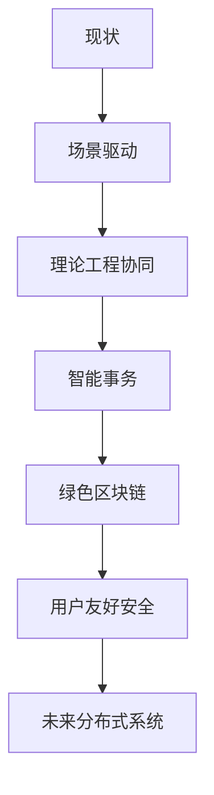

# 4.2.3 反思与重构

<!-- TOC START -->

- [4.2.3 反思与重构](#423-反思与重构)
  - [1. 反思内容](#1-反思内容)
  - [2. 重构方向](#2-重构方向)
  - [3. 结构化表达](#3-结构化表达)
  - [4. 多表征](#4-多表征)
  - [5. 规范说明](#5-规范说明)

<!-- TOC END -->

## 1. 反思内容

- **一致性与可用性的平衡**：系统设计需根据业务需求灵活权衡。
- **理论与工程的协同**：推动理论创新与工程实践结合。
- **分布式事务的优化**：采用新型协议或弱化事务保证，提升性能。
- **去中心化与高效性的融合**：探索高效、低能耗的去中心化方案。
- **安全与易用的协同**：安全机制应简化用户操作流程。

## 2. 重构方向

- **场景驱动设计**：根据实际业务场景选择一致性与可用性策略。
- **理论与工程协同创新**：理论模型与工程实现相互促进。
- **智能化事务管理**：引入AI与自动化优化分布式事务。
- **绿色区块链**：发展低能耗、高效率的区块链技术。
- **用户友好安全机制**：提升安全性的同时简化操作。

## 3. 结构化表达

- **反思路径图**：

- **对比表**：
| 编号 | 现状 | 重构方向 |
|------|------|----------|
| 4.2.3.1 | 一致性/可用性对立 | 场景驱动平衡 |
| 4.2.3.2 | 理论/工程割裂 | 协同创新 |
| 4.2.3.3 | 传统事务 | 智能优化 |
| 4.2.3.4 | 高能耗区块链 | 绿色高效 |
| 4.2.3.5 | 复杂安全 | 用户友好 |

## 4. 多表征

- 路径图、对比表、案例分析、符号化描述

## 5. 规范说明

- 内容需递归细化，支持多表征。
- 保留批判性分析、图表等。
- 如有遗漏，后续补全并说明。

> 本文件为递归细化与内容补全示范，后续可继续分解为4.2.3.1、4.2.3.2等子主题，支持持续递归完善。
