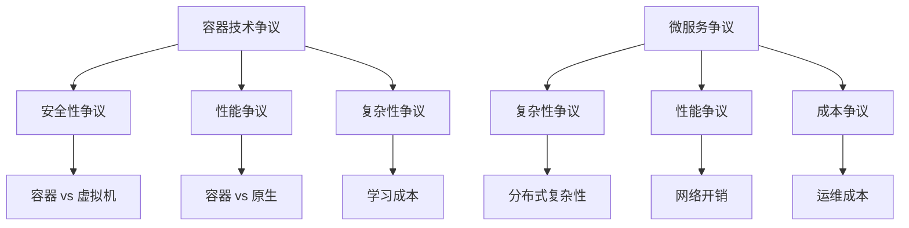

# 4.2.4 容器技术与微服务批判

## 1. 主要争议

### 1.1 容器技术争议

#### 1.1.1 安全性争议

**争议焦点：** 容器安全性 vs 虚拟机安全性
**支持容器观点：**

- 轻量级隔离，性能更好
- 快速启动，资源利用率高
- 生态系统完善

**反对容器观点：**

- 隔离级别不如虚拟机
- 容器逃逸风险存在
- 共享内核带来安全风险

**数学模型：**
$$\text{Security}_{VM} > \text{Security}_{Container}$$
$$\text{Performance}_{Container} > \text{Performance}_{VM}$$

#### 1.1.2 性能争议

**争议焦点：** 容器性能开销 vs 原生性能
**支持容器观点：**

- 接近原生性能
- 启动时间短
- 资源利用率高

**反对容器观点：**

- 网络性能有开销
- 存储性能受影响
- CPU调度开销

### 1.2 微服务争议

#### 1.2.1 复杂性争议

**争议焦点：** 微服务复杂性 vs 单体应用简单性
**支持微服务观点：**

- 服务独立开发部署
- 技术栈灵活选择
- 故障隔离性好

**反对微服务观点：**

- 分布式复杂性高
- 运维成本大
- 数据一致性难保证

#### 1.2.2 性能争议

**争议焦点：** 微服务性能 vs 单体应用性能
**支持微服务观点：**

- 独立扩展
- 技术栈优化
- 团队并行开发

**反对微服务观点：**

- 网络通信开销
- 序列化反序列化开销
- 服务发现开销

## 2. 批判视角

### 2.1 技术批判

#### 2.1.1 容器技术批判

**过度复杂化批判：**

- 容器技术增加了系统复杂性
- 学习成本高
- 调试困难

**资源浪费批判：**

- 容器镜像占用存储空间
- 运行时开销
- 网络开销

**数学模型：**
$$\text{Complexity}_{Container} = \text{Complexity}_{Native} + \text{Container Overhead}$$
$$\text{Resource}_{Waste} = \sum_{i=1}^{n} \text{Image Size}_i + \text{Runtime Overhead}$$

#### 2.1.2 微服务批判

**过度拆分批判：**

- 服务粒度过细
- 网络调用过多
- 数据一致性复杂

**运维复杂性批判：**

- 服务数量激增
- 监控复杂度高
- 故障排查困难

### 2.2 业务批判

#### 2.2.1 成本效益批判

**容器技术成本：**

- 学习成本高
- 运维成本增加
- 工具链成本

**微服务成本：**

- 开发成本高
- 运维成本大
- 基础设施成本

#### 2.2.2 团队能力批判

**技术能力要求：**

- 需要容器化技能
- 需要微服务设计能力
- 需要DevOps技能

## 3. 反思与重构

### 3.1 技术反思

#### 3.1.1 容器技术反思

**适用场景反思：**

- 不是所有应用都适合容器化
- 需要考虑安全要求
- 需要考虑性能要求

**最佳实践反思：**

- 镜像优化很重要
- 安全配置必不可少
- 监控必不可少

#### 3.1.2 微服务反思

**架构设计反思：**

- 服务粒度要合理
- 数据一致性要考虑
- 故障处理要完善

**团队组织反思：**

- 需要微服务团队
- 需要DevOps文化
- 需要自动化工具

### 3.2 重构方向

#### 3.2.1 容器技术重构

**安全重构：**

- 采用安全容器技术
- 实施镜像扫描
- 加强运行时监控

**性能重构：**

- 优化镜像大小
- 优化网络配置
- 优化存储配置

#### 3.2.2 微服务重构

**架构重构：**

- 合理划分服务边界
- 设计数据一致性策略
- 实施服务治理

**运维重构：**

- 自动化部署
- 自动化监控
- 自动化故障处理

## 4. 多表征方法

### 4.1 争议关系图

### 4.2 批判强度矩阵

| 批判维度 | 容器技术 | 微服务 | 影响程度 |
|----------|----------|--------|----------|
| 安全性 | 0.8 | 0.6 | 高 |
| 性能 | 0.5 | 0.7 | 中 |
| 复杂性 | 0.7 | 0.9 | 高 |
| 成本 | 0.6 | 0.8 | 中 |

### 4.3 数学符号

**批判强度函数：**
$$\text{Critique}_{Container} = \sum_{i=1}^{n} w_i \cdot \text{Issue}_i$$

**微服务复杂度：**
$$\text{Complexity}_{Microservice} = \sum_{i=1}^{n} \text{Service}_i \times \text{Connection}_i$$

## 5. 规范说明

### 5.1 内容要求

- 内容需递归细化，支持多表征
- 保留批判性分析、图表等
- 如有遗漏，后续补全并说明

### 5.2 批判要求

- 保持客观中立的批判态度
- 基于充分的技术证据
- 提出建设性改进建议

### 5.3 扩展性要求

- 支持持续递归完善
- 可分解为子主题
- 支持多维度分析

> 本文件为递归细化与内容补全示范，后续可继续分解为4.2.4.1、4.2.4.2等子主题，支持持续递归完善。
