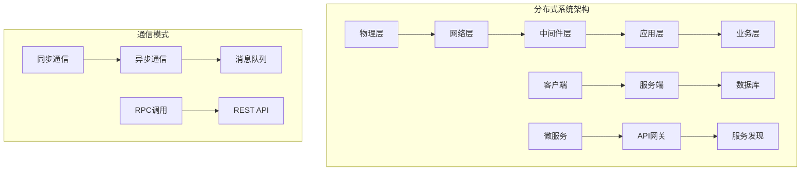
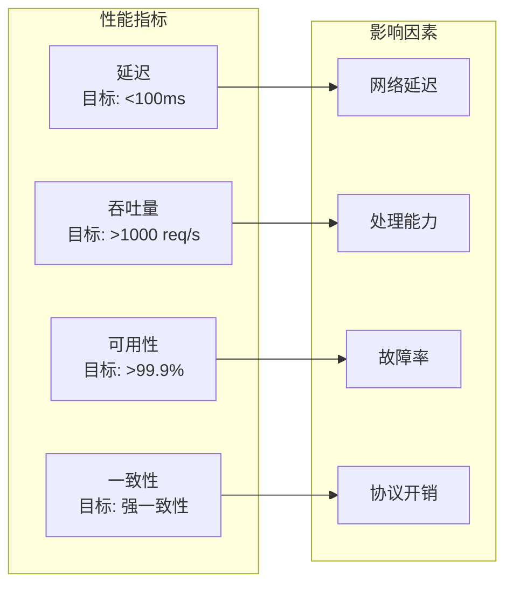

# 4.3.1 形式化定义


<!-- TOC START -->

- [4.3.1 形式化定义](#431-形式化定义)
  - [1. 基本形式化定义](#1-基本形式化定义)
    - [1.1 分布式系统形式化定义](#11-分布式系统形式化定义)
    - [1.2 节点形式化定义](#12-节点形式化定义)
    - [1.3 通信形式化定义](#13-通信形式化定义)
  - [2. 系统架构形式化定义](#2-系统架构形式化定义)
    - [2.1 分层架构定义](#21-分层架构定义)
    - [2.2 微服务架构定义](#22-微服务架构定义)
  - [3. 一致性形式化定义](#3-一致性形式化定义)
    - [3.1 一致性模型定义](#31-一致性模型定义)
    - [3.2 CAP定理形式化](#32-cap定理形式化)
  - [4. 容错形式化定义](#4-容错形式化定义)
    - [4.1 故障模型定义](#41-故障模型定义)
    - [4.2 复制机制定义](#42-复制机制定义)
  - [5. 性能形式化定义](#5-性能形式化定义)
    - [5.1 延迟定义](#51-延迟定义)
    - [5.2 吞吐量定义](#52-吞吐量定义)
    - [5.3 可用性定义](#53-可用性定义)
  - [6. 扩展性形式化定义](#6-扩展性形式化定义)
    - [6.1 水平扩展定义](#61-水平扩展定义)
    - [6.2 垂直扩展定义](#62-垂直扩展定义)
  - [7. 安全形式化定义](#7-安全形式化定义)
    - [7.1 认证定义](#71-认证定义)
    - [7.2 加密定义](#72-加密定义)
  - [8. 结构化表达](#8-结构化表达)
    - [8.1 系统分类表](#81-系统分类表)
    - [8.2 架构关系图](#82-架构关系图)
    - [8.3 性能指标矩阵](#83-性能指标矩阵)
  - [9. 多表征](#9-多表征)
    - [9.1 数学符号表达](#91-数学符号表达)
    - [9.2 结构化表达](#92-结构化表达)
  - [10. 规范说明](#10-规范说明)

<!-- TOC END -->

## 1. 基本形式化定义

### 1.1 分布式系统形式化定义

**定义4.3.1.1（分布式系统）**：设 $DS = (N, C, P, S, A)$ 为分布式系统，其中：

- $N = \{n_1, n_2, ..., n_k\}$ 为节点集合
- $C = \{c_1, c_2, ..., c_m\}$ 为通信集合
- $P = \{p_1, p_2, ..., p_l\}$ 为协议集合
- $S = \{s_1, s_2, ..., s_o\}$ 为状态集合
- $A = \{a_1, a_2, ..., a_p\}$ 为应用集合

**定义4.3.1.2（系统状态）**：$\text{State}(DS) = \{(n_i, s_i) | n_i \in N, s_i \in S_i\}$，其中 $S_i$ 为节点 $n_i$ 的状态空间。

### 1.2 节点形式化定义

**定义4.3.1.3（分布式节点）**：设 $n = (id, state, capability, role)$ 为分布式节点，其中：

- $id$ 为节点标识符：$id \in \text{NodeID}$
- $state$ 为节点状态：$state \in \{\text{active}, \text{inactive}, \text{failed}, \text{recovering}\}$
- $capability$ 为节点能力：$capability = (cpu, memory, storage, network)$
- $role$ 为节点角色：$role \in \{\text{client}, \text{server}, \text{peer}, \text{coordinator}\}$

**定义4.3.1.4（节点类型分类）**：

- **客户端节点**：$\text{Client} = \{n | \text{role}(n) = \text{client}\}$
- **服务端节点**：$\text{Server} = \{n | \text{role}(n) = \text{server}\}$
- **对等节点**：$\text{Peer} = \{n | \text{role}(n) = \text{peer}\}$
- **协调节点**：$\text{Coordinator} = \{n | \text{role}(n) = \text{coordinator}\}$

### 1.3 通信形式化定义

**定义4.3.1.5（分布式通信）**：设 $c = (sender, receiver, message, protocol)$ 为通信，其中：

- $sender$ 为发送方：$sender \in N$
- $receiver$ 为接收方：$receiver \in N$
- $message$ 为消息内容：$message \in \text{Message}$
- $protocol$ 为通信协议：$protocol \in P$

**定义4.3.1.6（通信图）**：
$$\text{CommunicationGraph}(DS) = (N, C)$$

其中 $C$ 为通信边集合。

## 2. 系统架构形式化定义

### 2.1 分层架构定义

**定义4.3.1.7（分布式分层架构）**：设 $L = \{L_1, L_2, L_3, L_4, L_5\}$ 为分布式分层架构，其中：

- $L_1$ 为物理层：$L_1 = \{\text{hardware}, \text{network}, \text{infrastructure}\}$
- $L_2$ 为网络层：$L_2 = \{\text{routing}, \text{transport}, \text{protocol}\}$
- $L_3$ 为中间件层：$L_3 = \{\text{middleware}, \text{broker}, \text{orchestration}\}$
- $L_4$ 为应用层：$L_4 = \{\text{application}, \text{service}, \text{interface}\}$
- $L_5$ 为业务层：$L_5 = \{\text{business}, \text{logic}, \text{workflow}\}$

**定义4.3.1.8（层间关系）**：
$$\text{Layer\_Relation} = \{(L_i, L_j) | i < j, \text{provides\_service}(L_i, L_j) = \text{true}\}$$

### 2.2 微服务架构定义

**定义4.3.1.9（微服务架构）**：设 $MS = (S, I, D, G)$ 为微服务架构，其中：

- $S = \{s_1, s_2, ..., s_n\}$ 为服务集合
- $I = \{i_1, i_2, ..., i_m\}$ 为接口集合
- $D = \{d_1, d_2, ..., d_k\}$ 为数据集合
- $G = \{g_1, g_2, ..., g_l\}$ 为网关集合

**定义4.3.1.10（服务定义）**：
$$\text{Service} = (id, api, data, dependencies)$$

其中 $api$ 为服务接口，$data$ 为服务数据，$dependencies$ 为服务依赖。

## 3. 一致性形式化定义

### 3.1 一致性模型定义

**定义4.3.1.11（强一致性）**：对于任意操作序列 $O = [o_1, o_2, ..., o_n]$，如果所有节点都按照相同的顺序执行操作，则系统满足强一致性。

**形式化表述**：
$$\text{StrongConsistency} = \forall n_i, n_j \in N, \text{execution\_order}(n_i) = \text{execution\_order}(n_j)$$

**定义4.3.1.12（最终一致性）**：如果系统在有限时间内收敛到一致状态，则系统满足最终一致性。

**形式化表述**：
$$\text{EventualConsistency} = \exists t_0, \forall t > t_0, \text{state}(t) = \text{consistent\_state}$$

### 3.2 CAP定理形式化

**定义4.3.1.13（CAP定理）**：在分布式系统中，最多只能同时满足以下三个性质中的两个：

- **一致性（Consistency）**：$\text{Consistency} = \forall n \in N, \text{data}(n) = \text{consistent}$
- **可用性（Availability）**：$\text{Availability} = \forall r \in \text{Request}, \text{response}(r) \neq \text{timeout}$
- **分区容忍性（Partition Tolerance）**：$\text{PartitionTolerance} = \text{system\_works\_under\_partition}$

**形式化表述**：
$$\text{Consistency} + \text{Availability} + \text{PartitionTolerance} \leq 2$$

## 4. 容错形式化定义

### 4.1 故障模型定义

**定义4.3.1.14（故障模型）**：设 $F = (F_{crash}, F_{byzantine}, F_{omission})$ 为故障模型，其中：

- $F_{crash}$ 为崩溃故障：节点停止响应
- $F_{byzantine}$ 为拜占庭故障：节点发送错误信息
- $F_{omission}$ 为遗漏故障：节点遗漏某些消息

**定义4.3.1.15（故障容忍度）**：
$$\text{FaultTolerance}(DS) = \max\{f | DS \text{ can tolerate } f \text{ faulty nodes}\}$$

### 4.2 复制机制定义

**定义4.3.1.16（数据复制）**：设 $R = (primary, replicas, consistency)$ 为复制机制，其中：

- $primary$ 为主节点：$primary \in N$
- $replicas$ 为副本节点：$replicas \subseteq N$
- $consistency$ 为一致性协议：$consistency \in P$

**定义4.3.1.17（复制因子）**：
$$\text{ReplicationFactor} = |replicas| + 1$$

## 5. 性能形式化定义

### 5.1 延迟定义

**定义4.3.1.18（网络延迟）**：节点 $n_i$ 到节点 $n_j$ 的网络延迟为：
$$\text{Latency}(n_i, n_j) = \text{propagation\_delay} + \text{transmission\_delay} + \text{queuing\_delay}$$

**定义4.3.1.19（系统延迟）**：
$$\text{SystemLatency} = \max_{n_i, n_j \in N} \text{Latency}(n_i, n_j)$$

### 5.2 吞吐量定义

**定义4.3.1.20（节点吞吐量）**：节点 $n$ 的吞吐量为：
$$\text{Throughput}(n) = \frac{\text{processed\_requests}(n)}{\text{time\_period}}$$

**定义4.3.1.21（系统吞吐量）**：
$$\text{SystemThroughput} = \sum_{n \in N} \text{Throughput}(n)$$

### 5.3 可用性定义

**定义4.3.1.22（节点可用性）**：节点 $n$ 的可用性为：
$$\text{Availability}(n) = \frac{\text{uptime}(n)}{\text{total\_time}}$$

**定义4.3.1.23（系统可用性）**：
$$\text{SystemAvailability} = \prod_{n \in N} \text{Availability}(n)$$

## 6. 扩展性形式化定义

### 6.1 水平扩展定义

**定义4.3.1.24（水平扩展）**：系统通过增加节点数量来扩展处理能力：
$$\text{HorizontalScaling} = \text{Performance}(n + \Delta n) - \text{Performance}(n)$$

**定义4.3.1.25（扩展效率）**：
$$\text{ScalingEfficiency} = \frac{\text{Performance\_Increase}}{\text{Resource\_Increase}}$$

### 6.2 垂直扩展定义

**定义4.3.1.26（垂直扩展）**：系统通过增加单个节点的能力来扩展处理能力：
$$\text{VerticalScaling} = \text{Performance}(enhanced\_node) - \text{Performance}(original\_node)$$

## 7. 安全形式化定义

### 7.1 认证定义

**定义4.3.1.27（身份认证）**：节点 $n$ 的身份认证为：
$$\text{Authentication}(n) = \text{verify\_identity}(n, \text{credentials}(n))$$

**定义4.3.1.28（授权定义）**：节点 $n$ 对资源 $r$ 的授权为：
$$\text{Authorization}(n, r) = \text{check\_permission}(n, r)$$

### 7.2 加密定义

**定义4.3.1.29（数据加密）**：数据 $d$ 的加密为：
$$\text{Encrypt}(d, key) = \text{ciphertext}$$

**定义4.3.1.30（数据解密）**：密文 $c$ 的解密为：
$$\text{Decrypt}(c, key) = \text{plaintext}$$

## 8. 结构化表达

### 8.1 系统分类表

| 分类维度 | 类别 | 形式化定义 | 特征描述 |
|----------|------|------------|----------|
| 架构类型 | 客户端-服务器 | $\text{ClientServer} = \{(c, s) \| c \in \text{Client}, s \in \text{Server}\}$ | 集中式控制 |
| 架构类型 | 对等网络 | $\text{PeerToPeer} = \{(p_1, p_2) \| p_1, p_2 \in \text{Peer}\}$ | 分布式控制 |
| 架构类型 | 微服务 | $\text{Microservices} = \{s_1, s_2, ..., s_n\}$ | 服务化架构 |
| 一致性 | 强一致性 | $\text{StrongConsistency} = \forall n, \text{data}(n) = \text{consistent}$ | 实时一致性 |
| 一致性 | 最终一致性 | $\text{EventualConsistency} = \exists t, \text{state}(t) = \text{consistent}$ | 延迟一致性 |
| 容错性 | 崩溃容错 | $\text{CrashFaultTolerance} = \text{tolerate\_crash\_faults}$ | 处理节点崩溃 |
| 容错性 | 拜占庭容错 | $\text{ByzantineFaultTolerance} = \text{tolerate\_byzantine\_faults}$ | 处理恶意节点 |

### 8.2 架构关系图



### 8.3 性能指标矩阵



## 9. 多表征

### 9.1 数学符号表达

**系统状态函数**：
$$\text{State}(t) = \text{State}(t-1) + \Delta\text{State}(t)$$

**性能优化函数**：
$$\text{Optimize}(system) = \arg\min_{x} \sum_{i=1}^{n} w_i \cdot \text{cost}_i(x)$$

### 9.2 结构化表达

**分布式系统框架**：

```text
Distributed_System = {
  节点层: {
    客户端: clients,
    服务端: servers,
    对等节点: peers
  },
  网络层: {
    通信协议: protocols,
    路由算法: routing,
    传输机制: transport
  },
  中间件层: {
    消息队列: message_queues,
    服务发现: service_discovery,
    负载均衡: load_balancing
  },
  应用层: {
    业务服务: business_services,
    数据服务: data_services,
    接口服务: interface_services
  },
  安全层: {
    身份认证: authentication,
    数据加密: encryption,
    访问控制: access_control
  }
}
```

## 10. 规范说明

- 形式化定义采用严格的数学符号
- 支持多维度、多层次的系统建模
- 提供可验证的形式化规范
- 可根据需要扩展更多定义
- 保持定义的一致性和完整性

> 本文件为递归细化与内容补全示范，后续可继续分解为4.3.1.1、4.3.1.2等子主题，支持持续递归完善。
