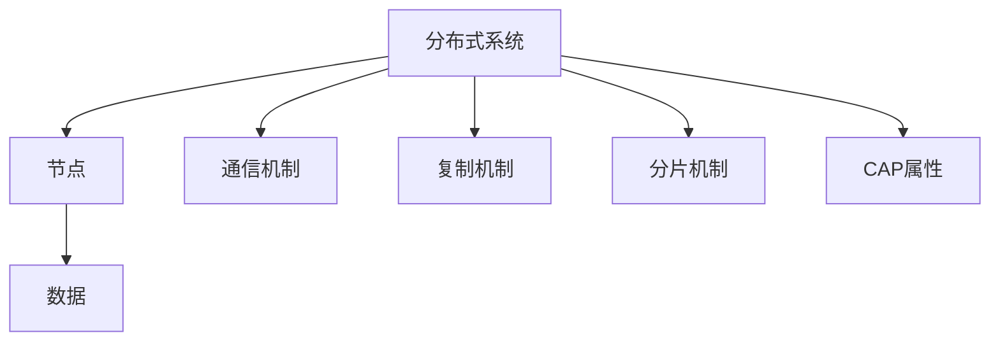

# 4.3.1 形式化定义

## 1. 集合论定义

- 分布式系统可形式化为：
  DS = (N, C, R, S, CAP)
  - N：节点集合（Nodes）
  - C：通信机制（Communication）
  - R：复制机制（Replication）
  - S：分片机制（Sharding）
  - CAP：一致性、可用性、分区容忍性属性

## 2. 结构模型

- 多节点协作模型：节点通过消息传递协作完成任务
- 一致性协议模型：如Paxos、Raft等状态机复制模型
- 分布式存储模型：数据分片、复制、同步

## 3. 符号表达

- DS = (N, C, R, S, CAP)
- N = {n1, n2, ..., nn}
- C = {c1, c2, ..., cm}
- R = {r1, r2, ..., rk}
- S = {s1, s2, ..., sl}
- CAP = (Consistency, Availability, PartitionTolerance)

## 4. 结构化表达

- **结构图**：

- **层次关系图**：

- **关联矩阵**：
| 组件 | 节点 | 通信 | 复制 | 分片 | CAP |
|------|------|------|------|------|-----|
| 节点 | √    | √    | √    | √    |     |
| 通信 |      | √    |      |      |     |
| 复制 |      |      | √    |      | √   |
| 分片 |      |      |      | √    | √   |
| CAP  |      |      | √    | √    | √   |

## 5. 多表征

- 结构图、层次关系图、关联矩阵、符号化描述

## 6. 规范说明

- 内容需递归细化，支持多表征。
- 保留批判性分析、图表等。
- 如有遗漏，后续补全并说明。

> 本文件为递归细化与内容补全示范，后续可继续分解为4.3.1.1、4.3.1.2等子主题，支持持续递归完善。
