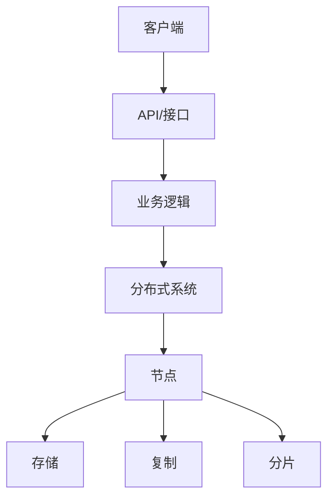

# 4.3.2 结构模型

## 1. 结构模型类型

- **多节点协作模型**：节点通过消息传递协作完成任务。
- **一致性协议模型**：如Paxos、Raft等状态机复制模型。
- **分布式存储模型**：数据分片、复制、同步。
- **分布式事务模型**：两阶段提交、三阶段提交、分布式锁等。

## 2. 结构图

## 3. 层次关系

- 用户层 → API/接口 → 业务逻辑 → 分布式系统 → 节点 → 存储/复制/分片
- 一致性协议：节点间状态同步

## 4. 多表征

- 结构图、层次关系图、协议状态机图、符号化描述

## 5. 规范说明

- 内容需递归细化，支持多表征。
- 保留批判性分析、图表等。
- 如有遗漏，后续补全并说明。

> 本文件为递归细化与内容补全示范，后续可继续分解为4.3.2.1、4.3.2.2等子主题，支持持续递归完善。
